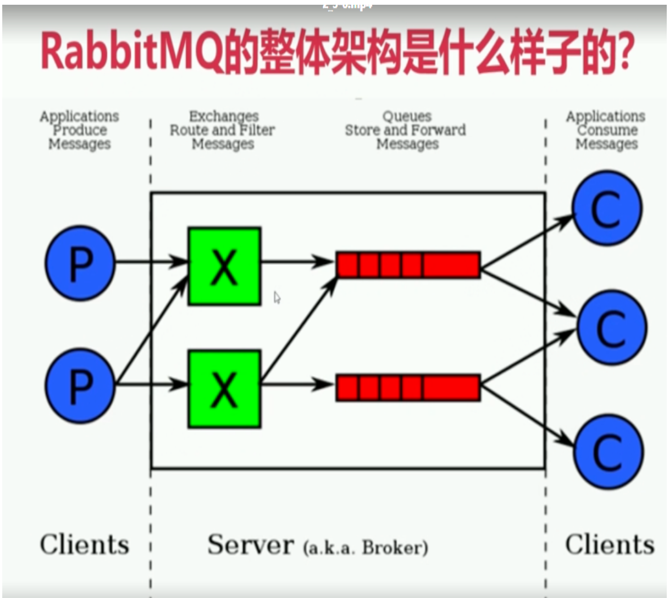
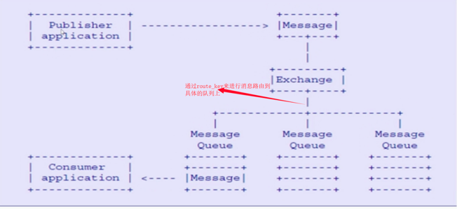

# 1.1 初识RabbitMq
> rabbitmq是一个开源的消息代理和队列服务器，通过普通的协议(Amqp协议)来完成不同应用之间的数 据共享; 
> rabbitmq是通过elang语言来开发的基于amqp协议

#### 各大互联网公司为什么选择Rabbitmq
- 1)比如滴滴，美团，携程，去哪儿 
- 2)开源，性能好，稳定性保证, 
- 3)提供了消息的可靠性投递（confirm），返回模式 
- 4)与sping amqp 整合和完美，提供丰富的api 
- 5)集群模式十分丰富(HA模式 镜像队列模型) 
- 6)保证数据不丢失的情况下，保证很好的性能

#### Rabbitmq高性能是如何做到的
>- 使用的语言是elang语言(通常使用到交互机上)，elang的语言的性能能与原生socket的延迟效果.  
>- 消息入队的延时已经消息的消费的响应很快

#### 什么是AMQP协议(Advanced message queue protocol) 高级消息队列协议
>- 是一个二进制协议 
>- amqp 是一个应用层协议的规范（定义了很多规范）,可以有很多不同的消息中间件产品（需要 遵循该规范）server：是消息队列节点 virtual host:虚拟注解 exchange 交换机(消息投递到交换机上) message queue（被消费者监听消费） 交互机和队列是有一个绑定的关系

# 1.2 AMQP的核心概念
> 1:server :又称为broker，接受客户端连接，实现amqp实体服务  
> 2:Connection: 连接,应用程序与brokder建立网络连接 
> 3：channel：网络通道，几乎所有的操作都是在channel中进行的，是进行消息对象的通道，客户端可以建立 多个通道，每一个channel表示一个会话任务 
> 4:Message: 服务器和应用程序之间传递数据的载体，有properties（消息属性,用来修饰消息,比如消息的优 先级,延时投递）和Body（消息体） 
> 5:virtual host(虚拟主机): 是一个逻辑概念,最上层的消息路由，一个虚拟主机中可以包含多个exhange 和 queue 但是一个虚拟主机中不能有名称相同的exchange 和queue 
> 6:exchange 交换机: 消息直接投递到交换机上，然后交换机根据消息的路由key 来路由到对应绑定的队列上 
> 7:baingding: 绑定 exchange 与queue的虚拟连接,bingding中可以包含route_key 
> 8：route_key 路由key ，他的作用是在交换机上通过route_key来把消息路由到哪个队列上 
> 9:queue：队列，用于来保存消息的载体，有消费者监听，然后消费消息 

#1.3 Rabbitmq的整体架构模型

#1.4 rabbitmq的消息是如何流转的

---
- 作者：face
- Github地址：https://github.com/facehai/thinking-framework-master
- 版权声明：著作权归作者所有，商业转载请联系作者获得授权，非商业转载请注明出处。
