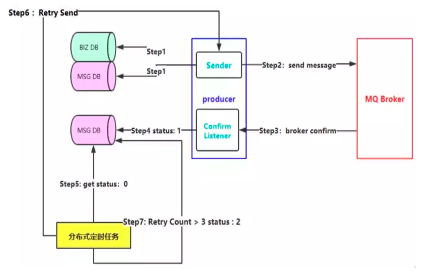
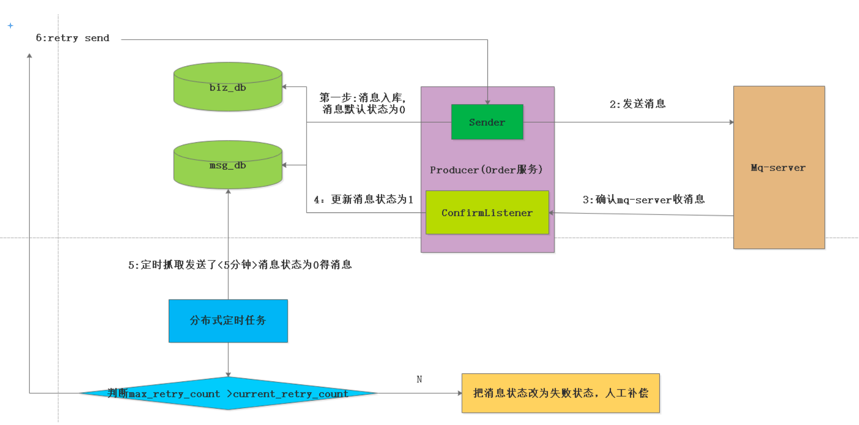

# 1.1 如何保障消息的可靠性投递
### 一: 如何保障消息的百分百投递成功 
> 1.1) 什么是生产端的可靠性投递?  
①:保障消息成功发送出去  
②:保障mq节点成功接收消息  
③:消息发送端需要收到mq服务的确认应答  
④:完善的消息补偿机制（百分百成功成功 需要该步骤） 

> 1.2）解决保障可靠性投递的方案（消息落库） 
>

> 消息入库打标解决思路 (Order_Serve 调用物流服务举列子)   
> 在消息生产者端(也就是订单服务)  
> 
> **正常链路流程**  
> 第一步(该环节调用了操作了二次数据库):在创建订单的操作的时候，把数据插入到订单相关的表中,并且构造调 用物流模块的数据消息，把消息插入到消息表中,初始状态为0  
> 第二步: 把物流消息投递到消息队列中,  
> 第三步；消息队列访问一个确认消息,并且由，订单服务来监控mq server的确认消息  
> 第四步:根据收到的确认消息来更新数据库中的消息记录的状态 
> 
> **异常链路流程**  
> 第一步(该环节调用了操作了二次数据库):在创建订单的操作的时候，把数据插入到订单相关的表中,并且构造调 用物流模块的数据消息，把消息插入到消息表中,初始状态为0  
> 第二步: 把物流消息投递到消息队列中,  
> 第三步:由于网络闪断，导致消费端监控mq服务访问的确认消息 没有收到，那么在msg_db中的那条消息的 状态永远就是0状态。这个时候，我们需要对这种情况下做出补偿  
> 
> **补偿机制:**  
> 启动一个分布式的定时任务,不定时的去扫描msg_db的这个表，状态为0的消息记录，在这里我们可以根据 业务来设置扫描重发规则  
> 规则1:插入msg_db 表中5Min后状态还是为0的记录，进行消息重试  
> 规则2:若重试的次数超过五次状态还是为0的话，我们就把消息状态改为2,此时我们需要人工的去确认状态 为2的消息是什么原因导致没有成功的  
> 
> **消息入库打标的缺点:**  
> 在第一步的过程中，既插入了业务数据表，也同时插入了消息记录表，进行了二次db操作，在高并发的环 境下，这个环境就会造成性能瓶颈

> 1.3）延时投递，做二次确认检测，回调检测
> 

# 1.2 幂等性以及消息的幂等性
> 一:什么是接口的幂等性?  
> 接口的幂等性:简而言之，就是对接口发起的一次调用和多次调用，锁生产的结果都是 一致的。 某些接口具有天然的幂等性: 比如长查询接口，不管是查询一次还是多次，返回的结果都 是一致的  
> 1.2）若接口没有保障幂等性，那么就出现问题  
> 
> **案例一:** 比如订单提交的过程中，用户点了一次提交，但是由于网络等原因，导致后端处理延时，客户就连 续点击了多次，在没有幂等性的条件下，那么就会造成订单的重复提交。  
> 
> **解决方案:** 在保存订单的时候，根据生成的系统全局唯一ID(这里订单号+业务类型),并且把该唯一ID 调用 redis 的setnx命令保存起来，在第一次保存的时候，由于redis中没有该key,那么就会 把全局唯一ID 进行设置上，此时订单就会保存成功，。这个时候若出现前端重复点击按钮, 由于第一步已经 setnx上了 就会阻止后面的保存。

### 二、MQ 是如何解决幂等性的
> 发送消息的流程  
> 第一步:消息生产者向Mq服务端发送消息  
> 第二步:mq 服务端把消息进行落地  
> 第三步:消息服务端向消息生产者发送ack  
> 第四步；消息消费者消费消息  
> 第五步:消费者发送ack 
> 第六步: mq服务将落地消息删除
> 

## 2.1）消息重复发送的原因 
为了保障消息的百分之百的投递，我们使用了消息重发，确认机制，使得消息可能被重复发送，由上图可知 道，由于网络原因，第三步的上半场ack丢失还是第五步的下半场ack丢失 都会导致消息重复发送 

## 2.2）消息重复发送的导致后果
上半场消息生产者是用户支付模块，专门是用来给用户扣费的，而下半场的消息消费者服务是会员卡服务， 是通过接受扣费服务发送的消息来进行发卡的, 由于第三步或者是第五步ack丢失，那么就会导致上游服务重复发送消息就会导致扣一次款，发多次卡 

## 2.3) mq服务端是如何保证幂等性的？ 
消息队列的服务中，对每一条消息都会生成一个全局唯一的与业务无关的ID(inner_msg_id),当mq_server 接受到消息的时候，先根据inner_msg_id 是否需要重复发送，再决定消息是否落DB ,这样保证每条消息都 只会落一次DB 

## 2.4）消费端如何来做到幂等性的？ 
还是把对每条消息做生成一个唯一性的ID 通过redis的来setnx命令来保证幂等性。

# 1.3 消息的确认Confirm

# 1.4 消息的confirm机制

# 1.5 return-listener-消息处理机制

# 1.6 消费端的自定义消费监听

# 1.7 消费端如何做限流量

# 1.8 消费端的ack

# 1.9 死信队列-死信交换机

# 2.0 分布式事务解决方案

---
- 作者：face
- Github地址：https://github.com/facehai/thinking-framework-master
- 版权声明：著作权归作者所有，商业转载请联系作者获得授权，非商业转载请注明出处。
