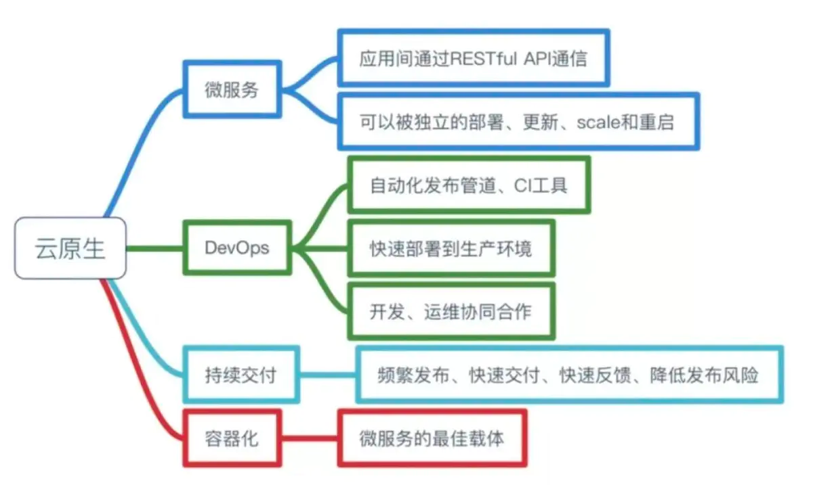

# 1.1.1 什么是云原生
> 云原生从字面意思上来看可以分成**云**和**原生**两个部分。 
> 云是和本地相对的，传统的应用必须跑在本地服务器上，现在流行的应用都跑在云端，云包含了IaaS、PaaS和SaaS。 
> 原生就是土生土长的意思，我们在开始设计应用的时候就考虑到应用将来是运行云环境里面的，要充分利用云资源的优点，比如️云服务的**弹性**和**分布式**优势。 

- 那具体要怎么利用呢，请参考下图：

### 云原生生态

### 微服务
> 微服务解决的是我们软件开发中一直追求的**低耦合+高内聚**，记得有一次我们系统的接口出了问题，结果影响了用户的前台操作，于是黎叔拍案而起，灵魂发问：“为啥这两个会互相影响？”。
> 
> 微服务可以解决这个问题，微服务的本质是把一块大饼分成若干块低耦合的小饼，比如一块小饼专门负责接收外部的数据，一块小饼专门负责响应前台的操作，小饼可以进一步拆分，比如负责接收外部数据的小饼可以继续分成多块负责接收不同类型数据的小饼，这样每个小饼出问题了，其它小饼还能正常对外提供服务。

### DevOps
> DevOps的意思就是开发和运维不再是分开的两个团队，而是你中有我，我中有你的一个团队。我们现在开发和运维已经是一个团队了，但是运维方面的知识和经验还需要持续提高。

### 持续交付
> 持续交付的意思就是在不影响用户使用服务的前提下频繁把新功能发布给用户使用，要做到这点非常非常难。我们现在两周一个版本，每次上线之后都会给不同的用户造成不同程度的影响。

### 容器化
> 容器化的好处在于运维的时候不需要再关心每个服务所使用的技术栈了，每个服务都被无差别地封装在容器里，可以被无差别地管理和维护，现在比较流行的工具是docker和k8s。

### 相关概念
- 样本（sample）：也叫示例，对于某个对象的描述
- 特征（feature）：也叫属性，对象的某方面表现或特征
- 特征空间（feature space）：特征张成的空间
- 样本空间/输入空间（sample space）：同特征空间
- 云原生（Cloud Native）：是一种基于云的基础之上的软件架构思想,以及基于云进行软件开发实践的一组方法论。

---
- 作者：face
- Github地址：https://github.com/facehai/thinking-framework-master
- 版权声明：著作权归作者所有，商业转载请联系作者获得授权，非商业转载请注明出处。
