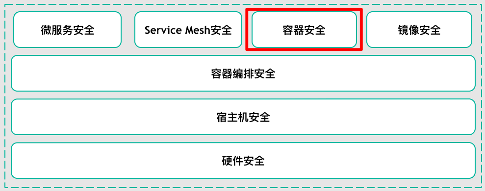
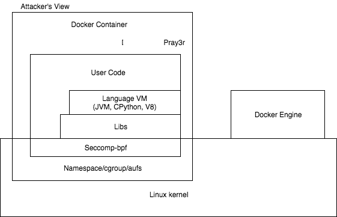
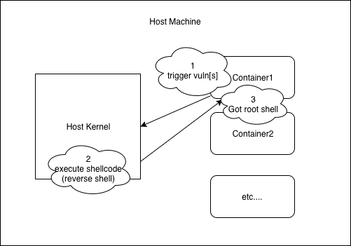
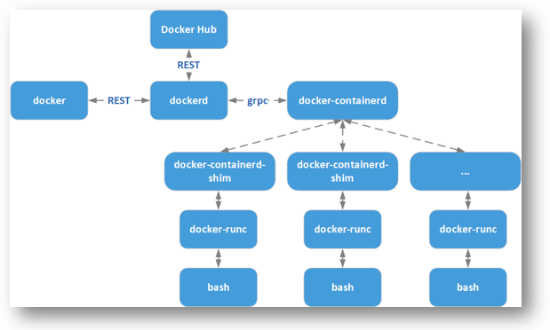

# 1.1.1 概述
> 云原生（Cloud Native）是一套技术体系和方法论，它由2个词组成，云（Cloud）和原生（Native）。云（Cloud）表示应用程序位于云中，而不是传统的数据中心；原生（Native）表示应用程序从设计之初即考虑到云的环境，原生为云而设计，在云上以最佳状态运行，充分利用和发挥云平台的弹性和分布式优势。
>
> 云原生的代表技术包括容器、服务网格（Service Mesh）、微服务（Microservice）、不可变基础设施和声明式API。

> 将“云原生安全”抽象成如上图所示的技术沙盘。自底向上看，底层从硬件安全（可信环境）到宿主机安全 。将容器编排技术（Kubernetes等）看作云上的“操作系统”，它负责自动化部署、扩缩容、管理应用等。在它之上由微服务、Service Mesh、容器技术（Docker等）、容器镜像（仓库）组成。它们之间相辅相成，以这些技术为基础构建云原生安全。
>
> 我们再对容器安全做一层抽象，又可以看作构建时安全（Build）、部署时安全（Deployment）、运行时安全（Runtime）。
>
> 在美团内部，镜像安全由容器镜像分析平台保障。它以规则引擎的形式运营监管容器镜像，默认规则支持对镜像中Dockerfile、可疑文件、敏感权限、敏感端口、基础软件漏洞、业务软件漏洞以及CIS和NIST的最佳实践做检查，并提供风险趋势分析，同时它确保部分构建时安全。 
> 容器在云原生架构下由容器编排技术（例如Kubernetes）负责部署，部署安全同时也与上文提及的容器编排安全有交集。

### 安全实施三阶段
- 攻击前：裁剪攻击面，减少对外暴露的攻击面（本文涉及的场景关键词：隔离）；
-  攻击时：降低攻击成功率（本文涉及的场景关键词：加固）；
-  攻击后：减少攻击成功后攻击者所能获取的有价值的信息、数据以及增加留后门的难度等。
> 近些年，数据中心的基础架构逐渐从传统的虚拟化（例如KVM+QEMU架构）转向容器化（Kubernetes+Docker架构），但“逃逸”始终都是企业要在这2种架构下所面对的最严峻的安全问题，同时它也是容器风险中最具代表性的安全问题。笔者将以容器逃逸为切入点，从攻击者角度（容器逃逸）到防御者角度（缓解容器逃逸）来阐述容器安全的实践，从而缓解容器风险。

### 容器风险
> 容器提供了将应用程序的代码、配置、依赖项打包到单个对象的标准方法。容器建立在两项关键技术之上：Linux Namespace和Linux Cgroups。 
> Namespace创建一个近乎隔离的用户空间，并为应用程序提供系统资源（文件系统、网络栈、进程和用户ID）。Cgroup强制限制硬件资源，如CPU、内存、设备和网络等。 
> 容器和VM不同之处在于，VM模拟硬件系统，每个VM都可以在独立环境中运行OS。管理程序模拟CPU、内存、存储、网络资源等，这些硬件可由多个VM共享多次。

> 容器一共有7个攻击面：Linux Kernel、Namespace/Cgroups/Aufs、Seccomp-bpf、Libs、Language VM、User Code、Container(Docker) engine。

**以容器逃逸为风险模型，提炼出3个攻击面：**
- Linux内核漏洞
- 容器自身
- 不安全部署、配置

### 1、Linux内核漏洞
> 容器的内核与宿主内核共享，使用Namespace与Cgroups这两项技术，使容器内的资源与宿主机隔离，所以Linux内核产生的漏洞能导致容器逃逸。

- **内核提权VS容器逃逸**
- **通用Linux内核提权方法论**

- 信息收集：收集一切对写exploit有帮助的信息。 如：内核版本，需要确定攻击的内核是什么版本？ 这个内核版本开启了哪些加固配置？ 还需知道在写shellcode的时候会调用哪些内核函数？这时候就需要查询内核符号表，得到函数地址。 还可从内核中得到一些对编写利用有帮助的地址信息、结构信息等等。

- 触发阶段：触发相关漏洞，控制RIP，劫持内核代码路径，简而言之，获取在内核中任意执行代码的能力。
- 布置shellcode：在编写内核exploit代码的时候，需要找到一块内存来存放我们的shellcode 。 这块内存至少得满足两个条件：
    - 第一：在触发漏洞时，我们要劫持代码路径，必须保证代码路径可以到达存放shellcode的内存。 
    - 第二：这块内存是可以被执行的，换句话说，存放shellcode的这块内存具有可执行权限。

- 执行阶段
    - 第一：获取高于当前用户的权限，一般我们都是直接获取root权限，毕竟它是Linux中的最高权限，也就是执行我们的shellcode。  
    - 第二：保证内核稳定，不能因为我们需要提权而破坏原来内核的代码路径、内核结构、内核数据等等，而导致内核崩溃。这样的话，即使得到root权限也没有太大的意义。
      简而言之，收集对编写exploit有帮助的信息，然后触发漏洞去执行特权代码，达到提权的效果。

    
> 容器逃逸和内核提权只有细微的差别，需要突破namespace的限制。将高权限的namespace赋到exploit进程的task_struct中。这部分的详细技术细节不在本文讨论范围内，笔者未来会抽空再写一篇关于容器逃逸的技术文章，详细介绍该相关技术的细节。
> 
### 2、容器安全

Docker本身由Docker（Docker Client）和Dockerd（Docker Daemon）组成。但从Docker 1.11开始，Docker不再是简单的通过Docker Dameon来启动，而是集成许多组件，包括containerd、runc等等。

Docker Client是Docker的客户端程序，用于将用户请求发送给Dockerd。Dockerd实际调用的是containerd的API接口，containerd是Dockerd和runc之间的一个中间交流组件，主要负责容器运行、镜像管理等。containerd向上为Dockerd提供了gRPC接口，使得Dockerd屏蔽下面的结构变化，确保原有接口向下兼容；向下，通过containerd-shim与runc结合创建及运行容器。更多的相关内容，请参考文末链接runc、containerd、architecture。了解清楚这些之后，我们就可以结合自身的安全经验，从这些组件相互间的通信方式、依赖关系等寻找能导致逃逸的漏洞。

下面我们以Docker中的runc组件所产生的漏洞来说明因容器自身的漏洞而导致的逃逸。

CVE-2019-5736：runc - container breakout vulnerability

runc在使用文件系统描述符时存在漏洞，该漏洞可导致特权容器被利用，造成容器逃逸以及访问宿主机文件系统；攻击者也可以使用恶意镜像，或修改运行中的容器内的配置来利用此漏洞。

- **攻击方式1：**（该途径需要特权容器）运行中的容器被入侵，系统文件被恶意篡改 ==> 宿主机运行docker exec命令，在该容器中创建新进程 ==> 宿主机runc被替换为恶意程序 ==> 宿主机执行docker run/exec 命令时触发执行恶意程序；
- **攻击方式2：**（该途径无需特权容器）docker run命令启动了被恶意修改的镜像 ==> 宿主机runc被替换为恶意程序 ==> 宿主机运行docker run/exec命令时触发执行恶意程序。

当runc在容器内执行新的程序时，攻击者可以欺骗它执行恶意程序。通过使用自定义二进制文件替换容器内的目标二进制文件来实现指回runc二进制文件。

如果目标二进制文件是/bin/bash，可以用指定解释器的可执行脚本替换#!/proc/self/exe。因此，在容器内执行/bin/bash，/proc/self/exe的目标将被执行，将目标指向runc二进制文件。

然后攻击者可以继续写入/proc/self/exe目标，尝试覆盖主机上的runc二进制文件。这里需要使用O_PATH flag打开/proc/self/exe文件描述符，然后以O_WRONLY flag 通过/proc/self/fd/重新打开二进制文件，并且用单独的一个进程不停地写入。当写入成功时，runc会退出。

### 3、不安全部署（配置）
在实际中，我们经常会遇到这种状况：不同的业务会根据自身业务需求提供一套自己的配置，而这套配置并未得到有效的管控审计，使得内部环境变得复杂多样，无形之中又增加了很多风险点。最常见的包括：

特权容器或者以root权限运行容器；
不合理的Capability配置（权限过大的Capability）。
面对特权容器，在容器内简单地执行一下命令，就可以轻松地在宿主机上留下后门：

### 相关资料
- [下载地址](https://tech.meituan.com/2020/03/12/cloud-native-security.html)

---
- 作者：face
- Github地址：https://github.com/facehai/thinking-framework-master
- 版权声明：著作权归作者所有，商业转载请联系作者获得授权，非商业转载请注明出处。
