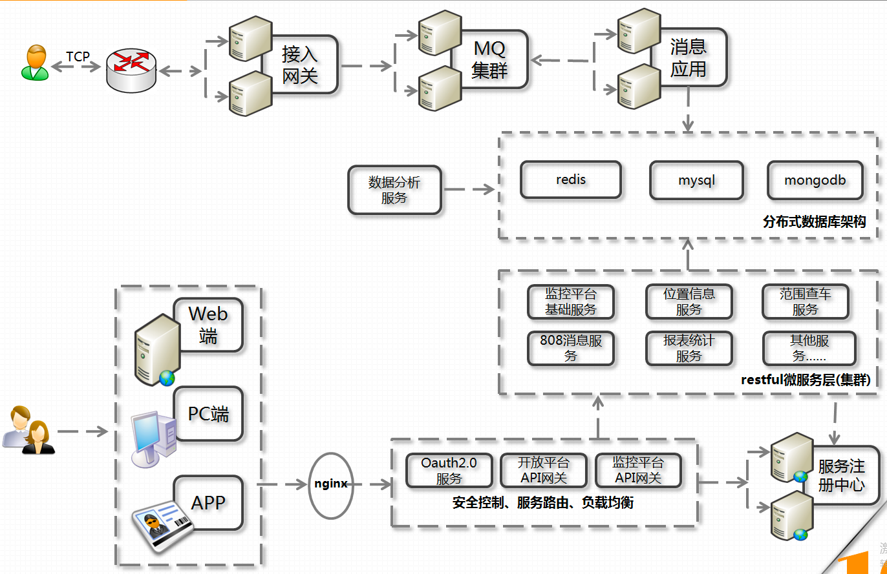

# 1.1.1 车载物联网架构
> **物联网**平台基于（《JT/T808-2011道路运输车辆卫星定位系统终端通讯协议及数据格式》以及《JT/T808-2013道路运输车辆卫星定位系统北斗兼容车载终端通讯协议技术规范》）通讯协议上构建，适用于物联网（车联网）领域应用，特别是基于交通部808协议或者其扩展协议的智能终端监控平台，是一个分布式、高可用、高并发、开放性（服务化，插件式）平台。

### 关键技术
- **长连接**
- **微服务**
- **协议栈**
- **云计算**

### 基础功能
- 1、车载终端网关采用mina/netty spring架构，独立于其他应用，主要负责维护接入终端的tcp链接、上行以及下行消息的解码、编码、流量控制，黑白名单等安全控制，网关同时支持交通部JT/T808-2011、JT/T808-2013两个版本全部的808协议，网关应用提供二次开发接口，支持以插件形式协议扩展而不需要改动任何原有代码。接入网关采用json消息通过MQ消息队列与业务平台进行交互，支持ActiveMQ和RabbitMQ，能够无缝接入各种异构系统。
本网关应用已历经并通过多次交通部部标的检测，性能稳定，适用于物联网（车联网）领域应用，特别是基于交通部808协议或者其扩展协议的智能终端监控平台，如车辆GPS定位监控平台。经测试在普通pc机上，单个网关应用至少可支持同时1w以上终端同时在线，具备至少600wGPS数据/小时的数据处理能力（见附件性能测试报告）。
本网关可水平扩展成支持高可用高并发的分布式架构
- 2、上行消息处理服务，采用spring mysql redis mongoDB框架，是基于事件驱动的责任链设计模式处理终端上行消息、批量存储消息、发布终端重要消息（告警，上下线等）等平台业务处理，提供以插件形式消息处理二次开发接口而不需要改动任何原有代码，实现个性格业务处理能力。本服务可水平扩展成支持高可用高并发的分布式架构
- 3、平台服务层是基于spring-boot的微服务架构，同时集成了服务注册中心，接口网关，支持高并发高可用的分布式架构；底层封装了基于元数据的几大高度抽象的restful风格接口（包括CRUD接口、复杂查询接口、下发消息接口等个性化定制接口），业务系统无需再单独开发数据库相关操作的代码（增加新的数据库表只需要建立entity映射，即可实现增上改查等功能），只需关注业务逻辑开发即可。同时模块也提供提供二次开发接口，而不需要改动任何原有代码，实现个性格业务处理以及自定义接口能力。
- 4、展现层web端对JQuery EasyUI进行了二次封装，提供部分js常用组件，对于普通的CRUD操作只需按照模板开发相关的界面即可完美展现,web端同时集成了WDR对终端上下线、告警等重要信息实时推送提醒消息。
- 5、框架集成了redis缓存，通过简单的注解就能使用缓存；
- 6、在业务功能目前实现了：
    - a、支持JT/T808协议的全部指令，如拍照、文本下发、监听、点名等；
    - b、平台告警设置：原地设防、围栏告警（圆形、矩形、多边形）、超速告警；
    - c、车辆监控：区域查车、车辆上下线提示、告警实时提示、车辆实时跟踪、历史轨迹、油耗、里程等；
    - d、车辆管理：车辆信息维护、多媒体信息、上行消息、下行消息、告警查询等；
    - e、账号维护：企业注册、企业信息维护、修改密码等；
    - f、各种统计报表。
- 7、开放平台遵循标准oauth2.0，提供几大基于元数据的高度抽象的restful风格的增删改查数据接口以及部分个性化定制的业务接口；开放平台支持接口调用频率控制（基于令牌桶算法），支持ip黑白名单、接口调用权限等功能。

---
- 作者：face
- Github地址：https://github.com/facehai/thinking-framework-master
- 版权声明：著作权归作者所有，商业转载请联系作者获得授权，非商业转载请注明出处。
