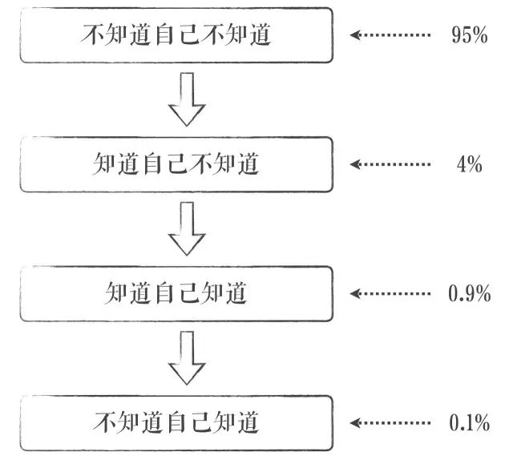
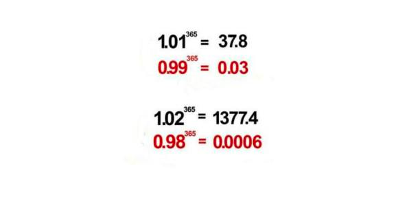
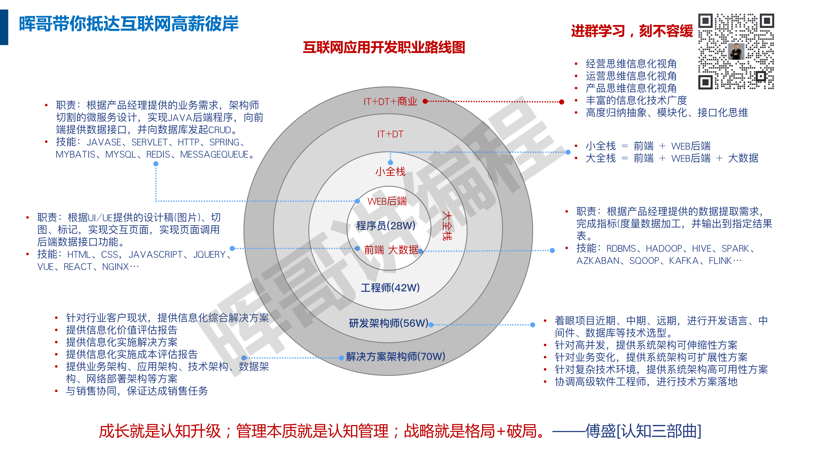

# thinking-framework-master

### 一、《人人都是架构师》
> 虽然每个人都可以做架构，但是架构师是需要的，因为需要有人专门处理冲突，做出最合适组织的架构决定。
> 架构师只是一个头衔，只在有规模的软件开发组织里才有存在的意义，越是大型的组织，需要考虑的方面越多，不光是技术方面，还有人事方面、利益方面、蛋糕分割方面……

### 二、认知四种境界

> **不知道自己不知道** —— 以为自己什么都知道，自以为是的认知状态。 
> **知道自己不知道** —— 有敬畏之心，开始空杯心态，准备丰富自己的认知。 
> **知道自己知道** —— 抓住了事情的规律，提升了自己的认知。 
> **不知道自己知道** —— 永远保持空杯心态，认知的最高境界。 

### 三、临渊羡鱼不如退而结网
> **杞人忧天，不如防微杜渐**  
**身心交瘁，不如以逸待劳**  
**捶胸顿足，不如亡羊补牢**  
**纸上谈兵，不如现身说法**  
**画蛇添足，不如适可而止**  
**固步自封/墨守成规/恪守不渝，不如出奇制胜**  
**合抱之木，生于毫末**  
**九层之台，起于累土**  
**千里之行, 始于足下**  
**心动不如行动**  
**罗马不是一天建成的**  
**绳锯木断，水滴石穿**  
**扬汤止沸,不如釜底抽薪**  
**坐以待毙，不如誓死一搏**  

### 四、三人行必有我师焉
> **三人行，必有我师焉。择其善者而从之，其不善者而改之**

### 五、你只管努力

> **与时俱进，不进则退。请警惕，每天只比你努力一点点的人，其实，已经甩你太远**

> 1.01的365次方=37.78343433289 >1  
> 1.01=1 0.01  
> 也就是每天进步一点。1.01的365次方也就是说你每天进步一点点，一年以后，你将进步很大，远远大于“1”

> 1的365次方=1  
> 1是指原地踏步，一年以后你还是原地踏步  

> 0.99的365次方= 0.02551796445229 <1  
> 0.99=1-0.01  
> 也就是说你每天退步一点点，你将在一年以后，远远小于“1”，远远被人抛在后面，将会是“1”事无成  

>**每天进步一点点，拥抱幸福是必然；** 
**每天进步一点点，成长足迹看得见；** 
**每天进步一点点，波折烦恼都不见；** 
**每天进步一点点，前进不止一小点；** 
**每天进步一点点，努力就会到终点；** 
**每天进步一点点，理想终会被实现；** 
**每天进步一点点，目标距离缩小点；** 
**每天进步一点点，成功就会在眼前；** 
**每天进步一点点，生活幸福比蜜甜；** 
**每天进步一点点，一切都会圆满点。** 

### 六、目录
<table>
  <tr>
    <td>第一章: JAVA架构师</td>
    <td><a href="#">JAVA架构师</a></td>
  </tr>
  <tr>
    <td>第二章: Python全栈</td>
    <td><a href="#">Python全栈</a></td>
  </tr>
  <tr>
    <td>第三章: GO编程</td>
    <td><a href="#">GO编程</a></td>
  </tr>
  <tr>
    <td>第四章: 数据挖掘</td>
    <td><a href="#">数据挖掘</a></td>
  </tr>
  <tr>
    <td>第五章: AI智能</td>
    <td><a href="#">AI智能</a></td>
  </tr>
  <tr>
    <td>第六章: 云原生</td>
    <td><a href="#">云原生</a></td>
  </tr>
  <tr>
    <td>第七章: 物联网</td>
    <td><a href="#">物联网</a></td>
  </tr>
  <tr>
    <td>第八章: 云计算</td>
    <td><a href="#">云计算</a></td>
  </tr>
  <tr>
    <td>第九章: 区块链</td>
    <td><a href="#">区块链</a></td>
  </tr>
  <tr>
    <td>第十章: 运维工程师</td>
    <td><a href="#">运维工程师</a></td>
  </tr>

  <tr>
    <td>第十一章: 元宇宙</td>
    <td><a href="#">元宇宙</a></td>
  </tr>
  <tr>
    <td>第十二章: WEB3.0</td>
    <td><a href="#">WEB3.0</a></td>
  </tr>
  <tr>
    <td>第一百章: 哲学智慧</td>
    <td><a href="#">哲学智慧</a></td>
  </tr>
</table>

### 七、百万年薪同心圆方法论

**1、道、法、术、器**

职业规律

无中生有

上善若水

道法自然

有道无术

有术无道止与术

为学日益，为道日损。损之又损，以至于无为。无为而无不为。

**2、愚者图其名，智者图其实**

   SSD、SAS、SATA、ESBI
1. 着眼项目近期、中期、远期，进行开发语言、中间件、数据库等技术选型
2. 针对高并发，提供系统架构可伸缩性方案
3. 针对业务变化，提供系统架构可扩展性方案
4. 针对复杂技术环境，提供系统架构高可用性方案
5. 协调高级软件工程师，进行技术方案落地

**3、智慧锦囊**

锦囊1：不谋全局者不足谋一域

锦囊2：不谋万世者不足谋一时

锦囊3：天予弗取反受其咎，时至不行必受其殃

------

## 联系方式

* Github: <https://github.com/facehai/thinking-framework-master>

------