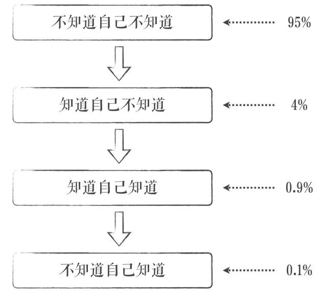
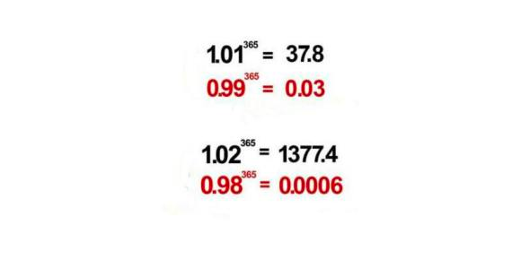

# thinking-framework-master

### 一、《人人都是架构师》
> 个人技术学习笔记 参考多个学习资源 包含个人理解与总结 不能保证完全专业正确性 如有错误欢迎提出 期待您的补充贡献！
- 致大师：致自己

### 二、《境界》

> **这是一个人认知的四种状态，也是人的四种境界。** 
> **不知道自己不知道** —— 以为自己什么都知道，自以为是的认知状态。 
> **知道自己不知道** —— 有敬畏之心，开始空杯心态，准备丰富自己的认知。 
> **知道自己知道** —— 抓住了事情的规律，提升了自己的认知。 
> **不知道自己知道** —— 永远保持空杯心态，认知的最高境界。 
现在我终于意识到，人和人根本的区别就在于这四种状态。

### 三、临渊羡鱼不如退而结网
> **杞人忧天，不如防微杜渐**  
**身心交瘁，不如以逸待劳**  
**捶胸顿足，不如亡羊补牢**  
**纸上谈兵，不如现身说法**  
**画蛇添足，不如适可而止**  
**固步自封/墨守成规/恪守不渝，不如出奇制胜**  
**合抱之木，生于毫末**  
**九层之台，起于累土**  
**千里之行, 始于足下**  
**心动不如行动**  
**罗马不是一天建成的**  
**绳锯木断，水滴石穿**  
**扬汤止沸,不如釜底抽薪**  
**坐以待毙，不如誓死一搏**  

### 四、三人行必有我师焉
> **三人行，必有我师焉。择其善者而从之，其不善者而改之**

### 五、你只管努力

> **与时俱进，不进则退。请警惕，每天只比你努力一点点的人，其实，已经甩你太远**

> 1.01的365次方=37.78343433289 >1  
> 1.01=1 0.01，也就是每天进步一点。1.01的365次方也就是说你每天进步一点点，一年以后，你将进步很大，远远大于“1”

> 1的365次方=1  
> 1是指原地踏步，一年以后你还是原地踏步  

> 0.99的365次方= 0.02551796445229 <1  
> 0.99=1-0.01，也就是说你每天退步一点点，你将在一年以后，远远小于“1”，远远被人抛在后面，将会是“1”事无成  

>**每天进步一点点，拥抱幸福是必然；** 
**每天进步一点点，成长足迹看得见；** 
**每天进步一点点，波折烦恼都不见；** 
**每天进步一点点，前进不止一小点；** 
**每天进步一点点，努力就会到终点；** 
**每天进步一点点，理想终会被实现；** 
**每天进步一点点，目标距离缩小点；** 
**每天进步一点点，成功就会在眼前；** 
**每天进步一点点，生活幸福比蜜甜；** 
**每天进步一点点，一切都会圆满点。** 

### 六、目录
<table>
  <tr>
    <td>第 1 章: JAVA架构师</td>
    <td><a href="#">JAVA架构师</a></td>
  </tr>
  <tr>
    <td>第 2 章: Python全栈</td>
    <td><a href="#">Python全栈</a></td>
  </tr>
  <tr>
    <td>第 3 章: GO编程</td>
    <td><a href="#">GO编程</a></td>
  </tr>
  <tr>
    <td>第 4 章: 数据挖掘</td>
    <td><a href="#">数据挖掘</a></td>
  </tr>
  <tr>
    <td>第 5 章: AI智能</td>
    <td><a href="#">AI智能</a></td>
  </tr>
  <tr>
    <td>第 6 章: 云原生</td>
    <td><a href="#">云原生</a></td>
  </tr>
  <tr>
    <td>第 7 章: 物联网</td>
    <td><a href="#">物联网</a></td>
  </tr>
  <tr>
    <td>第 8 章: 云计算</td>
    <td><a href="#">云计算</a></td>
  </tr>
  <tr>
    <td>第 9 章: 区块链</td>
    <td><a href="#">区块链</a></td>
  </tr>
  <tr>
    <td>第 10 章: 运维工程师</td>
    <td><a href="#">运维工程师</a></td>
  </tr>
</table>

### 三、推荐资源
- [Google机器学习速成课程](https://developers.google.cn/machine-learning/crash-course/)
- [斯坦福大学公开课-机器学习的动机与应用 讲师：Andrew Ng](http://open.163.com/movie/2008/1/M/C/M6SGF6VB4_M6SGHFBMC.html)
- [吴恩达机器学习](https://study.163.com/course/courseMain.htm?courseId=1004570029)

### 四、参考
- 百度百科、维基百科
- [AiLearning](https://github.com/apachecn/AiLearning)
- 引用相关大佬前辈
    - [吴恩达 Andrew Ng](https://baike.baidu.com/item/%E5%90%B4%E6%81%A9%E8%BE%BE/9465313)