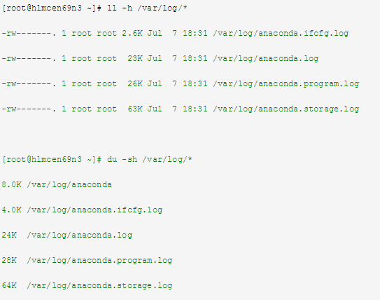
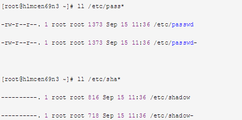
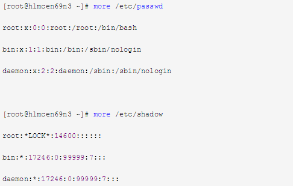
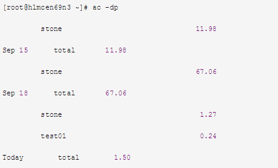
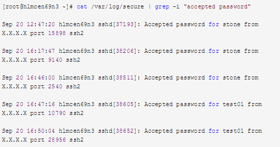
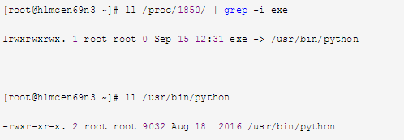
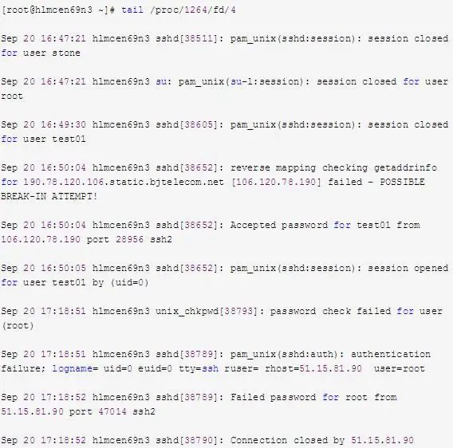
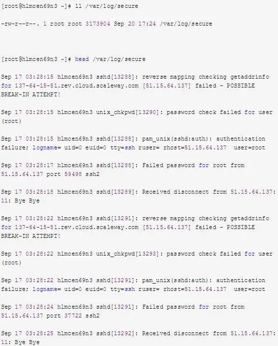

# 第一章 JAVA架构师
- ## 第10章 运维工程师

------
## 目录
- [第一章 - JAVA架构师](JAVA架构师.md)
- [第二章 - python全栈](python全栈.md)
- [第三章 – GO编程](GO编程.md)
- [第四章 – 大数据](大数据.md)
- [第五章 – AI智能](AI智能.md)
- [第六章 – 云原生](云原生.md)
- [第七章 – 物联网](物联网.md)
- [第八章 - 云计算](云计算.md)
- [第九章 - 区块链](区块链.md)
- [第十章 - 运维工程师](运维工程师.md)
- [第十一章 - 元宇宙](元宇宙.md)
- [第十二章 - WEB3.0](WEB3.0.md)
------

随着开源产品的越来越盛行，作为一个Linux运维工程师，能够清晰地鉴别异常机器是否已经被入侵了显得至关重要，个人结合自己的工作经历，整理了几种常见的机器被黑情况供参考：
背景信息：以下情况是在CentOS 6.9的系统中查看的，其它Linux发行版类似。

## 1.入侵者可能会删除机器的日志信息
> 可以查看日志信息是否还存在或者是否被清空，相关命令示例：

## 2.入侵者可能创建一个新的存放用户名及密码文件
可以查看/etc/passwd及/etc/shadow文件，相关命令示例：

## 3.入侵者可能修改用户名及密码文件
可以查看/etc/passwd及/etc/shadow文件内容进行鉴别，相关命令示例：

## 4.查看机器最近成功登陆的事件和最后一次不成功的登陆事
对应日志“/var/log/lastlog”，相关命令示例：

    
## 5.查看机器当前登录的全部用户
对应日志文件“/var/run/utmp”，相关命令示例：

## 6.查看机****器创建以来登陆过的用户
对应日志文件“/var/log/wtmp”，相关命令示例：

## 7.查看机器所有用户的连接时间（小时）
对应日志文件“/var/log/wtmp”，相关命令示例：

## 8.如果发现机器产生了异常流量
可以使用命令“tcpdump”抓取网络包查看流量情况或者使用工具”iperf”查看流量情况

## 9.可以查看/var/log/secure日志文件
尝试发现入侵者的信息，相关命令示例：

## 10.查询异常进程所对应的执行脚本文件
a.top命令查看异常进程对应的PID

b.在虚拟文件系统目录查找该进程的可执行文件

## 11.如果确认机器已被入侵，重要文件已被删除，可以尝试找回被删除的文件Note:
1. 当进程打开了某个文件时，只要该进程保持打开该文件，即使将其删除，它依然存在于磁盘中。这意味着，进程并不知道文件已经被删除，它仍然可以向打开该文件时提供给它的文件描述符进行读取和写入。除了该进程之外，这个文件是不可见的，因为已经删除了其相应的目录索引节点。
2. 在/proc 目录下，其中包含了反映内核和进程树的各种文件。/proc目录挂载的是在内存中所映射的一块区域，所以这些文件和目录并不存在于磁盘中，因此当我们对这些文件进行读取和写入时，实际上是在从内存中获取相关信息。大多数与 lsof 相关的信息都存储于以进程的 PID 命名的目录中，即 /proc/1234 中包含的是 PID 为 1234 的进程的信息。每个进程目录中存在着各种文件，它们可以使得应用程序简单地了解进程的内存空间、文件描述符列表、指向磁盘上的文件的符号链接和其他系统信息。lsof 程序使用该信息和其他关于内核内部状态的信息来产生其输出。所以lsof 可以显示进程的文件描述符和相关的文件名等信息。也就是我们通过访问进程的文件描述符可以找到该文件的相关信息。
3. 当系统中的某个文件被意外地删除了，只要这个时候系统中还有进程正在访问该文件，那么我们就可以通过lsof从/proc目录下恢复该文件的内容。
假设入侵者将/var/log/secure文件删除掉了，尝试将/var/log/secure文件恢复的方法可以参考如下：

a.查看/var/log/secure文件，发现已经没有该文件

b.使用lsof命令查看当前是否有进程打开/var/log/secure，

c.从上面的信息可以看到 PID 1264（rsyslogd）打开文件的文件描述符为4。同时还可以看到/var/log/ secure已经标记为被删除了。因此我们可以在/proc/1264/fd/4（fd下的每个以数字命名的文件表示进程对应的文件描述符）中查看相应的信息，如下：

从上面的信息可以看出，查看/proc/1264/fd/4就可以得到所要恢复的数据。如果可以通过文件描述符查看相应的数据，那么就可以使用I/O重定向将其重定向到文件中，如:

再次查看/var/log/secure，发现该文件已经存在。对于许多应用程序，尤其是日志文件和数据库，这种恢复删除文件的方法非常有用。

---
- 作者：face
- Github地址：https://github.com/facehai/thinking-framework-master
- 版权声明：著作权归作者所有，商业转载请联系作者获得授权，非商业转载请注明出处。
