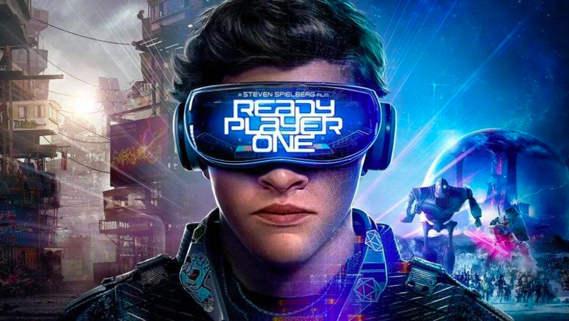
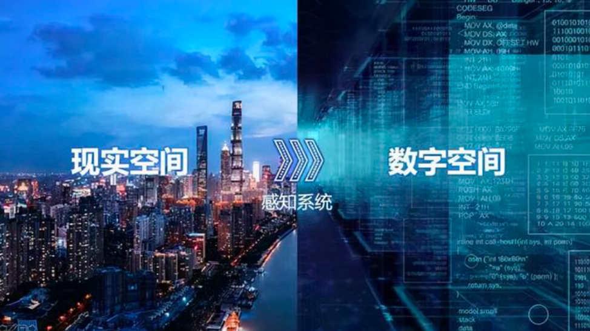
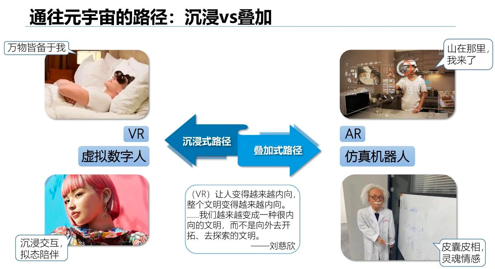
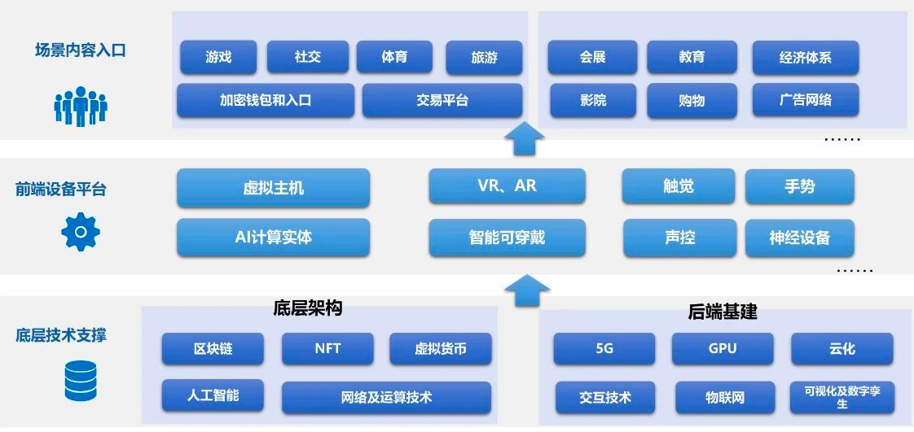
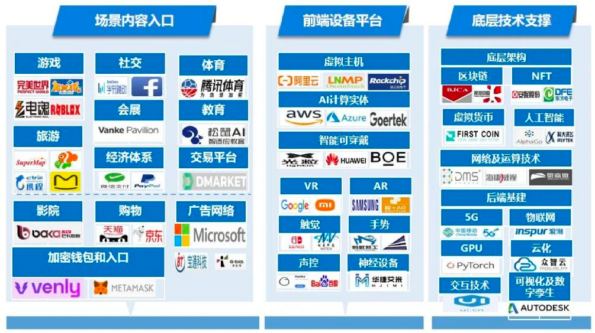

# 第十一章 元宇宙

------
## 目录
- [第一章 - JAVA架构师](JAVA架构师.md)
- [第二章 - python全栈](python全栈.md)
- [第三章 – GO编程](GO编程.md)
- [第四章 – 大数据](大数据.md)
- [第五章 – AI智能](AI智能.md)
- [第六章 – 云原生](云原生.md)
- [第七章 – 物联网](物联网.md)
- [第八章 - 云计算](云计算.md)
- [第九章 - 区块链](区块链.md)
- [第十章 - 运维工程师](运维工程师.md)
- [第十一章 - 元宇宙](11.1初识元宇宙.md)
- [第十二章 - WEB3.0](WEB3.0.md)
------

对于元宇宙，在FaceBook改名为Meta后又加速带火了元宇宙这个概念。所以现在谈数字化转型好像都不流行的，当下最热的就是元宇宙。

## 1.1 概述
### 元宇宙是什么？
在清华大学这份研究报告里面，实际给元宇宙这个概念一个简单的定义：
> 元宇宙是整合了多种新技术而产生的新型虚实相容的互联网应用和社会形态，它基于扩展现实技术来提供沉浸式体验，基于数字孪生技术来生成现实世界的镜像，基于区块链技术来搭建数字经济，将虚拟世界和现实世界在经济系统，社交系统，身份系统上密切融合，并且允许每个用户进行内容生成和世界编辑。

这个概念实际还是相对准确的。

在谈企业数字化转型的核心内在逻辑的时候，我就谈到了核心是在解决现实世界和抽象世界之间的高度融合统一问题，对于云计算，5G，物联网，数字孪生，区块链等都是关键的支撑技术。

如果要谈区别一定要注意一个关键点。就是元宇宙搭建了一个现实世界和虚拟世界共存的社会形态和生态系统。

现实世界和虚拟世界可以是依赖关系，同时也可以是完全独立平行的两个世界。现实世界你可能是一个穷光蛋，但是并不影响你在虚拟世界可以是一个富豪，能够享受各种虚拟世界里面的精神体验。

虚拟世界既是现实世界的一个镜像，但是由于虚拟世界也打造了完全可以独立运行的社会形态和经济系统，有自己的运作规则和逻辑。因此元宇宙不是简单的虚拟世界，而是虚拟世界和现实世界的融合统一。

在元宇宙概念火爆的时候，从投资和股票市场可以看到，最先操作的是VR，AR公司，是提供图形算力的显卡公司，是做类似SecongLift游戏的公司。但是实际VR，虚拟游戏离真正的元宇宙这个概念还差得远，其关键还是能够形成一个独立运行的经济系统和生态系统。

## 1.2 虚拟和现实的关系

在这里先看下虚拟现实补偿论，即人在现实世界所缺失的，将努力在虚拟世界进行补偿；在有可能的时候，他会在现实世界实现虚拟世界中的补偿。

也正是有了这个理论支撑，才出现了对整个现实世界进行模拟和仿真的虚拟世界创造论。

基于这样的“虚拟现实补偿论”，才有了Nick Bostrom、Elon Musk等人相信的“世界模拟”论——假定一个文明为了得到补偿而创造虚拟世界的冲动是永恒的，那么在长时段的发展中就必然会创造出一个个虚拟世界，其自身所处的世界也极有可能是上层设计者打造的。

布希亚区分了人类仿真历史的三个阶段：第一个阶段是仿造，认为现实世界中才有价值，虚构活动要模拟、复制和反映自然。真实与它的仿造物泾渭分明。第二个阶段是生产，价值受市场规律支配，目的是盈利，大规模生产出来的仿造物与真实的摹本成为平等关系。

第三个阶段是仿真，在此阶段，拟像创造出了“超现实”，且把真实同化于它的自身之中，二者的界限消失。作为模仿对象的真实已经不存在，仿造物成为了没有原本的东西的摹本，幻觉与现实混淆。

元宇宙正是第三阶段的仿真，元宇宙向人们提供可以活出另一种人生的虚拟世界。

注意这个虚拟世界有完整独立的运行体系，社交体系，经济体系和生态结构。除游戏外，你还可以进行社交，商品买卖，休闲娱乐等各种活动。

虚拟世界既相当独立，又可以和现实世界融为一体，形成一种超现实能力。而类似VR，AR等各种设备就成为了虚拟和现实之间的一个关键连接媒介。比如你本来是在跑步机上跑步，但是通过VR等设备，完全可以模拟高仿真的你在海边，森林跑步的场景。

## 1.3 元宇宙的理论框架

对于清华大学这个PPT材料，关于理论框架这块实际讲解得不算太好。

如果简单来讲就是万物皆可模拟和仿真，虚拟世界可以完全独立现实世界而存在。抽象的虚拟世界可以具备独立的经济系统，社会系统，组织和社交体系，安全法规体系等。

万物即可抽象和模拟。

对于人类来说，除了一副皮囊外，其余均可以在原始宇宙中完成。

科学的进步，文明的发展，人类不断地理解自然和改造自然。但是最终还是体现在自身的物质文明和精神文明两类欲望上。

对物质的欲望发展到最极致，那么物理存在的人仅仅需要的是营养液的补给。而对于精神文明，各类文明，艺术，文化，音乐等更是可以在虚拟世界中创造和满足。

你会发现在现实世界中很多欲望的满足实际上是可被替代的。

从极致的发展来说，地球的资源总有耗尽的时候，那么是否就会真正进入到一种低消耗，低欲望的现实世界，而所有的欲望满足全部迁移到虚拟世界中完成。

如果按这个目标，经济系统，安全法规等构建对元宇宙本身可持续发展才启动关键作用。

## 1.4 元宇宙的产业生态

在我谈数字化的时候谈到一个观点，元宇宙本身就是数字化发展的一个终极形态，实现现实世界和抽象世界的高度融合统一。

元宇宙不是一个企业的数字化转型，而是个人，社会，国家乃至整个世界的完全数字化。

当前元宇宙的产业链时间包括了底层技术支撑，前端设备平台，场景内容入口三个部分。

对于底层技术支撑实际和我谈数字化时候谈的底层技术支撑能力基本一致，包括了物联网，5G，云计算，数字孪生，区块链，人工智能，底层AI芯片算力等。

而前端的场景入口，当前最先实现的就是游戏和社交，在元宇宙发展的终极阶段你会看到所有的类似体育，购物，电影，教育等将全部在虚拟世界中实现。虚拟世界作为可以独立运行的单元，本身就应该具备独立创造，独立自我进化的能力。

当然在前端场景和后端技术之间，一个关键还是类似VR，AR，声控，脑电波，可穿戴设备等各种中间衔接单元。而这块当前也是最近市场的主流特点。

从现实世界到虚拟世界，从物质世界到精神世界，从相互融合到平行世界，从依存文明到独立高级文明。在资源越来越缺乏的未来，随着虚拟世界对现实世界的不断仿真，复制，也随着虚拟世界构建的完全可以自我进化的社会系统和经济系统。元宇宙很可能是未来世界发展的一个终极形态。

---
- 作者：face
- Github地址：https://github.com/facehai/thinking-framework-master
- 版权声明：著作权归作者所有，商业转载请联系作者获得授权，非商业转载请注明出处。
