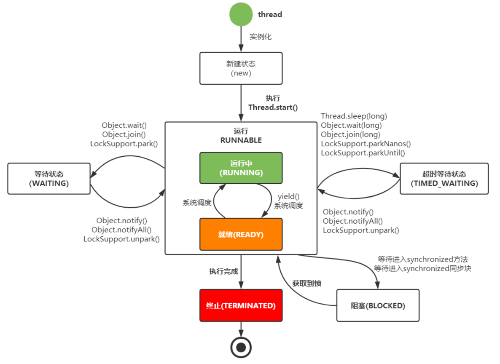
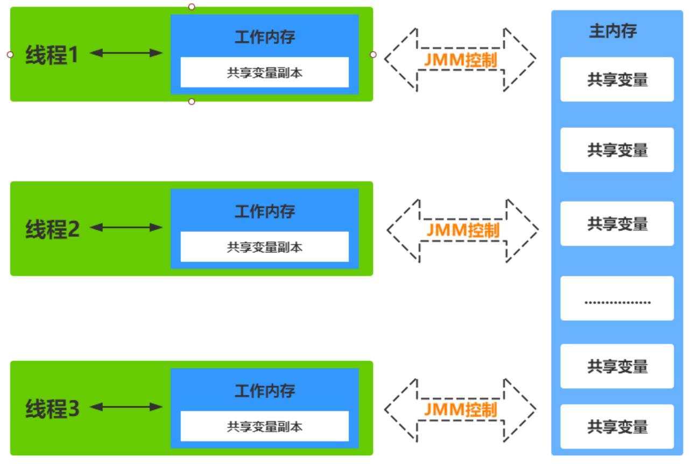
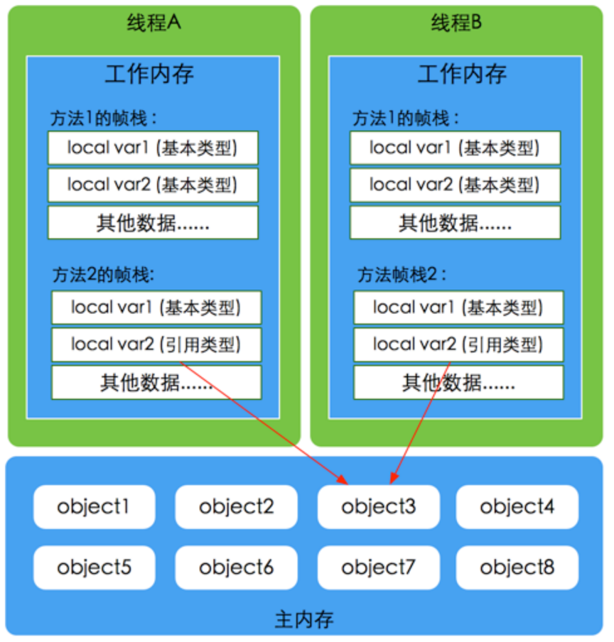
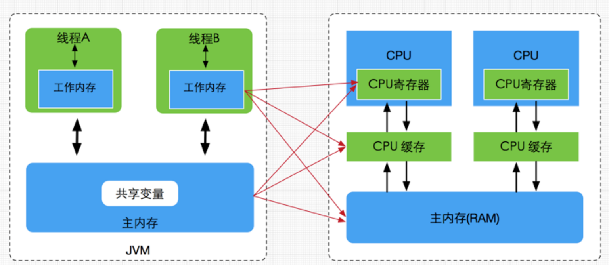

# 一、并发编程之线程

### 什么是线程
进程是系统分配资源的基本单位，线程是调度CPU的基本单位，一个进程至少包含一个执行线程，线程寄生在进程当中。
每个线程都有一个程序计数器（记录要执行的下一条指令），一组寄存器（保存当前线程的工作变量），堆栈（记录执行历史，其中每一帧保存了一个已经调用但未返回的过程）

**线程分为两类：**

1. 用户级线程(User-Level Thread)
2. 内核线线程(Kernel-Level Thread)

用户空间划分：
1. 内核空间
2. 用户空间

### Java线程生命状态

### 并发产生的问题
1. 高并发场景下，导致频繁的上下文切换
2. 临界区线程安全问题，容易出现死锁

### JMM模型

JMM与JVM内存区域的划分是不同的概念层次，更恰当说JMM描述的是一组规则，通过这组规则控制程序中各个变量在共享数据区域和私有数据区域的访问方式，JMM是围绕原子性，有序性、可见性展开。

### JVM虚拟机规范主内存与工作内存

### Java内存模型与硬件内存架构的关系

JMM模型跟CPU缓存模型结构类似，是基于CPU缓存模型建立起来的，JMM模型是标准化的，
屏蔽掉了底层不同计算机的区别。对于硬件内存来说只有寄存器、缓存内存、主内存的概念，并没有工作内存(线程私有数据区域)和主内存(堆内存)之分，也就是说Java内存模型对内存的划分对硬件内存并没有任何影响

### Java内存模型内存交互操作

- lock(锁定)：作用于主内存的变量，把一个变量标记为一条线程独占状态
- unlock(解锁)：作用于主内存的变量，把一个处于锁定状态的变量释放出来，释放后的变量才可以被其他线程锁定
- read(读取)：作用于主内存的变量，把一个变量值从主内存传输到线程的工作内存中，以便随后的load动作使用
- load(载入)：作用于工作内存的变量，它把read操作从主内存中得到的变量值放入工作内存的变量副本中
- use(使用)：作用于工作内存的变量，把工作内存中的一个变量值传递给执行引擎
- assign(赋值)：作用于工作内存的变量，它把一个从执行引擎接收到的值赋给工作内存的变量
- store(存储)：作用于工作内存的变量，把工作内存中的一个变量的值传送到主内存中，以便随后的write的操作
- write(写入)：作用于工作内存的变量，它把store操作从工作内存中的一个变量的值传送到主内存的变量中

### Java内存模型内存同步规则

- 不允许一个线程无原因地（没有发生过任何assign操作）把数据从工作内存同步回主内存中
- 一个新的变量只能在主内存中诞生，不允许在工作内存中直接使用一个未被初始化（load或者assign）的变量。即就是对一个变量实施use和store操作之前，必须先自行assign和load操作。
- 一个变量在同一时刻只允许一条线程对其进行lock操作，但lock操作可以被同一线程重复执行多次，多次执行lock后，只有执行相同次数的unlock操作，变量才会被解锁。lock和unlock必须成对出现。
- 如果对一个变量执行lock操作，将会清空工作内存中此变量的值，在执行引擎使用这个变量之前需要重新执行load或assign操作初始化变量的值。
- 如果一个变量事先没有被lock操作锁定，则不允许对它执行unlock操作；也不允许去unlock一个被其他线程锁定的变量。
- 对一个变量执行unlock操作之前，必须先把此变量同步到主内存中（执行store和write操作）

### volatile原理与内存语

- volatile是Java虚拟机提供的轻量级的同步机制
- volatile语义有如下两个作用
- 可见性：保证被volatile修饰的共享变量对所有线程总数可见的，也就是当一个线程修改了一个被volatile修饰共享变量的值，新值总是可以被其他线程立即得知。
- 有序性：禁止指令重排序优化。
- volatile缓存可见性实现原理
- JMM内存交互层面：volatile修饰的变量的read、load、use操作和assign、store、write必须是连续的，即修改后必须立即同步会主内存，使用时必须从主内存刷新，由此保证volatile变量的可见性。
底层实现：通过汇编lock前缀指令，它会锁定变量缓存行区域并写回主内存，这个操作称为“缓存锁定”，缓存一致性机制会阻止同时修改被两个以上处理器缓存的内存区域数据。一个处理器的缓存回写到内存内存会导致其他处理器的缓存无效

### 可见性&原子性&有序性

- 并发编程三大特性
- 可见性
- 原子性
- 有序性
- volatile保证可见性与有序性，但是不能保证原子性，要保证原子性需要借助synchronized、Lock锁机制，同理也能保证有序性与可见性。因为synchronized和Lock能够保证任一时刻只有一个线程访问该代码块。

### 有序性&指令重排

- java语言规范规定JVM线程内部维持顺序化语义。即只要程序的最终结果与它顺序化情况的结果相等，那么指令的执行顺序可以与代码顺序不一致，此过程叫指令的重排序。
- 指令重排序的意义：JVM能根据处理器特性（CPU多级缓存系统、多核处理器等）适当的对机器指令进行重排序，使机器指令能更符合CPU的执行特性，最大限度的发挥机器性能。
- 在编译器与CPU处理器中都能执行指令重排优化操作

---
- 作者：face
- 版权声明：著作权归作者所有，商业转载请联系作者获得授权，非商业转载请注明出处。
