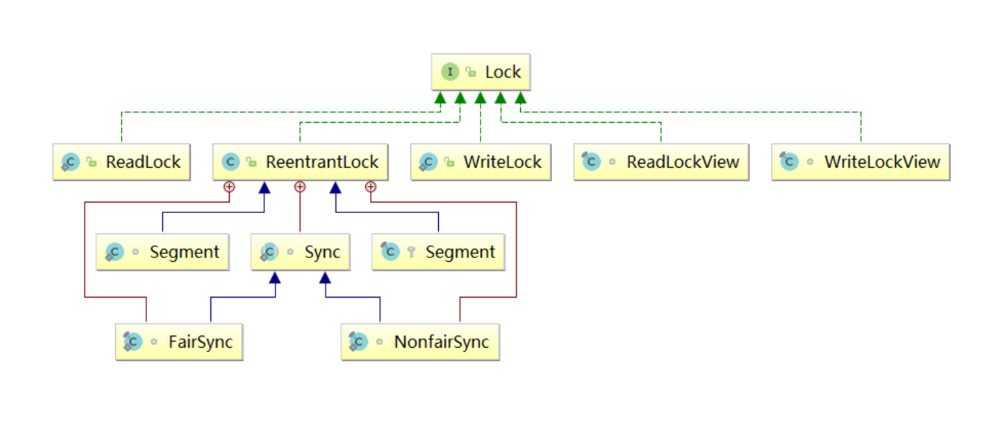

# 并发-锁

## Java锁体系
**加锁目的：**序列化访问临界资源，即同一时刻只能有一个线程访问临界资源(同步互斥访问)

## Java线程生命状态

## synchronized使用与原理
1. 加锁方式：
- ①.同步实例方法，锁是当前实例对象
- ②.同步类方法，锁是当前类对象
- ③.同步代码块，锁是括号里面的对象
2. 底层原理:
   JVM内置锁通过synchronized使用，通过内部对象Monitor(监视器锁)实现，基于进入与退出Monitor对象实现方法与
   代码块同步，监视器锁的实现依赖底层操作系统的Mutex lock（互斥锁）实现，它是一个重量级锁性能较低
   

## 对象内存结构

- 每个对象都有一个自己的Monitor(监视器锁)
- 认识对象的内存结构：
- 对象头：比如 hash码，对象所属的年代，对象锁，锁状态标志，偏向锁（线程）ID，偏向时间，数组长度（数组对象）等
- 对象实际数据：即创建对象时，对象中成员变量，方法等
- 对齐填充：对象的大小必须是8字节的整数倍

以32位JVM中存储内容为例

### JVM内置锁优化升级过程
- JDK1.6版本之后对synchronized的实现进行了各种优化，如自旋锁、偏向锁和轻量级锁
- 并默认开启偏向锁
- 开启偏向锁：-XX:+UseBiasedLocking -XX:BiasedLockingStartupDelay=0
- 关闭偏向锁：-XX:-UseBiasedLocking

### Lock

### 同步框架AbstractQueuedSynchronizer
Java并发编程核心在于java.concurrent.util包
而juc当中的大多数同步器实现都是围绕着共同的基础行为，比如等待队列、条件队列、独占获取、共享获取等，而这个行为的抽象就是基于AbstractQueuedSynchronizer简称AQS，AQS定义了一套多线程访问共享资源的同步器框架，是一个依赖状态(state)的同步器。
- AQS具备特性
- 阻塞等待队列
- 共享/独占
- 公平/非公平
- 可重入
- 允许中断

## 并发编程包依赖于AQS的内部实现

- Java.concurrent.util当中同步器的实现如Lock,Latch,Barrier等，都是基于AQS框架实现
- 一般通过定义内部类Sync继承AQS
- 将同步器所有调用都映射到Sync对应的方法
- AQS框架-管理状态
- AQS内部维护属性volatile int state (32位)
- state表示资源的可用状态
- State三种访问方式
- getState()、setState()、compareAndSetState()
- AQS定义两种资源共享方式
- Exclusive-独占，只有一个线程能执行，如ReentrantLock
- Share-共享，多个线程可以同时执行，如Semaphore/CountDownLatch
- AQS定义两种队列
- 同步等待队列
- 条件等待队列

## 同步队列
CLH队列是Craig、Landin、Hagersten三人发明的一种基于双向链表数据结构的队列，是FIFO先入先出线程等待队列，Java中的CLH队列是原CLH队列的一个变种,线程由原自旋机制改为阻塞机制。

## 条件队列
Condition是一个多线程间协调通信的工具类，使得某个，或者某些线程一起等待某个条件（Condition）,只有当该条件具备时 ，这些等待线程才会被唤醒，从而重新争夺锁

## 公平锁

## 非公平锁

## 重入锁

## 不可重入锁

## 读写锁
- 写锁(独享锁、排他锁)，是指该锁一次只能被一个线程所持有。如果线程T对数据A加上排它锁后，则其他线程不能再对A加任何类型的锁。获得写锁的线程即能读数据又能修改数据。
- 读锁(共享锁)是指该锁可被多个线程所持有。如果线程T对数据A加上共享锁后，则其他线程只能对A再加共享锁，不能加排它锁。获得读锁的线程只能读数据，不能修改数据。
- AQS中state字段（int类型，32位），此处state上分别描述读锁和写锁的数量于是将state变量“按位切割”切分成了两个部分
- 高16位表示读锁状态（读锁个数）
- 低16位表示写锁状态（写锁个数）

------

- 作者：face
- 版权声明：著作权归作者所有，商业转载请联系作者获得授权，非商业转载请注明出处。
