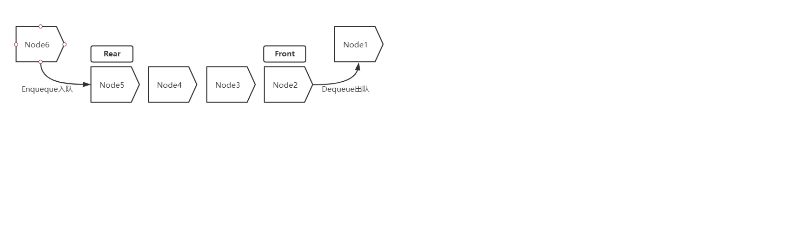

# 一、Java锁

## BlockingQueue

**队列实质就是一种存储数据的结构**

- 通常用链表或者数组实现
- 一般而言队列具备FIFO先进先出的特性，当然也有双端队列（Deque）优先级队列
- 主要操作：入队（EnQueue）与出队（Dequeue）

## BlockingQueue

- 1、ArrayBlockingQueue 由数组支持的有界队列
- 2、LinkedBlockingQueue 由链接节点支持的可选有界队列
- 3、PriorityBlockingQueue 由优先级堆支持的无界优先级队列
- 4、DelayQueue 由优先级堆支持的、基于时间的调度队列

## ArrayBlockingQueue数据结构

队列基于数组实现,容量大小在创建ArrayBlockingQueue对象时已定义好

由优先级堆支持的、基于时间的调度队列，内部基于无界队列PriorityQueue实现，而无界队列基于数组的扩容实现。

应用场景 电影票

要求
入队的对象必须要实现Delayed接口,而Delayed集成自Comparable接口

## HashMap

## ConcurrentHashMap

---

- 作者：face
- 版权声明：著作权归作者所有，商业转载请联系作者获得授权，非商业转载请注明出处。