# 一、操作系统并发

### 现代计算机理论模型
1. 控制器(Control)
2. 运算器(Datapath)
3. 存储器(Memory)
4. 输入(Input system)
5. 输出(Output system)
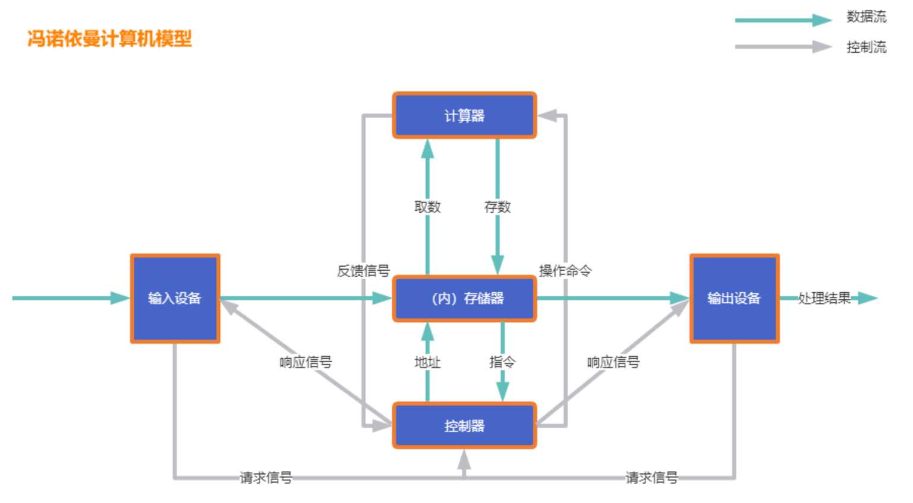

### 现代计算机硬件基本结构

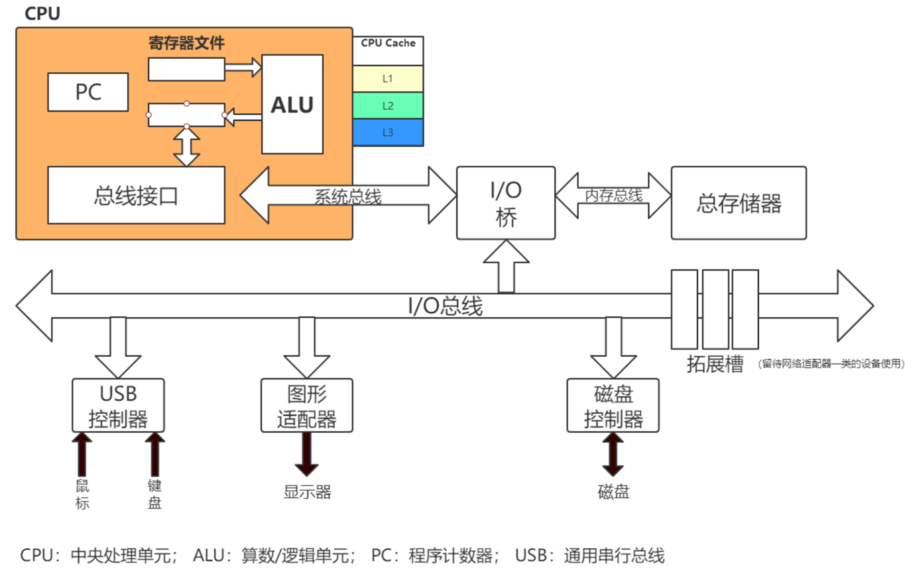

### CPU内部结构

1. 控制单元
2. 运算单元
3. 内存单元
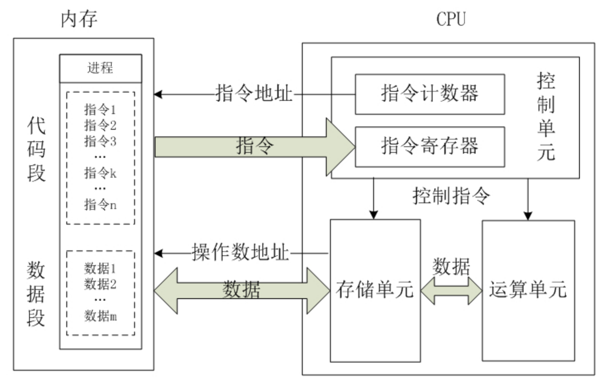

### CPU多核缓存架构

缓存一致性问题
1. L1 cache
2. L2 cache
3. L3 cache
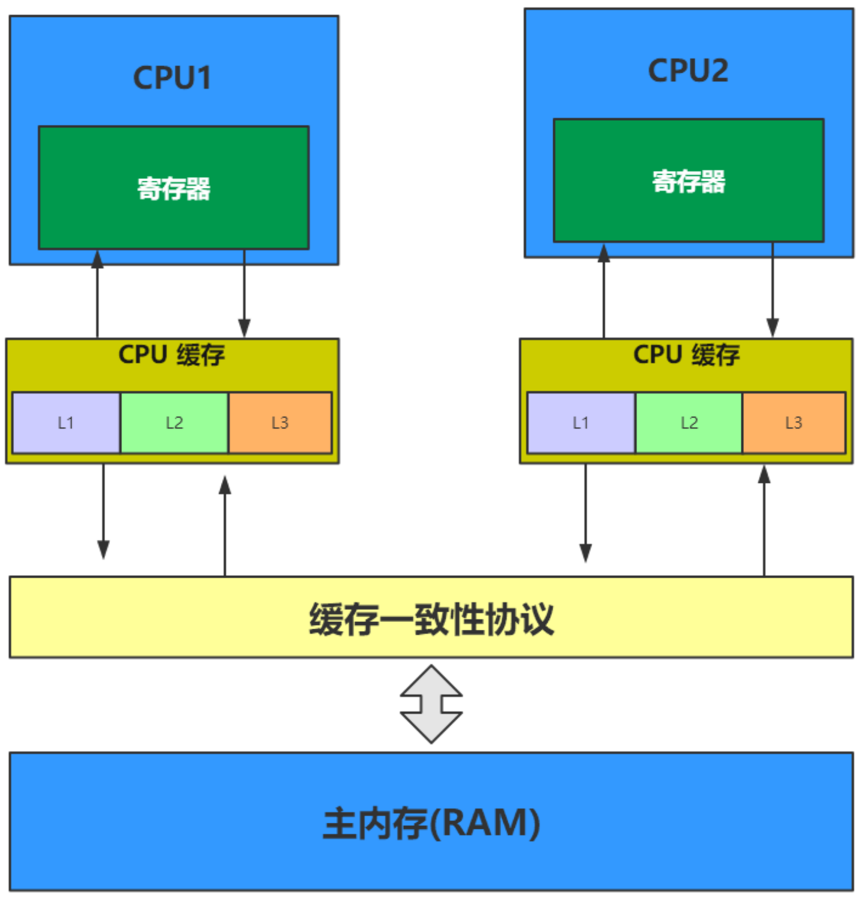

### 缓存一致性协议

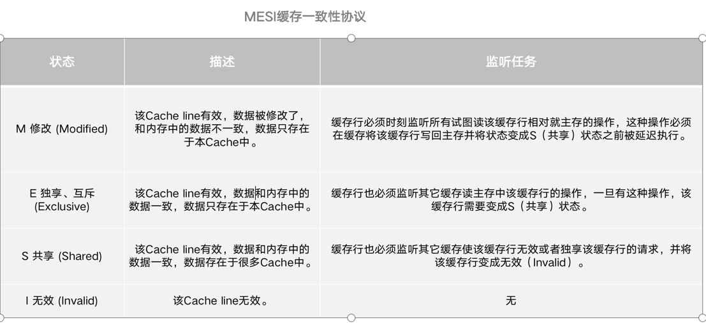

### 原子操作

原子即“不能被进一步分割的最小粒子”，原子操作（atomic operation）即”不可被中断的一个或一系列操作
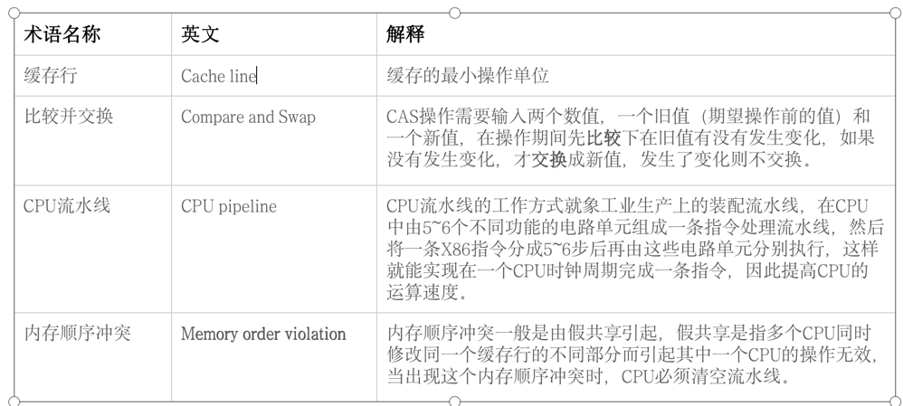

### 原子操作

处理器自动保证基本内存操作的原子性，如对同一个缓存行里进行16/32/64位的操作是原子的。
复杂的内存操作处理器不能自动保证其原子性，比如跨总线宽度，跨多个缓存行，跨页表的访问。

### Atomic

在Atomic包里一共有12个类，四种原子更新方式,原子更新基本类型,原子更新数组,原子更新引用,原子更新字段, Atomic包里的类基本都是使用Unsafe实现的包装类。
- 基本类：AtomicInteger、AtomicLong、AtomicBoolean；
- 引用类型：AtomicReference、AtomicReference的ABA实例、AtomicStampedRerence、AtomicMarkableReference；
- 数组类型：AtomicIntegerArray、AtomicLongArray、AtomicReferenceArray
- 属性原子修改器（Updater）：AtomicIntegerFieldUpdater、AtomicLongFieldUpdater、AtomicReferenceFieldUpdater

### Unsafe

Unsafe是位于sun.misc包下的一个类，主要提供一些用于执行低级别、不安全操作的方法，如直接访问系统内存资源、自主管理内存资源等，这些方法在提升Java运行效率、增强Java语言底层资源操作能力方面起到了很大的作用。
Unsafe类为一单例实现，提供静态方法getUnsafe获取Unsafe实例，当且仅当调用getUnsafe方法的类为引导类加载器所加载时才合法，否则抛出SecurityException异常
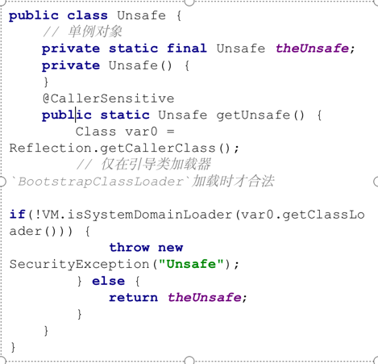

### 如何获取Unsafe

- 1、把调用Unsafe相关方法的类Demo所在jar包路径追加到默认的bootstrap路径中，使得A被引导类加载器加载
java -Xbootclasspath/Demo:${path} // 其中path为调用Unsafe相关方法的类所在jar包路径
- 2、通过反射获取单例对象theUnsafe
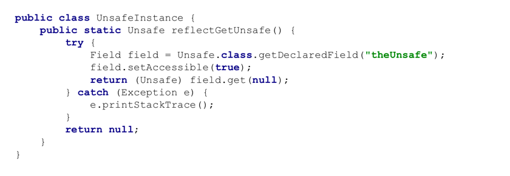

### Unsafe功能

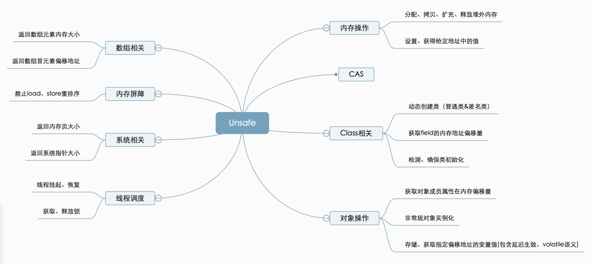

## 线程调度

//取消阻塞线程
public native void unpark(Object thread);
//阻塞线程
public native void park(boolean isAbsolute, long time);
//获得对象锁（可重入锁）
@Deprecate
public native void monitorEnter(Object o);
//释放对象锁
@Deprecated
public native void monitorExit(Object o);
//尝试获取对象锁
@Deprecated
public native boolean tryMonitorEnter(Object o);

## 内存屏障

- //内存屏障，禁止load操作重排序。屏障前的load操作不能被重排序到屏障后，屏障后的load操作不能被重排序到屏障前
- public native void loadFence();
- //内存屏障，禁止store操作重排序。屏障前的store操作不能被重排序到屏障后，屏障后的store操作不能被重排序到屏障前
- public native void storeFence(); 
-//内存屏障，禁止load、store操作重排序
- public native void fullFence();
- 典型应用
- StampedLock的validate()方法使用内存屏障，防止指令重排
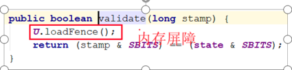
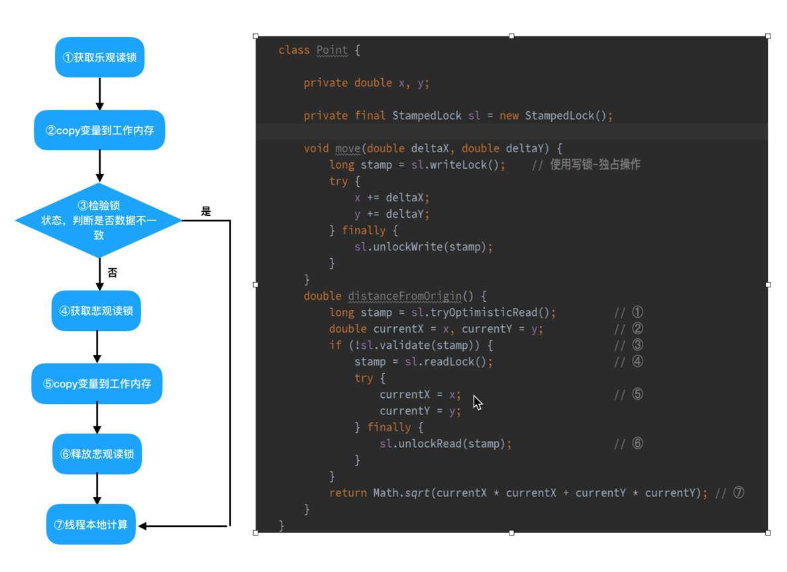

---
- 作者：face
- 版权声明：著作权归作者所有，商业转载请联系作者获得授权，非商业转载请注明出处。
