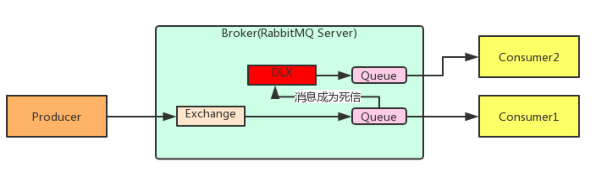
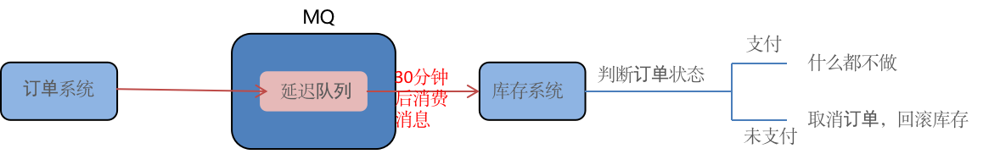
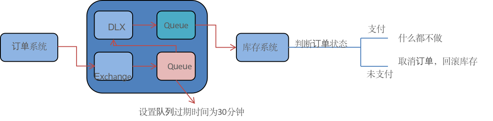
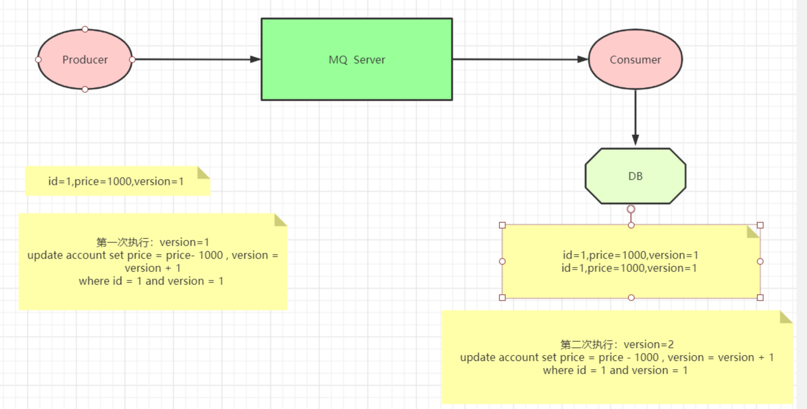

# 第一章 JAVA架构师
- ## 4.1-消息中间件
    - ### 4.1.2-rabbitmq高级.md

------
## 目录
- [第一章 - JAVA架构师](JAVA架构师.md)
- [第二章 - python全栈](python全栈.md)
- [第三章 – GO编程](GO编程.md)
- [第四章 – 大数据](大数据.md)
- [第五章 – AI智能](AI智能.md)
- [第六章 – 云原生](云原生.md)
- [第七章 – 物联网](物联网.md)
- [第八章 - 云计算](云计算.md)
- [第九章 - 区块链](区块链.md)
- [第十章 - 运维工程师](运维工程师.md)
- [第十一章 - 元宇宙](元宇宙.md)
- [第十二章 - WEB3.0](WEB3.0.md)
------

# 1.1 RabbitMQ高级特性
* 1、消费端限流
* 2、TTL
* 3、死信队列
* 4、延迟队列
* 5、消息可靠性投递
* 6、Consumer ACK

# 1.2 消息的可靠投递一
在使用 RabbitMQ 的时候，作为消息发送方希望杜绝任何消息丢失或者投递失败场景。RabbitMQ 为我们提供了两种方式用来控制消息的投递可靠性模式。
- confirm 确认模式
- return  退回模式
rabbitmq 整个消息投递的路径为：
> producer--->rabbitmq broker--->exchange--->queue--->consumer
- 消息从 producer 到 exchange 则会返回一个 confirmCallback 。
- 消息从 exchange-->queue 投递失败则会返回一个 returnCallback 。
> 我们将利用这两个 callback 控制消息的可靠性投递

# 1.2 消息的可靠投递二
- 设置ConnectionFactory的publisher-confirms="true" 开启 确认模式。
- 使用rabbitTemplate.setConfirmCallback设置回调函数。当消息发送到exchange后回调confirm方法。在方法中判断ack，如果为true，则发送成功，如果为false，则发送失败，需要处理。
- 设置ConnectionFactory的publisher-returns="true" 开启 退回模式。
- 使用rabbitTemplate.setReturnCallback设置退回函数，当消息从exchange路由到queue失败后，如果设置了rabbitTemplate.setMandatory(true)参数，则会将消息退回给producer。并执行回调函数returnedMessage。

# 1.3 消息的可靠投递Consumer Ack
> ack指Acknowledge，确认。 表示消费端收到消息后的确认方式。 
> 有三种确认方式：
> - 自动确认：acknowledge="none"
> - 手动确认：acknowledge="manual"
> - 根据异常情况确认：acknowledge="auto" 
> 
> 其中自动确认是指，当消息一旦被Consumer接收到，则自动确认收到，并将相应 message 从 RabbitMQ 的消息缓存中移除。但是在实际业务处理中，很可能消息接收到，业务处理出现异常，那么该消息就会丢失。如果设置了手动确认方式，则需要在业务处理成功后，调用channel.basicAck()，手动签收，如果出现异常，则调用channel.basicNack()方法，让其自动重新发送消息。

在rabbit:listener-container标签中设置acknowledge属性，设置ack方式 none：自动确认，manual：手动确认

如果在消费端没有出现异常，则调用channel.basicAck(deliveryTag,false);方法确认签收消息

如果出现异常，则在catch中调用 basicNack或 basicReject，拒绝消息，让MQ重新发送消息。

# 1.3 消息的可靠投递总结
1、持久化
* exchange要持久化
* queue要持久化
* message要持久化 

2、生产方确认Confirm 
3、消费方确认Ack 
4、Broker高可用 

# 1.4 消费端限流
在<rabbit:listener-container> 中配置 prefetch属性设置消费端一次拉取多少消息

消费端的确认模式一定为手动确认。acknowledge="manual"

# 1.5 TTL
TTL 全称 Time To Live（存活时间/过期时间）。 
当消息到达存活时间后，还没有被消费，会被自动清除。 
RabbitMQ可以对消息设置过期时间，也可以对整个队列（Queue）设置过期时间。 

设置队列过期时间使用参数：x-message-ttl，单位：ms(毫秒)，会对整个队列消息统一过期。 
设置消息过期时间使用参数：expiration。单位：ms(毫秒)，当该消息在队列头部时（消费时），会单独判断这一消息是否过期。 
如果两者都进行了设置，以时间短的为准。 

# 1.6 死信队列
死信队列，英文缩写：DLX  。Dead Letter Exchange（死信交换机），当消息成为Dead message后，可以被重新发送到另一个交换机，这个交换机就是DLX。

消息成为死信的三种情况： 
1. 队列消息长度到达限制； 
2. 消费者拒接消费消息，basicNack/basicReject,并且不把消息重新放入原目标队列,requeue=false； 
3. 原队列存在消息过期设置，消息到达超时时间未被消费； 

# 1.7 队列绑定死信交换机
队列绑定死信交换机：
给队列设置参数： x-dead-letter-exchange 和 x-dead-letter-routing-key

1. 死信交换机和死信队列和普通的没有区别
2. 当消息成为死信后，如果该队列绑定了死信交换机，则消息会被死信交换机重新路由到死信队列
3. 消息成为死信的三种情况：
1. 队列消息长度到达限制；
2. 消费者拒接消费消息，并且不重回队列；
3. 原队列存在消息过期设置，消息到达超时时间未被消费；

# 1.8 延迟队列
延迟队列，即消息进入队列后不会立即被消费，只有到达指定时间后，才会被消费。

需求：
1. 下单后，30分钟未支付，取消订单，回滚库存。
2. 新用户注册成功7天后，发送短信问候。

实现方式：
1. 定时器
2. 延迟队列

**在RabbitMQ中并未提供延迟队列功能。但是可以使用：TTL+死信队列 组合实现延迟队列的效果。**

1. 延迟队列 指消息进入队列后，可以被延迟一定时间，再进行消费。
2. RabbitMQ没有提供延迟队列功能，但是可以使用 ： TTL + DLX 来实现延迟队列效果。

# 1.9 消息幂等性保障
幂等性指一次和多次请求某一个资源，对于资源本身应该具有同样的结果。也就是说，其任意多次执行对资源本身所产生的影响均与一次执行的影响相同。

在MQ中指，消费多条相同的消息，得到与消费该消息一次相同的结果。
### 消息幂等性保障--乐观锁机制

# 2.0 消息积压
1. 消费者宕机积压
2. 消费者消费能力不足积压
3. 发送者发流量太大

**解决方案:**
上线更多的消费者,进行正常消费上线专门的队列消费服务,将消息先批量取出来,记录数据库,再慢慢处理

---
- 作者：face
- Github地址：https://github.com/facehai/thinking-framework-master
- 版权声明：著作权归作者所有，商业转载请联系作者获得授权，非商业转载请注明出处。
