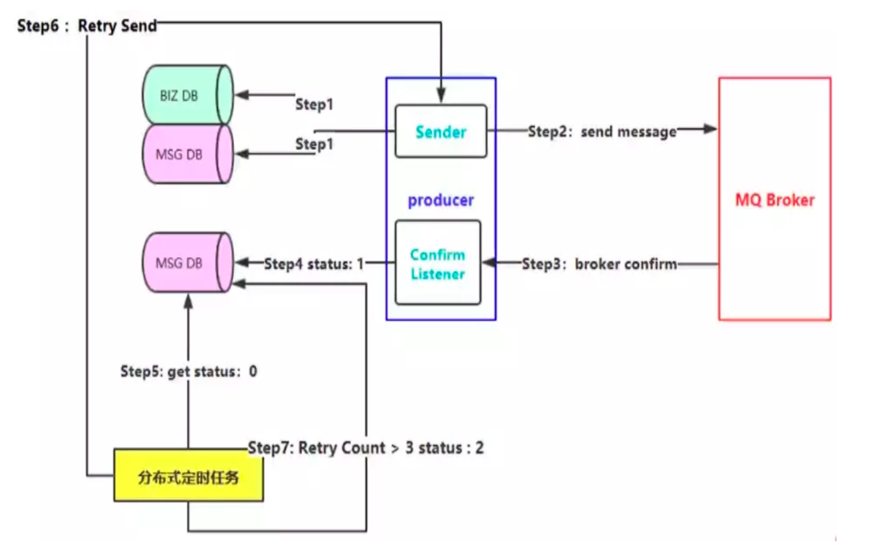
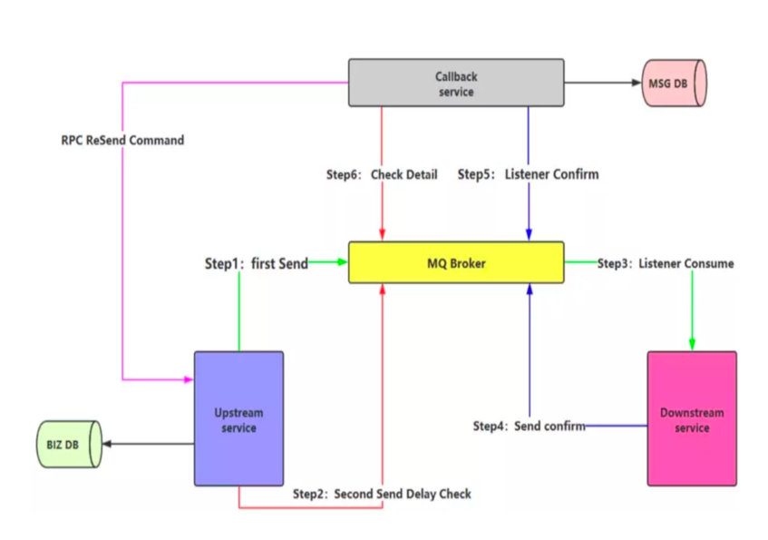
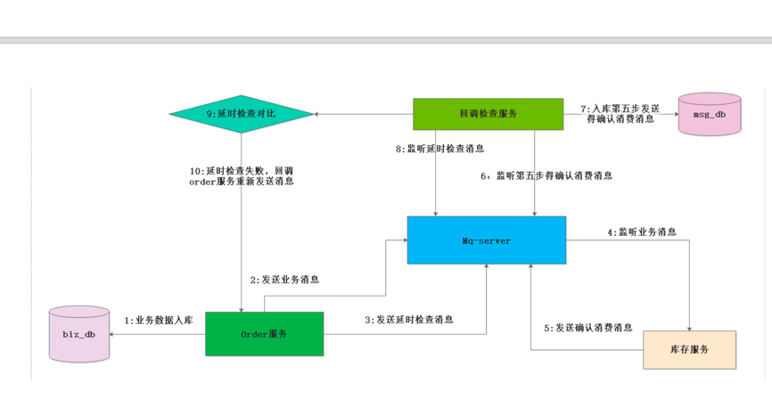
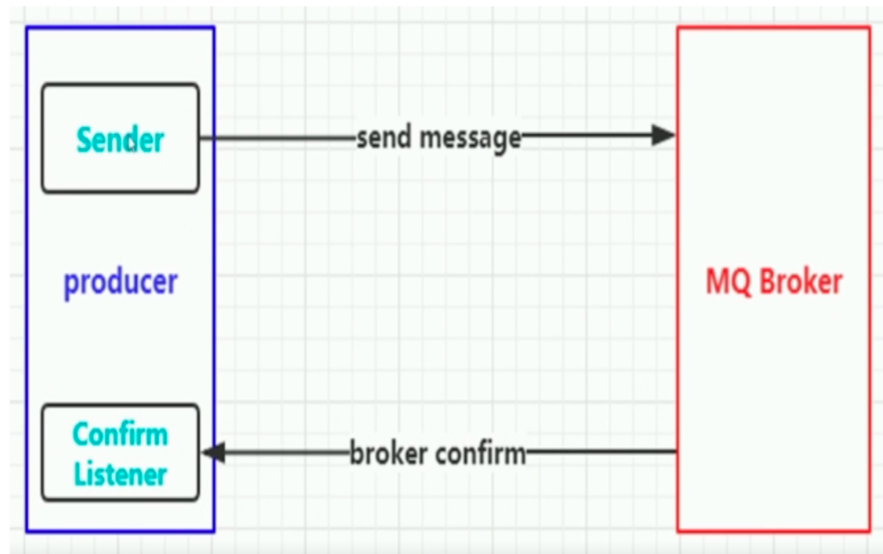
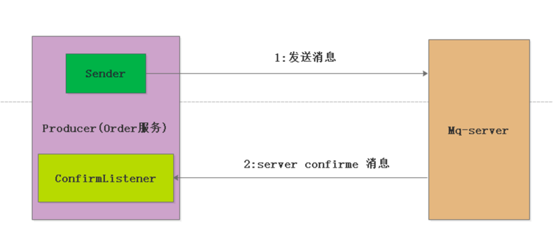
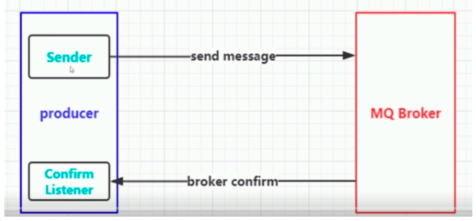
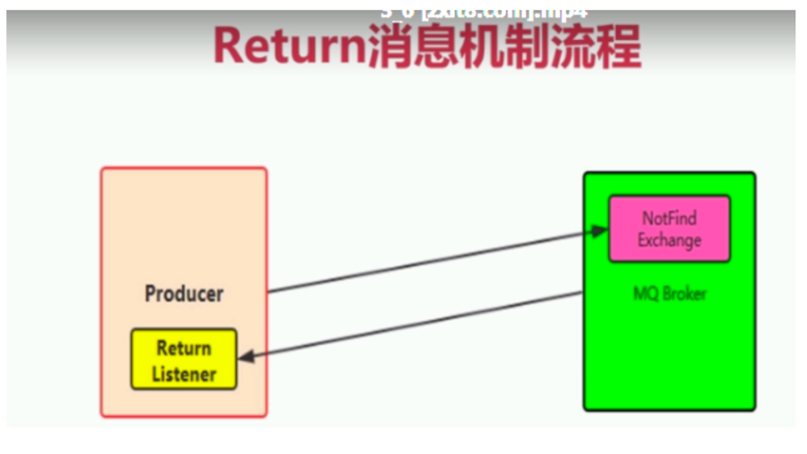
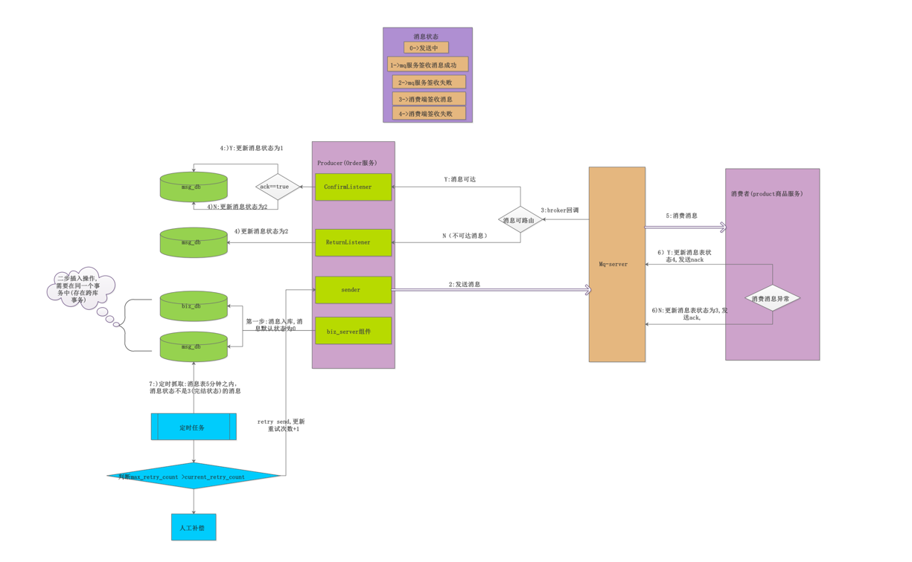

# 第一章 JAVA架构师
- ## 4.1-消息中间件
    - ### 4.1.3-rabbitmq可靠.md

------
## 目录
- [第一章 - JAVA架构师](JAVA架构师.md)
- [第二章 - python全栈](python全栈.md)
- [第三章 – GO编程](GO编程.md)
- [第四章 – 大数据](大数据.md)
- [第五章 – AI智能](AI智能.md)
- [第六章 – 云原生](云原生.md)
- [第七章 – 物联网](物联网.md)
- [第八章 - 云计算](云计算.md)
- [第九章 - 区块链](区块链.md)
- [第十章 - 运维工程师](运维工程师.md)
- [第十一章 - 元宇宙](元宇宙.md)
- [第十二章 - WEB3.0](WEB3.0.md)
------

# 1.1 如何保障消息的可靠性投递
### 一: 如何保障消息的百分百投递成功 
> 1.1) 什么是生产端的可靠性投递?  
①:保障消息成功发送出去  
②:保障mq节点成功接收消息  
③:消息发送端需要收到mq服务的确认应答  
④:完善的消息补偿机制（百分百成功成功 需要该步骤） 

> 1.2）解决保障可靠性投递的方案（消息落库） 
>

> 消息入库打标解决思路 (Order_Serve 调用物流服务举列子)   
> 在消息生产者端(也就是订单服务)  
> 
> **正常链路流程**  
> 第一步(该环节调用了操作了二次数据库):在创建订单的操作的时候，把数据插入到订单相关的表中,并且构造调 用物流模块的数据消息，把消息插入到消息表中,初始状态为0  
> 第二步: 把物流消息投递到消息队列中,  
> 第三步；消息队列访问一个确认消息,并且由，订单服务来监控mq server的确认消息  
> 第四步:根据收到的确认消息来更新数据库中的消息记录的状态 
> 
> **异常链路流程**  
> 第一步(该环节调用了操作了二次数据库):在创建订单的操作的时候，把数据插入到订单相关的表中,并且构造调 用物流模块的数据消息，把消息插入到消息表中,初始状态为0  
> 第二步: 把物流消息投递到消息队列中,  
> 第三步:由于网络闪断，导致消费端监控mq服务访问的确认消息 没有收到，那么在msg_db中的那条消息的 状态永远就是0状态。这个时候，我们需要对这种情况下做出补偿  
> 
> **补偿机制:**  
> 启动一个分布式的定时任务,不定时的去扫描msg_db的这个表，状态为0的消息记录，在这里我们可以根据 业务来设置扫描重发规则  
> 规则1:插入msg_db 表中5Min后状态还是为0的记录，进行消息重试  
> 规则2:若重试的次数超过五次状态还是为0的话，我们就把消息状态改为2,此时我们需要人工的去确认状态 为2的消息是什么原因导致没有成功的  
> 
> **消息入库打标的缺点:**  
> 在第一步的过程中，既插入了业务数据表，也同时插入了消息记录表，进行了二次db操作，在高并发的环 境下，这个环境就会造成性能瓶颈

> 1.3）延时投递，做二次确认检测，回调检测
> 

# 1.2 幂等性以及消息的幂等性
> 一:什么是接口的幂等性?  
> 接口的幂等性:简而言之，就是对接口发起的一次调用和多次调用，锁生产的结果都是 一致的。 某些接口具有天然的幂等性: 比如长查询接口，不管是查询一次还是多次，返回的结果都 是一致的  
> 1.2）若接口没有保障幂等性，那么就出现问题  
> 
> **案例一:** 比如订单提交的过程中，用户点了一次提交，但是由于网络等原因，导致后端处理延时，客户就连 续点击了多次，在没有幂等性的条件下，那么就会造成订单的重复提交。  
> 
> **解决方案:** 在保存订单的时候，根据生成的系统全局唯一ID(这里订单号+业务类型),并且把该唯一ID 调用 redis 的setnx命令保存起来，在第一次保存的时候，由于redis中没有该key,那么就会 把全局唯一ID 进行设置上，此时订单就会保存成功，。这个时候若出现前端重复点击按钮, 由于第一步已经 setnx上了 就会阻止后面的保存。

### 二、MQ 是如何解决幂等性的
> 发送消息的流程  
> 第一步:消息生产者向Mq服务端发送消息  
> 第二步:mq 服务端把消息进行落地  
> 第三步:消息服务端向消息生产者发送ack  
> 第四步；消息消费者消费消息  
> 第五步:消费者发送ack 
> 第六步: mq服务将落地消息删除
> 

### 2.1）消息重复发送的原因 
> 为了保障消息的百分之百的投递，我们使用了消息重发，确认机制，使得消息可能被重复发送，由上图可知 道，由于网络原因，第三步的上半场ack丢失还是第五步的下半场ack丢失 都会导致消息重复发送 

### 2.2）消息重复发送的导致后果
> 上半场消息生产者是用户支付模块，专门是用来给用户扣费的，而下半场的消息消费者服务是会员卡服务， 是通过接受扣费服务发送的消息来进行发卡的, 由于第三步或者是第五步ack丢失，那么就会导致上游服务重复发送消息就会导致扣一次款，发多次卡 

### 2.3) mq服务端是如何保证幂等性的？ 
> 消息队列的服务中，对每一条消息都会生成一个全局唯一的与业务无关的ID(inner_msg_id),当mq_server 接受到消息的时候，先根据inner_msg_id 是否需要重复发送，再决定消息是否落DB ,这样保证每条消息都 只会落一次DB 

### 2.4）消费端如何来做到幂等性的？ 
> 还是把对每条消息做生成一个唯一性的ID 通过redis的来setnx命令来保证幂等性。

# 1.3 消息的确认Confirm
> **一:理解Confirm消息确认机制**  
> 1.1) 消息的确认是指，生产端投递消息后，若mq-server接受到消息，就会给生产者一个应答  
> 1.2）生产端根据mq broker返回应答来确认该条消息是否正常发送到了broker,这种方式是消息可靠性投递的核心保障  
> 1.3）消息确认机制的流程图 

> 1.4）如何来做消息的confirm  
> 第一步:在channel上开启确认模式 channel.confirmSelect(); 
> 第二部;在channel上增加confirm监听，来监听成功和异常的confirm结果 

# 1.4 消息的confirm机制
> 一:mq 的confirm机制  
> 1：消息的确认:指的是生产者将消息投递后，如何mq-server接受到消息，就会给生产者一个应答.  
> 2:生产者接受到应答，来确保该条消息是否成功发送到了mq-server  
> 3:confirm机制是消息可靠性投递的核心保障 
> 二:mq的confirm机制的核心流程图
> 
> 三:confirm机制的现实步骤  
> 第一步：在channel 上开启确认模式 channel.confirmSelect();  
> 第二步:在channel上添加监听，用来监听mq-server返回的应答 

# 1.5 return-listener-消息处理机制
> 一:Return Listener是用来处理一些不可路由的消息  
> 1.1:我们的消息生产者，通过把消息投递到exchange上，然后通过routingkey 把消息路由到某一个队列上，然后我们 消费者通过队列消息侦听，然后进行消息消费处理.  
> **以上会出现的情况**  
> 情况一: broker中根本没有对应的exchange交换机来接受该消息  
> 情况二:消息能够投递到broker的交换机上，但是交换机根据routingKey 路由不到某一个队列上. 

针对上述二种情况 我们就需要return listener来处理这种不可达的消息. 处理一；若在消息生产端 的mandatory设置为true 那么就会调用生产端ReturnListener 来处理， 处理二；若消息生产端的mandatory设置为false(默认值也是false) 那么mq-broker就会自动删除消息

# 1.6 消费端的自定义消费监听
> 一:从3.1-3.4)我们消费端来消费消息的方式都是通过如下方式消费消息 while (true) { QueueingConsumer.Delivery delivery = queueingConsumer.nextDelivery(); System.out.println(new String(delivery.getBody())); } 我们需要一个更加优雅的方式来消费消息,通过继承DefaultConsumer类来实现自定义的消息端

# 1.7 消费端如何做限流量
> 一:什么是消费端的限流  
> 场景:首先，我们迎来了订单的高峰期，在mq的broker上堆积了成千上万条消息没有处理，这个时候，我们随便打开了 消费者，就会出现下面请 如此多的消息瞬间推送给消费者，我们的消费者不能处理这么多消息 就会导致消费者出现巨大压力，甚至服务器崩溃  
> 
> 解决方案: rabbitmq 提供一个钟qos（服务质量保证）,也就是在关闭了消费端的自动ack的前提 下，我们可以设置阈值（出队）的消息数没有被确认（手动确认），那么就不会推送 消息过来. 限流的级别(consumer级别或者是channel级别)  
> 实现的方式 void BasicQos(uint prefetchSize,ushort prefetchCount ,bool global)  
> uint prefetchSize ：指定的是设定消息的大小(rabbitmq还没有该功能，所以一般是填写0表示不限制)  
> ushort perfetchCount ：表示设置消息的阈值，每次过来几条消息(一般是填写1 一条 一条的处理消息)  
> bool global：表示是channel级别的还是 consumer的限制(channel的限制rabbitmq 还没有该功能) 

# 1.8 消费端的ack
> 一:消费端的ack模式 
> 消费端的ack类型:自动ack 和手动ack 做消息限流的时候，我们需要关闭自动ack 然后进行手动ack的确认,若我们业务出现了问题，我们就可以进 行nack  
> 重回队列  
> 当消费端进行了nack的操作的时候，我们可以通过设置来进行对消息的重回队列的操作(但是一般我们不会设 置重回队列的操作) 

# 1.9 死信队列-死信交换机
> 1.1）什么是死信?  
> 就是在队列中的消息如果没有消费者消费，那么该消息就成为一个死信，那这个 消息被重新发送到另外一个exchange上的话， 那么后面这个exhcange就是死信队列  
> 
> 1.2)消息变成死信的几种情况  
> 消息被拒绝：（basic.reject/basic.nack）并且requeue(重回队列)的属性设置为 false 表示不需要重回队列，那么该消息就是一个死信消息  
> 消息TTL过期 消息本身设置了过期时间，或者队列设置了消息过期时间x-message-ttl 队列达到最大长度:比如队列最大长度是3000 ,那么3001消息就会被送到死信队列上.  
> 
> 1.3)死信队列也是一个正常的exchange,也会通过routingkey 绑定到具体的队列上。

# 2.0 分布式事务解决方案

---
- 作者：face
- Github地址：https://github.com/facehai/thinking-framework-master
- 版权声明：著作权归作者所有，商业转载请联系作者获得授权，非商业转载请注明出处。
