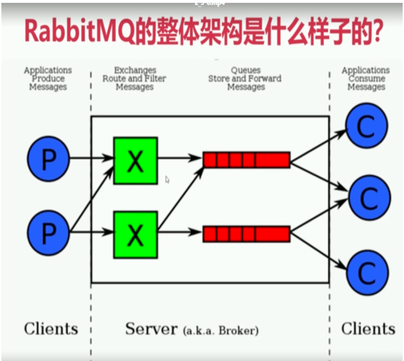

# 第一章 JAVA架构师
- ## 4.1-消息中间件
    - ### 4.1.1-rabbitmq入门.md

------
## 目录
- [第一章 - JAVA架构师](JAVA架构师.md)
- [第二章 - python全栈](python全栈.md)
- [第三章 – GO编程](GO编程.md)
- [第四章 – 数据挖掘](数据挖掘.md)
- [第五章 – AI智能](AI智能.md)
- [第六章 – 云原生](云原生.md)
- [第七章 – 物联网](物联网.md)
- [第八章 - 云计算](云计算.md)
- [第九章 - 区块链](区块链.md)
- [第十章 - 运维工程师](运维工程师.md)
- [第十一章 - 元宇宙](元宇宙.md)
- [第十二章 - WEB3.0](WEB3.0.md)
------

## 1.1 Rabbitmq 概述
> rabbitmq是一个开源的消息代理和队列服务器，通过普通的协议(Amqp协议)来完成不同应用之间的数 据共享; 
> rabbitmq是通过elang语言来开发的基于amqp协议

## 1.2 RabbitMQ简介
> **AMQP**，即 Advanced Message Queuing Protocol（高级消息队列协议），是一个网络协议，是应用层协议的一个开放标准，为面向消息的中间件设计。基于此协议的客户端与消息中间件可传递消息，并不受客户端/中间件不同产品，不同的开发语言等条件的限制。2006年，AMQP 规范发布。类比HTTP。
>- 是一个二进制协议,AMQP协议(Advanced message queue protocol) 高级消息队列协议 
>- amqp 是一个应用层协议的规范（定义了很多规范）,可以有很多不同的消息中间件产品（需要 遵循该规范）server：是消息队列节点 virtual host:虚拟注解 exchange 交换机(消息投递到交换机上) message queue（被消费者监听消费） 交互机和队列是有一个绑定的关系

> 2007年，Rabbit 技术公司基于 AMQP 标准开发的 RabbitMQ 1.0 发布。RabbitMQ 采用 Erlang 语言开发。Erlang 语言由 Ericson 设计，专门为开发高并发和分布式系统的一种语言，在电信领域使用广泛。 

> **RabbitMQ 基础架构如下图：**

## 1.3 为什么选择Rabbitmq
- 1)比如滴滴，美团，携程，去哪儿等为什么选择
- 2)开源，性能好，稳定性保证,
- 3)提供了消息的可靠性投递（confirm），返回模式 
- 4)与sping amqp 整合和完美，提供丰富的api 
- 5)集群模式十分丰富(HA模式 镜像队列模型) 
- 6)保证数据不丢失的情况下，保证很好的性能

## 1.4 Rabbitmq高性能是如何做到的
>- 使用的语言是elang语言(通常使用到交互机上)，elang的语言的性能能与原生socket的延迟效果.  
>- 消息入队的延时已经消息的消费的响应很快

## 1.5 RabbitMQ 简介
> 1: server :又称为broker，接受客户端连接，实现amqp实体服务  
> 2: Connection: 连接,应用程序与brokder建立网络连接 
> 3: Channel：网络通道，几乎所有的操作都是在channel中进行的，是进行消息对象的通道，客户端可以建立 多个通道，每一个channel表示一个会话任务 
> 4: Message: 服务器和应用程序之间传递数据的载体，有properties（消息属性,用来修饰消息,比如消息的优 先级,延时投递）和Body（消息体） 
> 5: virtual host(虚拟主机): 是一个逻辑概念,最上层的消息路由，一个虚拟主机中可以包含多个exhange 和 queue 但是一个虚拟主机中不能有名称相同的exchange 和queue 
> 6: exchange 交换机: 消息直接投递到交换机上，然后交换机根据消息的路由key 来路由到对应绑定的队列上 
> 7: baingding: 绑定 exchange 与queue的虚拟连接,bingding中可以包含route_key 
> 8: route_key 路由key ，他的作用是在交换机上通过route_key来把消息路由到哪个队列上 
> 9: queue：队列，用于来保存消息的载体，有消费者监听，然后消费消息 

## 1.6 Rabbitmq 整体架构模型

## 1.7 Rabbitmq 消息流转

## 1.8 RabbitMQ 6种工作模式
RabbitMQ 提供了 6 种工作模式：简单模式、work queues、Publish/Subscribe 发布与订阅模式、Routing 路由模式、Topics 主题模式、RPC 远程调用模式（远程调用，不太算 MQ；暂不作介绍）。
官网对应模式介绍：https://www.rabbitmq.com/getstarted.html

### 1)、简单模式
P：生产者，也就是要发送消息的程序  
C：消费者：消息的接收者，会一直等待消息到来  
queue：消息队列，图中红色部分。类似一个邮箱，可以缓存消息；生产者向其中投递消息，消费者从其中取出消息

### 2)、工作队列模式
Work Queues：与入门程序的简单模式相比，多了一个或一些消费端，多个消费端共同消费同一个队列中的消息。 
应用场景：对于任务过重或任务较多情况使用工作队列可以提高任务处理的速度。  
1. 在一个队列中如果有多个消费者，那么消费者之间对于同一个消息的关系是竞争的关系。 
2. Work Queues 对于任务过重或任务较多情况使用工作队列可以提高任务处理的速度。例如：短信服务部署多个，只需要有一个节点成功发送即可。

### 3)、Pub/Sub订阅模式
在订阅模型中，多了一个 Exchange 角色，而且过程略有变化： 
P：生产者，也就是要发送消息的程序，但是不再发送到队列中，而是发给X（交换机） 
C：消费者，消息的接收者，会一直等待消息到来 
Queue：消息队列，接收消息、缓存消息 
Exchange：交换机（X）。一方面，接收生产者发送的消息。另一方面，知道如何处理消息，例如递交给某个特别队列、递交给所有队列、或是将消息丢弃。到底如何操作，取决于Exchange的类型。Exchange有常见以下3种类型： 
  - Fanout：广播，将消息交给所有绑定到交换机的队列 
  - Direct：定向，把消息交给符合指定routing key 的队列 
  - Topic：通配符，把消息交给符合routing pattern（路由模式） 的队列  

Exchange（交换机）只负责转发消息，不具备存储消息的能力，因此如果没有任何队列与 Exchange 绑定，或者没有符合路由规则的队列，那么消息会丢失！ 
应用场景：发布/订阅模式所有消费者获取相同的消息，适合"数据提供商与应用商"

**总结**
1. 交换机需要与队列进行绑定，绑定之后；一个消息可以被多个消费者都收到。
2. 发布订阅模式与工作队列模式的区别：
   工作队列模式不用定义交换机，而发布/订阅模式需要定义交换机
   发布/订阅模式的生产方是面向交换机发送消息，工作队列模式的生产方是面向队列发送消息(底层使用默认交换机)
   发布/订阅模式需要设置队列和交换机的绑定，工作队列模式不需要设置，实际上工作队列模式会将队列绑 定到默认的交换机

### 4)、路由模式
Routing 模式要求队列在绑定交换机时要指定 routing key，消息会转发到符合 routing key 的队列。
- 队列与交换机的绑定，不能是任意绑定了，而是要指定一个 RoutingKey（路由key）
- 消息的发送方在向 Exchange 发送消息时，也必须指定消息的 RoutingKey
- Exchange 不再把消息交给每一个绑定的队列，而是根据消息的 Routing Key 进行判断，只有队列的Routingkey 与消息的 Routing key 完全一致，才会接收到消息
**图解**
- P：生产者，向 Exchange 发送消息，发送消息时，会指定一个routing key
- X：Exchange（交换机），接收生产者的消息，然后把消息递交给与 routing key 完全匹配的队列
- C1：消费者，其所在队列指定了需要 routing key 为 error 的消息 
- C2：消费者，其所在队列指定了需要 routing key 为 info、error、warning 的消息

### 5)、通配符模式
Topic 主题模式可以实现 Pub/Sub 发布与订阅模式和 Routing 路由模式的功能，只是 Topic 在配置routing key 的时候可以使用通配符，显得更加灵活。

- Topic 类型与 Direct 相比，都是可以根据 RoutingKey 把消息路由到不同的队列。只不过 Topic 类型Exchange 可以让队列在绑定 Routing key 的时候使用通配符！
- Routingkey 一般都是有一个或多个单词组成，多个单词之间以”.”分割，例如： item.insert
- 通配符规则：# 匹配一个或多个词，* 匹配不多不少恰好1个词，例如：item.# 能够匹配 item.insert.abc 或者 item.insert，item.* 只能匹配 item.insert

## 1.9 RabbitMQ 工作模式总结
> 1、简单模式 HelloWorld
- 一个生产者、一个消费者，不需要设置交换机（使用默认的交换机）。

> 2、工作队列模式 Work Queue
- 一个生产者、多个消费者（竞争关系），不需要设置交换机（使用默认的交换机）。

> 3、发布订阅模式 Publish/subscribe
- 需要设置类型为 fanout 的交换机，并且交换机和队列进行绑定，当发送消息到交换机后，交换机会将消息发送到绑定的队列。

> 4、路由模式 Routing
- 需要设置类型为 direct 的交换机，交换机和队列进行绑定，并且指定 routing key，当发送消息到交换机后，交换机会根据 routing key 将消息发送到对应的队列。

> 5、通配符模式 Topic
- 需要设置类型为 topic 的交换机，交换机和队列进行绑定，并且指定通配符方式的 routing key，当发送消息到交换机后，交换机会根据 routing key 将消息发送到对应的队列。

---
- 作者：face
- Github地址：https://github.com/facehai/thinking-framework-master
- 版权声明：著作权归作者所有，商业转载请联系作者获得授权，非商业转载请注明出处。
