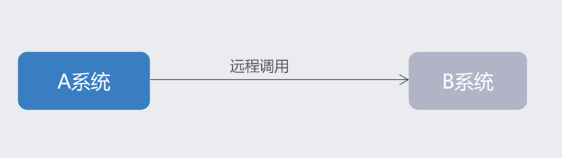
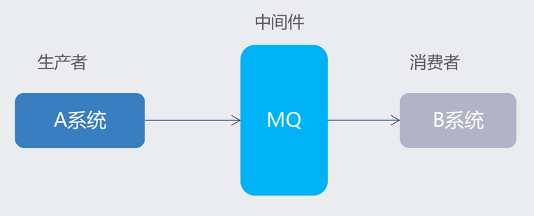

# 第一章 JAVA架构师
- ## 4.1-消息中间件

------
## 目录
- [第一章 - JAVA架构师](JAVA架构师.md)
- [第二章 - python全栈](python全栈.md)
- [第三章 – GO编程](GO编程.md)
- [第四章 – 数据挖掘](数据挖掘.md)
- [第五章 – AI智能](AI智能.md)
- [第六章 – 云原生](云原生.md)
- [第七章 – 物联网](物联网.md)
- [第八章 - 云计算](云计算.md)
- [第九章 - 区块链](区块链.md)
- [第十章 - 运维工程师](运维工程师.md)
- [第十一章 - 元宇宙](元宇宙.md)
- [第十二章 - WEB3.0](WEB3.0.md)
------

## 1.1 MQ概述
> MQ全称 Message Queue（消息队列），是在消息的传输过程中保存消息的容器。多用于分布式系统之间进行通信。
> 

## 1.2 MQ优势
- 应用解耦：提高系统容错性和可维护性
- 异步提速：提升用户体验和系统吞吐量
- 削峰填谷：提高系统稳定性

>- **应用解耦:**  
   > 系统的耦合性越高，容错性就越低，可维护性就越低。 
   > 使用 MQ 使得应用间解耦，提升容错性和可维护性。
>
>- **异步提速：**  
   > 
   > 
   > 一个下单操作耗时：20 + 300 + 300 + 300 = 920ms，用户点击完下单按钮后，需要等待920ms才能得到下单响应 
   > 用户点击完下单按钮后，只需等待25ms就能得到下单响应 (20 + 5 = 25ms)。提升用户体验和系统吞吐量（单位时间内处理请求的数目）。
>
>- **削峰填谷**
   > 
   > 
   > 
   > 使用了 MQ 之后，限制消费消息的速度为1000，这样一来，高峰期产生的数据势必会被积压在 MQ 中，高峰就被“削”掉了，但是因为消息积压，在高峰期过后的一段时间内，消费消息的速度还是会维持在1000，直到消费完积压的消息，这就叫做“填谷”。 使用MQ后，可以提高系统稳定性。

## 1.3 常见MQ产品

---
- 作者：face
- Github地址：https://github.com/facehai/thinking-framework-master
- 版权声明：著作权归作者所有，商业转载请联系作者获得授权，非商业转载请注明出处。
