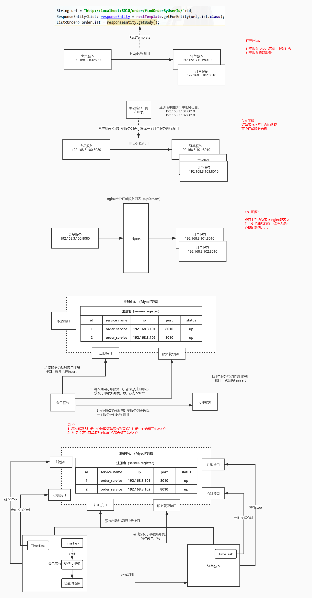

# 第一章 JAVA架构师
- ## 05-微服务架构
    - ### 5.1-Nacos.md

------
## 目录
- [第一章 - JAVA架构师](JAVA架构师.md)
- [第二章 - python全栈](python全栈.md)
- [第三章 – GO编程](GO编程.md)
- [第四章 – 大数据](大数据.md)
- [第五章 – AI智能](AI智能.md)
- [第六章 – 云原生](云原生.md)
- [第七章 – 物联网](物联网.md)
- [第八章 - 云计算](云计算.md)
- [第九章 - 区块链](区块链.md)
- [第十章 - 运维工程师](运维工程师.md)
- [第十一章 - 元宇宙](元宇宙.md)
- [第十二章 - WEB3.0](WEB3.0.md)
------

## 1.1 Nacos 概述
> 官方：一个更易于构建云原生应用的动态服务发现(Nacos Discovery )、服务配置(Nacos Config)和服务管理平台。 集 注册中心+配置中心+服务管理 平台 Nacos 的关键特性包括: 服务发现和服务健康监测 动态配置服务 动态 DNS 服务 服务及其元数据管理集注册中心+配置中心+服务管理 平台

Nacos 的关键特性包括:
- 服务发现和服务健康监测
- 动态配置服务
- 动态 DNS 服务
- 服务及其元数据管理

## 1.2 Nacos注册中心
**管理所有微服务、解决微服务之间调用关系错综复杂、难以维护的问题；**

#### 注册中心演变及其设计思想

### 1.3 核心功能
Nacos Discovery
服务注册：Nacos Client会通过发送REST请求的方式向Nacos Server注册自己的服务，提供自身的元数据，比如ip地址、端口等信息。Nacos Server接收到注册请求后，就会把这些元数据信息存储在一个双层的内存Map中。
服务心跳：在服务注册后，Nacos Client会维护一个定时心跳来持续通知Nacos Server，说明服务一直处于可用状态，防止被剔除。默认5s发送一次心跳。
服务同步：Nacos Server集群之间会互相同步服务实例，用来保证服务信息的一致性。  leader    raft    
服务发现：服务消费者（Nacos Client）在调用服务提供者的服务时，会发送一个REST请求给Nacos Server，获取上面注册的服务清单，并且缓存在Nacos Client本地，同时会在Nacos Client本地开启一个定时任务定时拉取服务端最新的注册表信息更新到本地缓存
服务健康检查：Nacos Server会开启一个定时任务用来检查注册服务实例的健康情况，对于超过15s没有收到客户端心跳的实例会将它的healthy属性置为false(客户端服务发现时不会发现)，如果某个实例超过30秒没有收到心跳，直接剔除该实例(被剔除的实例如果恢复发送心跳则会重新注册)

主流的注册中心
CAP    C 一致性 A可用性 P 分区容错性

雪崩保护：  
保护阈值： 设置0-1之间的值  0.6
临时实例： spring.cloud.nacos.discovery.ephemeral =false,   当服务宕机了也不会从服务列表中剔除

下图代表永久实例：

健康实例、 不健康实例；

健康实例数/总实例数 < 保护阈值`
1/2<0.6

结合负载均衡器 权重的机制，  设置的越大

3 Nacos Server部署
下载源码编译
源码下载地址：https://github.com/alibaba/nacos/     可以用迅雷下载
cd nacos/
mvn -Prelease-nacos clean install -U
下载安装包
下载地址：https://github.com/alibaba/Nacos/releases
3.1 单机模式
官方文档： https://nacos.io/zh-cn/docs/deployment.html
解压，进入nacos目录

单机启动nacos，执行命令
bin/startup.sh -m standalone
也可以修改默认启动方式

访问nocas的管理端：http://192.168.3.14:8848/nacos ，默认的用户名密码是 nocas/nocas

3.2 集群模式
1. jdk1.8+  
   2.maven 3.3+
   3.nginx 作为负载均衡
   4.mysql
   官网文档： https://nacos.io/zh-cn/docs/cluster-mode-quick-start.html
   集群部署架构图

1.下载

mkdir nacos

wget https://github.com/alibaba/nacos/releases/download/1.4.1/nacos-server-1.4.1.tar.gz

创建多个nacos server
重复三次
tar -zxvf nacos-server-1.4.1.tar.gz

mv nacos nacos8849

1）单机搭建伪集群，复制nacos安装包，修改为nacos8849，nacos8850，nacos8851

2）以nacos8849为例，进入nacos8849目录
2.1）修改conf\application.properties的配置，使用外置数据源  要使用mysql5.7+（包括）
#使用外置mysql数据源
spring.datasource.platform=mysql

### Count of DB:
db.num=1

### Connect URL of DB:
db.url.0=jdbc:mysql://127.0.0.1:3306/nacos?characterEncoding=utf8&connectTimeout=1000&socketTimeout=3000&autoReconnect=true&useUnicode=true&useSSL=false&serverTimezone=UTC
db.user.0=root
db.password.0=root

2.2）将conf\cluster.conf.example改为cluster.conf,添加节点配置
# ip:port
192.168.65.220:8849
192.168.65.220:8850
nacos8850，nacos8851 按同样的方式配置。
3）创建mysql数据库,sql文件位置：conf\nacos-mysql.sql
4)  如果出现内存不足：修改启动脚本（bin\startup.sh）的jvm参数
    JAVA_OPT="${JAVA_OPT} -server -Xms512m -Xmx512m -Xmn256 -XX:MetaspaceSize=64m -XX:MaxMetaspaceSize=128m"

5)  分别启动nacos8849，nacos8850，nacos8851
    以nacos8849为例，进入nacos8849目录，启动nacos
    bin/startup.sh

6) 测试
   登录 http://192.168.3.14:8849/nacos  ，用户名和密码都是nacos

下载nginx
1.添加官方源仓库
yum install -y yum-utils
yum-config-manager --add-repo https://openresty.org/package/centos/openresty.repo

2.安装openresty
yum install -y openresty

cd /usr/local/openresty/
7）官方推荐，nginx反向代理   
192.168.56.220:8847/nacos/
upstream nacoscluster {
server 127.0.0.1:8849;
server 127.0.0.1:8850;
server 127.0.0.1:8851;
}
server {
listen        8847;
server_name   localhost;

        location /nacos/{
            proxy_pass http://nacoscluster/nacos/;
        }
    }

访问： http://192.168.3.14:8847/nacos

1.3  prometheus+grafana监控Nacos（扩展）
https://nacos.io/zh-cn/docs/monitor-guide.html
Nacos 0.8.0版本完善了监控系统，支持通过暴露metrics数据接入第三方监控系统监控Nacos运行状态。
1. nacos暴露metrics数据
   management.endpoints.web.exposure.include=*
   测试： http://localhost:8848/nacos/actuator/prometheus

2. prometheus采集Nacos metrics数据
   启动prometheus服务
   prometheus.exe --config.file=prometheus.yml
   测试：http://localhost:9090/graph

3. grafana展示metrics数据
   测试： http://localhost:3000/

4. Spring Cloud Alibaba Nacos快速开始
   4.1 Spring Cloud Alibaba版本选型

4.2 搭建Nacos-client服务
1）引入依赖
父Pom中支持spring cloud&spring cloud alibaba, 引入依赖
<dependencyManagement>
<dependencies>
<!--引入springcloud的版本-->
<dependency>
<groupId>org.springframework.cloud</groupId>
<artifactId>spring-cloud-dependencies</artifactId>
<version>Hoxton.SR3</version>
<type>pom</type>
<scope>import</scope>
</dependency>

        <dependency>
            <groupId>com.alibaba.cloud</groupId>
            <artifactId>spring-cloud-alibaba-dependencies</artifactId>
            <version>2.2.1.RELEASE</version>
            <type>pom</type>
            <scope>import</scope>
        </dependency>
    </dependencies>

当前项目pom中引入依赖
<dependency>
<groupId>com.alibaba.cloud</groupId>
<artifactId>spring-cloud-starter-alibaba-nacos-discovery</artifactId>
2) application.properties中配置
   server.port=8002
#微服务名称
spring.application.name=service-user
#配置 Nacos server 的地址
更多配置：https://github.com/alibaba/spring-cloud-alibaba/wiki/Nacos-discovery

3）启动springboot应用，nacos管理端界面查看是否成功注册

4）测试
使用RestTemplate进行服务调用，可以使用微服务名称 （spring.application.name）
String url = "http://service-order/order/findOrderByUserId/"+id;
注意：需要添加@LoadBalanced注解
@Bean
@LoadBalanced
public RestTemplate restTemplate() {
return new RestTemplate();

4.3 Nacos注册中心架构

 

---
- 作者：face
- Github地址：https://github.com/facehai/thinking-framework-master
- 版权声明：著作权归作者所有，商业转载请联系作者获得授权，非商业转载请注明出处。
