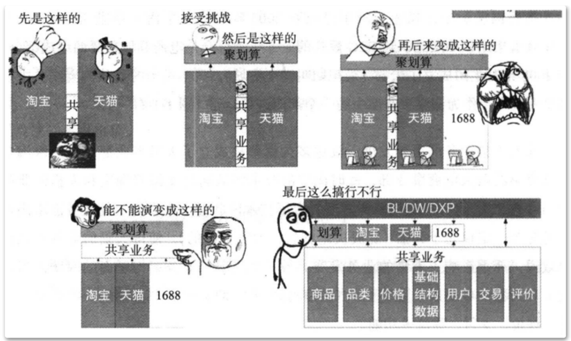
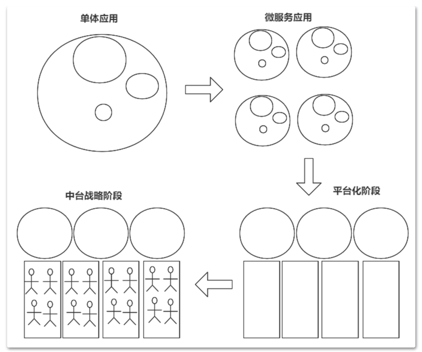

# 第一章 JAVA架构师
- ## 08-架构设计

------
## 目录
- [第一章 - JAVA架构师](JAVA架构师.md)
- [第二章 - python全栈](python全栈.md)
- [第三章 – GO编程](GO编程.md)
- [第四章 – 大数据](大数据.md)
- [第五章 – AI智能](AI智能.md)
- [第六章 – 云原生](云原生.md)
- [第七章 – 物联网](物联网.md)
- [第八章 - 云计算](云计算.md)
- [第九章 - 区块链](区块链.md)
- [第十章 - 运维工程师](运维工程师.md)
- [第十一章 - 元宇宙](元宇宙.md)
- [第十二章 - WEB3.0](WEB3.0.md)
------

## 1.1 大话中台
中台，是国内互联网中，继微服务之后又一个火热的概念。从2015年阿里提
出"小前台+大中台"的概念后，中台成了国内微服务实施过程中绕不开的一个目标。
但是，虽然中台的实施如火如荼，但是关于中台，依然是雾里看花，一百个人会有
一百种理解。关于中台的知识，即使单独拉出一个专题课程出来，也不一定能说得
清楚，所以这节课中不会去做过多讨论。这一讲关于中台的讲解只是作为一个载
体，来分享一下我在参与了多个中台项目建设后的一些心得与体会。

## 1.2 什么是中台？
中台这个概念，最早是由阿里在2015年提出的"小前台，大中台"战略中衍生出来
的一个概念，他的灵感来自于一家芬兰的小公司supercell。这是一家号称是全世界
最成功的移动游戏公司，说这个公司你可能没什么印象，但是说到他开发出来的游
戏，你可能就会有点印象了。supercell可以说是全世界最会赚钱的游戏公司，旗下
推出的每一个游戏都非常火爆，包括《部落冲突》《皇室战争》，还有《卡通农
场》、《海岛奇兵》、《荒野乱斗》。他有个显著的特点，就是在公司内部，任何
人都可以提出自己的游戏点子，然后在公司内组织自己的项目团队，称为cell。每个
cell人数不多，一般不会超过7个。每个Cell内自行组织游戏的设计、开发、快速推
广。然后以最快的时间推出产品的公测版，看看游戏是否受到用户的欢迎。火爆的
游戏就存活下来，反响平平的游戏就快速终止。期间几乎没有管理角色的接入，同
时失败后，团队也不会收到惩罚，团队成员总结项目经验后，迅速转入其他Cell。而
阿里正是在对supercell进行考察之后，才有了中台这个概念。于2015年正式开始推
行中台战略，并指定了为期三年的中台战略考察期，并迅速成为了互联网企业的标
杆。

**所谓中台，就是将各个业务线中可以复用的一些功能抽取出来，剥离个性、提取
共性，形成一些可复用的组件。通过这些组件，就可以使日后的系统开发成本降
低，质量提高。大体上，中台可以分为三类，业务中台、数据中台和技术中台。**

- 业务中台： 就是抽象出来，在各个业务线都可以共用的一些业务组件，像用户权
限、会员管理、移动支付等等这些公用组件，可以在各个业务线中都使用。
- 数据中台： 是对整个业务系统的数据进行统一存储、建模与计算，为各个业务系统
的数据分析与利用提供支持。
- 技术中台： 就是要封装各个业务系统所要采用的技术框架，使上层业务开发的门槛
降低，提升交付速度。

## 1.3 怎么建设中台？
中台的建设，也不仅仅是技术方面的问题，而是涉及到整个企业内资源调度的综
合性问题。很多企业在组件软件开发团队时，都会优先基于业务的横向分割，形成
产品、设计、开发、测试、运维这样大的组织结构，称为烟囱式团队。例如阿里早
期的团队建设是这样的：

这种模式没有太多的历史技术和业务的包袱，在业务简单、参与的人比较少的时
候，往往可以获得一个比较快的支付速度。但是随着项目的不端推进，业务变得越
来越复杂，参与的团队会越来越多，这时候这种烟囱式的团队建设就会体现出很多
的弊端。例如最为明显的就是功能重复建设以及维护会带来重复的投资。另外更深
层次的问题在于，这种烟囱式的团队，团队之间的沟通和协作会非常困难。即不利
于企业的业务经验沉淀，也不利于技术梯队的建设。在企业长期的发展过程中，就
会体现出人力资源内耗严重，项目新需求研发越来越慢，交付的产品质量越来越
低。

## 1.4 怎么设计一个可落地的技术中台？
中台战略的形成，往往需要经过三个阶段的转化。第一个阶段是从单体应用到微
服务应用的转化：这个阶段跟业务系统转化是相同的。第二个阶段是从微服务应用
向平台化的转化：在这个阶段会逐渐将各个业务线的共有能力提炼并沉淀，集中形
成一个一个的平台。第三个阶段是从平台化建设向中台战略的转型：经过平台化的
建设阶段后，技术中台就基本成型了。在以后的阶段，针对这些技术平台，再逐渐
调整公司的整个组织架构以及资源投入，就形成了完整的中台战略。

这个技术中台是更为广义的技术中台。在这个技术中台中需要实现的，是统一各
个需求的技术栈以及由此衍生出来的测试、发布、运维等一系列的技术动作。通过
这样的技术中台，各个业务团队的技术门槛得到极大的降低，开发的工作量减少
了，测试运维的工作也都比较固定了，整个团队的工作模式也就越来越高效，可以
将更多的精力集中用来深刻理解业务，并快速响应业务需求的变化。

而在中台建设过程当中，技术中台往往是最为重要的一环。技术中台团队，往往
需要由最精锐的开发人员组成。这样的技术中台需要功能全面、简单易用、部署简
单、易于升级等等非常多的特点。下面列出几点我之前参与建设的技术中台的特
点，或许能够让你对技术中台有个大致的概念。

技术栈统一：采用SpringCloud技术栈，提供统一的架构支持。同步服务调用、
异步消息通信，再到数据存储等功能，提供基于SpringBoot的拔插式支持，各应
用只需要按需组合即可。在此基础上，提供统一配置、统一版本管理等集中式的
管理方案。

解决方案统一：对微服务调用、MQ异步通知、日志脱敏、传输数据加密、缓存
一致性等各种功能在框架中提供统一的解决方案。这些解决方案，大部分是以
API的形式提供，业务方只需要进行调用即可。而如果不能形成API接口的，集成
到代码静态检查规范当中，在编译发布的阶段给出统一的指导。
运维与框架统一：将外部依赖的组件与框架形成统一。例如某业务可能需要用到
MQ做异步通信，会由技术中台团队完成MQ的部署，并且将MQ相关的实现以及
配置信息一并上传到配置管理中心。业务团队在使用时甚至都不需要知道MQ部
署地址，就可以直接拿来用。
部署与运维统一：以Jenkins为基础，定制整套完整的部署运维方案。业务团队只
需要往Git仓库中提交代码，后续项目打包以及测试环境的部署全部自动完成，不
需要人工参与。
上线方案统一：对线上环境，机器配置与服务部署都形成统一的标准，业务团队
申请线上资源时，只需要申请自己需要什么，而不用管具体的细节。

---
- 作者：face
- Github地址：https://github.com/facehai/thinking-framework-master
- 版权声明：著作权归作者所有，商业转载请联系作者获得授权，非商业转载请注明出处。
