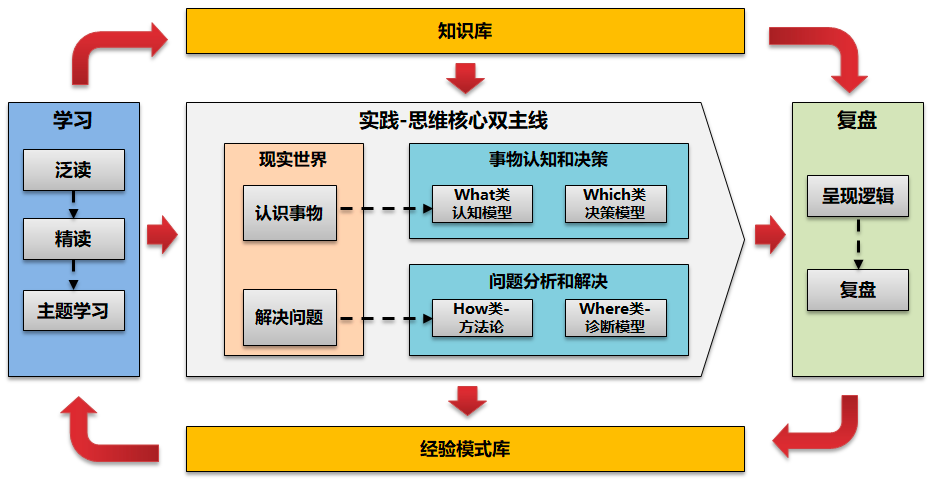
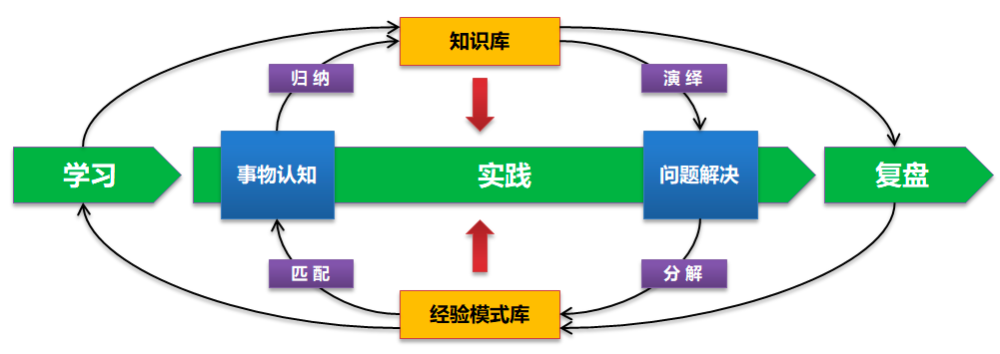
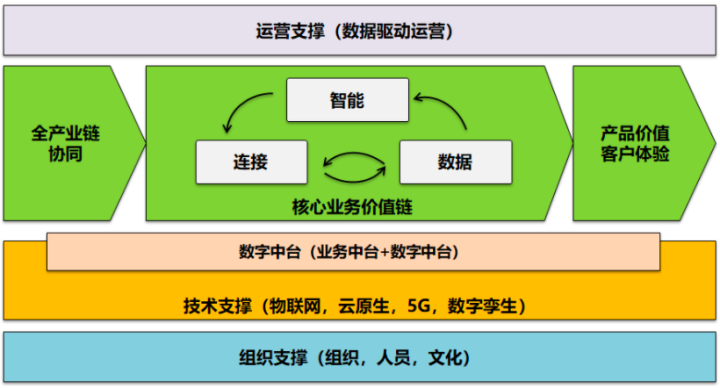
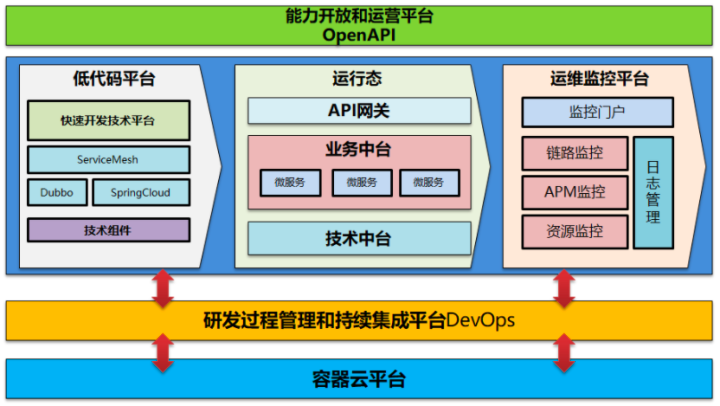
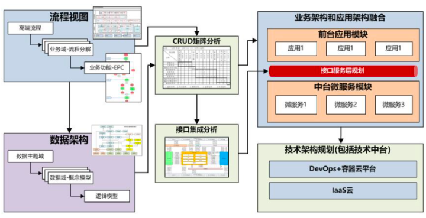
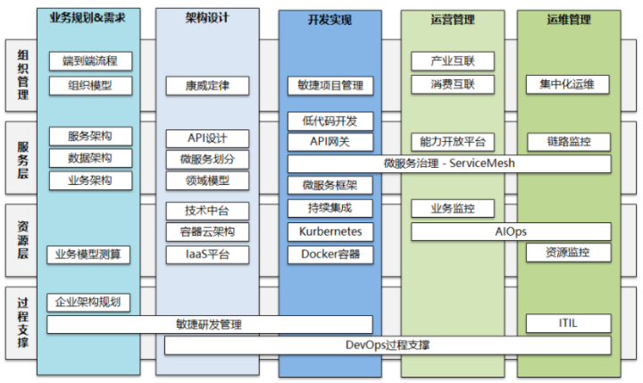
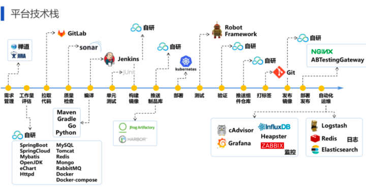
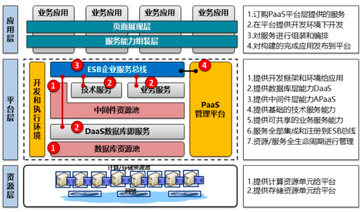
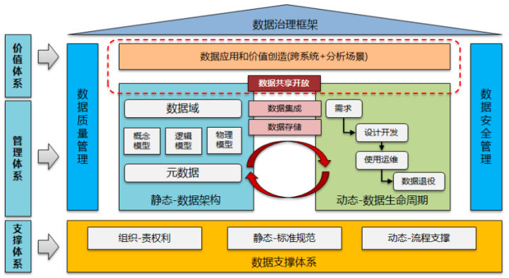
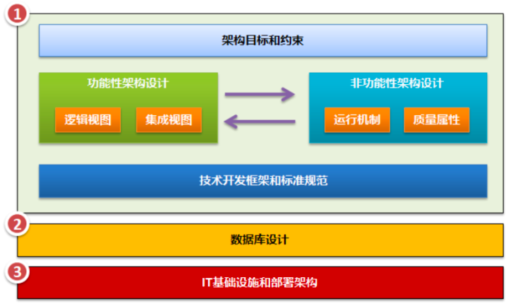

# 第一章 JAVA架构师
- ## 08-架构设计

------
## 目录
- [第一章 - JAVA架构师](JAVA架构师.md)
- [第二章 - python全栈](python全栈.md)
- [第三章 – GO编程](GO编程.md)
- [第四章 – 大数据](大数据.md)
- [第五章 – AI智能](AI智能.md)
- [第六章 – 云原生](云原生.md)
- [第七章 – 物联网](物联网.md)
- [第八章 - 云计算](云计算.md)
- [第九章 - 区块链](区块链.md)
- [第十章 - 运维工程师](运维工程师.md)
- [第十一章 - 元宇宙](元宇宙.md)
- [第十二章 - WEB3.0](WEB3.0.md)
------

## 1.1 架构思维训练

在整个思维能力中涉及到事物认知，问题分析解决两大关键核心。而事物认知本身底层逻辑是归纳演绎逻辑，而问题分析解决底层逻辑是模式匹配逻辑。这个是思维框架的小闭环，但是完整的思维体系一定涉及到学习，个人知识经验库，实践，复盘构成的大闭环框架体系。

思维和个人知识管理实际上是在非技术领域我思考最多的一个小领域。从10多年前关注个人知识管理，到最近几年对思维和问题分析解决层面的关注和总结。

作为个体成长，可以看到始终就是一个不断的学习实践，认识和理解事物，分析和解决问题的持续迭代过程，在这个过程中我们不断的积累自己的知识库，做事情的方法和模式。

## 1.2 数字化转型架构

对于数字化转型，最近半年重点是从能力框架到方法论的思考。当然整体方法论还是围绕在企业IT架构转型，技术支撑，技术中台和业务中台构建方面。

数字化转型，简单一句话总结核心就是实现事物在时间和空间上信息的高度融合统一，核心仍然是围绕核心业务价值链实现的连接，数据，智能三个方面的内容。从以往转型前的两个思维转变，一个是数据驱动，一个是运营思维。

要理解数字化转型，建议先阅读我整理的核心要素和能力框架构建思考这篇文章，建立对整个数字化转型完整的知识框架结构。

## 1.3 云原生架构

对于云原生，是我整个文章输出里面比重最大的部分，常说的微服务，DevOps，容器云等都可以纳入到云原生技术实践体系中。如上图，我们也构建了覆盖整个软件生命周期的云原生解决方案技术中台。在该图中可以更加清楚地看到各个技术组件所处的位置。

而今年上半年对于云原生的思考重点还是在微服务治理，云原生整体技术架构，无服务器化和服务网格方面。

## 1.4 企业架构和微服务架构

对于传统企业架构规划，我们在多个大项目中均有实践，而今年的一个重要输出即是围绕中台建设和传统IT架构微服务化，对已有的企业架构规划方法进行了优化和重构，形成了新的微服务架构规划咨询方法论。

其核心点仍然体现在微服务如何拆分，API接口如何识别上。而在今年上半年围绕新一代企业架构规划，对相关内容重新进行整理。

## 1.5 中台和微服务架构

对中台建设的整体知识体系重新进行整后。即从动态生命周期和静态维度拆分两个方面来构建一个完整的知识体系架构图。从上面我们也基本可以看到完成一个中台建设所涉及到的业务规划，架构设计，开发实施，过程支撑方面的关键内容。这个关键内容仍然是围绕我前面提到的，即：

企业中台构建 =》业务规划设计（业务层面）+云原生架构（技术层面）

对于业务规划设计方面，核心的知识体系仍然是结合SOA和云计算，微服务架构思想的企业架构规划和领域模型设计。在云原生架构层面，重点仍然是微服务架构，DevOps和容器云。

## 1.6 DevOps架构

对于DevOps属于云原生的一个关键要素，DevOps将成为后续文章写作的一个关键方向，不仅仅是技术内容，更多的是我自己的DevOps管理实践和技术实践。其中又包括了敏捷研发，持续集成和交付，流水线设计，自动化测试，自动化运维等内容。

## 1.7 SOA参考架构

虽然当前谈微服务比较多，但是企业传统IT转型到微服务会有相当漫长的一个时间周期，包括有些内部IT本身也不适合转为微服务架构，因此对于SOA集成平台和ESB总线，和微服务架构下的API网关，本身也会共存相当长一段时间。

## 1.8 数据治理架构

对于数据治理这块，主要是重新梳理了数据治理整体框架结构，数据治理体系本身应该包括数据管理体系和数据价值体系两个方面内容。

对于数据管理体系本身又应该围绕静态和动态两个维度来思考，在静态维度重点是数据对象和数据架构，而在动态维度重点是数据全生命周期管理。数据管理最终是将数据沉淀为资产开放和共性，让数据产生价值。

## 1.9 软件架构

架构设计包括了功能性架构和技术架构设计两个部分的内容，功能性架构解决业务流程和功能问题，而技术架构解决非功能性需求等问题。两种架构都包括了动态和静态两个方面的内容，对于功能性架构中动态部分为业务流程驱动全局用例，用例驱动的用例实现等；对于技术架构中动态部分为架构运行机制，而静态部分为框架，分层等方面的内容。

---
- 作者：face
- Github地址：https://github.com/facehai/thinking-framework-master
- 版权声明：著作权归作者所有，商业转载请联系作者获得授权，非商业转载请注明出处。
