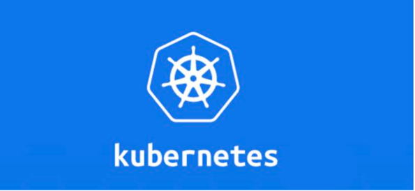
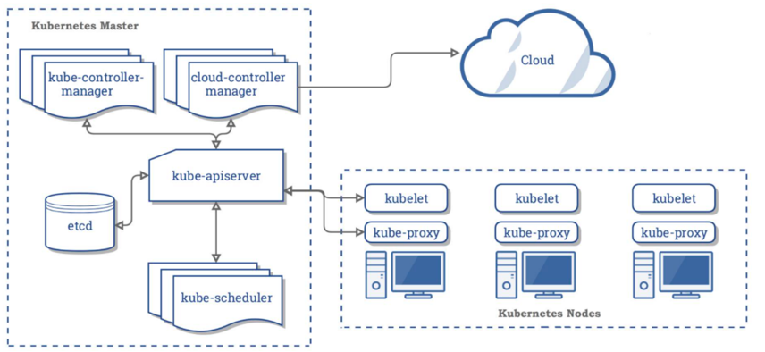

# 第六章 云原生
- ## 02-云原生环境搭建

------
## 目录
- [第一章 - JAVA架构师](JAVA架构师.md)
- [第二章 - python全栈](python全栈.md)
- [第三章 – GO编程](GO编程.md)
- [第四章 – 大数据](大数据.md)
- [第五章 – AI智能](AI智能.md)
- [第六章 – 云原生](云原生.md)
- [第七章 – 物联网](物联网.md)
- [第八章 - 云计算](云计算.md)
- [第九章 - 区块链](区块链.md)
- [第十章 - 运维工程师](运维工程师.md)
- [第十一章 - 元宇宙](元宇宙.md)
- [第十二章 - WEB3.0](WEB3.0.md)
------

# K8S 概览
# 1.1 K8S 是什么？
> K8S官网文档：https://kubernetes.io/zh/docs/home/ 
> 
> K8S 是Kubernetes的全称，源于希腊语，意为“舵手”或“飞行员”，官方称其是：用于 自动部署、扩展和管理“容器化（containerized）应用程序”的开源系统。 翻译成大白话就是：“K8S 是 负责自动化运维管理多个 Docker 程序的集群”。那么问题 来了：Docker 运行可方便了，为什么要用 K8S，它有什么优势？

# 1.2 K8S核心特性
- 服务发现与负载均衡：无需修改你的应用程序即可使用陌生的服务发现机制。 
- 存储编排：自动挂载所选存储系统，包括本地存储。 
- Secret和配置管理：部署更新Secrets和应用程序的配置时不必重新构建容器镜 像，且不必将软件堆栈配置中的秘密信息暴露出来。 
- 批量执行：除了服务之外，Kubernetes还可以管理你的批处理和CI工作负载， 在期望时替换掉失效的容器。 
- 水平扩缩：使用一个简单的命令、一个UI或基于CPU使用情况自动对应用程序进 行扩缩。
- 自动化上线和回滚：Kubernetes会分步骤地将针对应用或其配置的更改上线， 同时监视应用程序运行状况以确保你不会同时终止所有实例。 
- 自动装箱：根据资源需求和其他约束自动放置容器，同时避免影响可用性。 
- 自我修复：重新启动失败的容器，在节点死亡时替换并重新调度容器，杀死不响 应用户定义的健康检查的容器。

# 1.3 K8S集群安装
> 容器化的好处在于运维的时候不需要再关心每个服务所使用的技术栈了，每个服务都被无差别地封装在容器里，可以被无差别地管理和维护，现在比较流行的工具是docker和k8s。

# 1.4 K8S 核心架构原理

K8S 是属于主从设备模型（Master-Slave 架构），即有 Master 节点负责核心的调度、管 理和运维，Slave 节点则执行用户的程序。但是在 K8S 中，主节点一般被称为Master Node 或者 Head Node，而从节点则被称为Worker Node 或者 Node。 

注意：Master Node 和 Worker Node 是分别安装了 K8S 的 Master 和 Woker 组件的实 体服务器，每个 Node 都对应了一台实体服务器（虽然 Master Node 可以和其中一个 Worker Node 安装在同一台服务器，但是建议 Master Node 单独部署），所有 Master Node 和 Worker Node 组成了 K8S 集群，同一个集群可能存在多个 Master Node 和 Worker Node。

首先来看Master Node都有哪些组件： 
- API Server。K8S 的请求入口服务。API Server 负责接收 K8S 所有请求（来自 UI 界面或者 CLI 命令行工具），然后，API Server 根据用户的具体请求，去通知其 他组件干活。 
- Scheduler。K8S 所有 Worker Node 的调度器。当用户要部署服务时， Scheduler 会选择最合适的 Worker Node（服务器）来部署。 
- Controller Manager。K8S 所有 Worker Node 的监控器。Controller Manager 有很多具体的 Controller， Node Controller、Service Controller、 Volume Controller 等。Controller 负责监控和调整在 Worker Node 上部署的服 务的状态，比如用户要求 A 服务部署 2 个副本，那么当其中一个服务挂了的时候， Controller 会马上调整，让 Scheduler 再选择一个 Worker Node 重新部署服务。 
- etcd。K8S 的存储服务。etcd 存储了 K8S 的关键配置和用户配置，K8S 中仅 API Server 才具备读写权限，其他组件必须通过 API Server 的接口才能读写数据。
接着来看Worker Node的组件： 
- Kubelet。Worker Node 的监视器，以及与 Master Node 的通讯器。 Kubelet 是 Master Node 安插在 Worker Node 上的“眼线”，它会定期向 Master Node 汇报自己 Node 上运行的服务的状态，并接受来自 Master Node 的 指示采取调整措施。负责控制所有容器的启动停止，保证节点工作正常。 
- Kube-Proxy。K8S 的网络代理。Kube-Proxy 负责 Node 在 K8S 的网络通 讯、以及对外部网络流量的负载均衡。 
- Container Runtime。Worker Node 的运行环境。即安装了容器化所需的软 件环境确保容器化程序能够跑起来，比如 Docker Engine运行环境。

---
- 作者：face
- Github地址：https://github.com/facehai/thinking-framework-master
- 版权声明：著作权归作者所有，商业转载请联系作者获得授权，非商业转载请注明出处。
