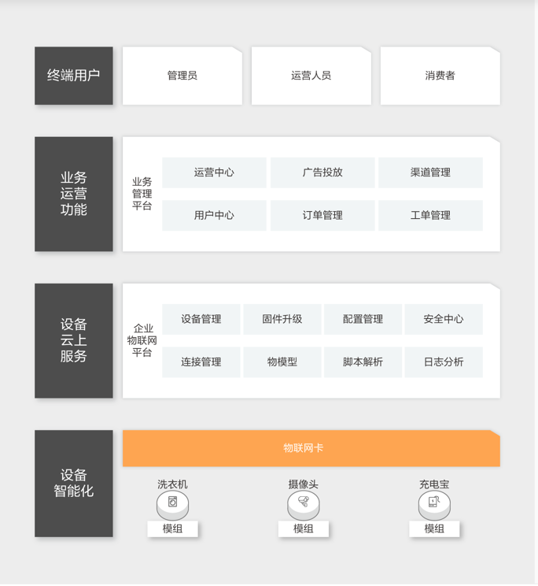

# 1.1.1 何谓物联网？
> **物联网**（Internet of Things，简称IoT）是指通过各种信息传感器、射频识别技术、全球定位系统、红外感应器、激光扫描器等各种装置与技术，实时采集任何需要监控、 连接、互动的物体或过程，采集其声、光、热、电、力学、化学、生物、位置等各种需要的信息，通过各类可能的网络接入，实现物与物、物与人的泛在连接，实现对物品和过程的智能化感知、识别和管理。物联网是一个基于互联网、传统电信网等的信息承载体，它让所有能够被独立寻址的普通物理对象形成互联互通的网络 。

### 关键技术
- **射频识别技术**
- **传感网**
- **M2M系统框架**
- **云计算**

### 应用
- **智能交通**
- **智能家居**
- **公共安全**
- **云计算**

### 挑战
- **技术标准的统一与协调**
- **管理平台问题**
- **成本问题**
- **安全性问题**

---
- 作者：face
- Github地址：https://github.com/facehai/thinking-framework-master
- 版权声明：著作权归作者所有，商业转载请联系作者获得授权，非商业转载请注明出处。
