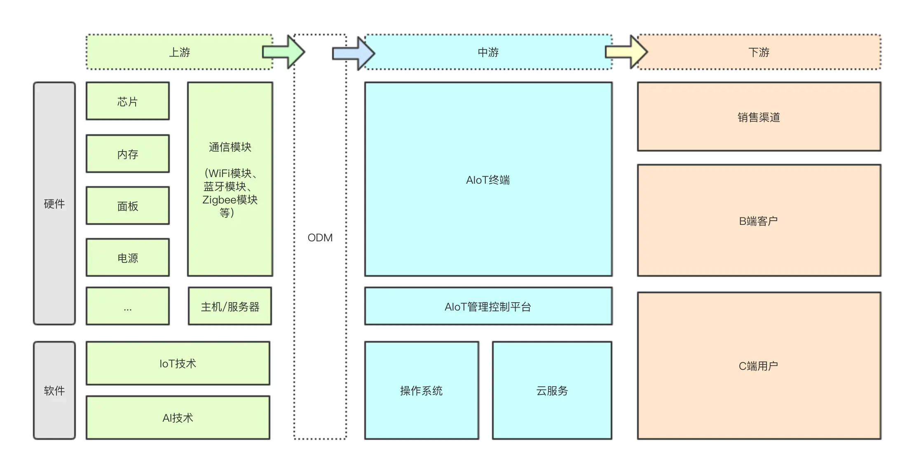
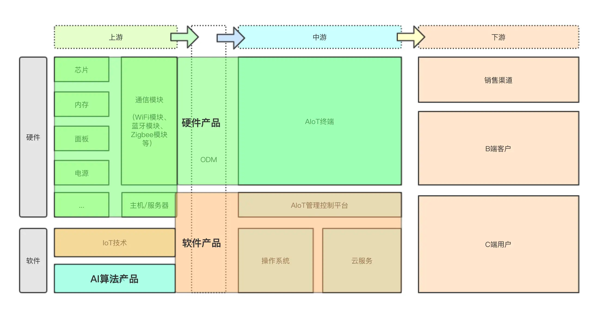
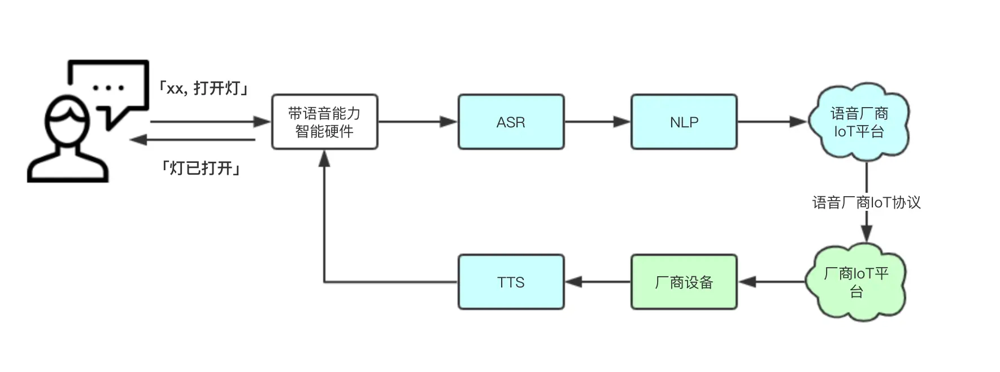
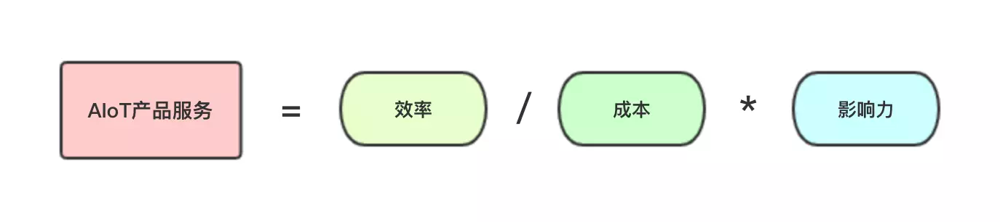

# 第七章 物联网
- ## 04-AIoT的语音技术

------
## 目录
- [第一章 - JAVA架构师](JAVA架构师.md)
- [第二章 - python全栈](python全栈.md)
- [第三章 – GO编程](GO编程.md)
- [第四章 – 大数据](大数据.md)
- [第五章 – AI智能](AI智能.md)
- [第六章 – 云原生](云原生.md)
- [第七章 – 物联网](物联网.md)
- [第八章 - 云计算](云计算.md)
- [第九章 - 区块链](区块链.md)
- [第十章 - 运维工程师](运维工程师.md)
- [第十一章 - 元宇宙](元宇宙.md)
- [第十二章 - WEB3.0](WEB3.0.md)
------

# 1.1.1 AIoT的语音技术，究竟如何落地？
> AIoT融合AI技术和IoT技术，除了实现技术的革新，其主要技术的应用和真正落地也是该领域的重点问题。。

> 是新的技术和生产工艺（例如，早期的汽车）通过被应用和被应用而获得改善，之后在获得进一步的应用和采用，进而创造出正反馈或者收益递增的效用。——《技术的本质》，布莱恩·阿瑟

AIoT并非泛泛而谈的口号，他是有自身的用户价值和商业价值逻辑。从这篇开始我们要讲讲在AIoT用到的主要技术，也是我入门（keng）以来的梳理和沉淀，若有问题也欢迎交流。
我认识在AI领域这样强技术领域，了解其技术原理和技术边界，结合市场需求，才能更高效地输出产品服务。

# 1.1.2 AIoT产业链
**AIoT产业链主要包括以下几个部分：**
- 上游：硬件：芯片厂商、通信模块等；软件：AI技术、IoT技术
- 中游：操作系统、App、云端服务
- 下游：渠道（线上 / 线下）

  从上图我们可以大致了解整个AIoT产业全貌，是一个软硬通吃，涉及模块最全的行业。所以作为产品经理，在这个领域，有很大的发挥空间。

# 1.1.3 AIoT产品都做些什么
不同类型的AIoT产品对技术理解要求不同，如阿里云IoT、腾讯云IoT其业务目标是要做生态，做水电煤，主打PaaS层的输出，直接服务开发者，所以这对产品的技术能力要求就非常高，一般得有几年相关开发经验。

而做前端交互体验的，跟用户直接接触的体验层产品对技术要求就不那么高了，结合产业链越往下游对产品对技术要求越低。结合上面的产业链结构图可以分为三大块：

硬件产品：为整个终端硬件体验负责。需要从硬件定义、设计到最后的量产全链路环节都有深入理解，这块在这儿不展开说，后续讲到硬件产品再深入聊；
软件产品：为整个IoT软件服务体验负责。这个是个大模块，再往细的分有 App产品、系统产品、IoT平台产品，如果还有线上渠道，那还有电商产品等；
AI算法产品：为整个AI体验负责。按照技术链路还可以细分为声学前端产品、ASR产品、NLP产品、TTS产品。关于这块的技术，下面我们具体展开来说。

# 1.1.4 AIoT之语音技术
对于产品经理来说，了解语音技术主要的技术点，可以：

- 快速收敛问题，帮助开发提高定位和修改问题效率；
- 输出稳定产品，了解技术原理和边界，才能快速输出稳定的产品服务。这个无论对于C端用户或B端客户来说都是最基本的需求。

我们这里以用户使用语音中控设备控制灯为例（详情可见以下流程图）：

用户发出「打开灯」指令，则会经过以下几个步骤：

**第一步 拾音**

根据使用场景也分为近场拾音（一般3m以内）和 远场拾音（一般3-5m）。这一部分在技术上称为声学前端。

主要原理是通过单mic或mic阵列能准确获取到用户语音信息，为下一步ASR（语音识别）做准备，主要包括以下几个技术点（但不限于，整个链路涉及到很多技术环节，下面主要将跟产品体验比较相关的主要技术点抽离出来）：

- VAD（Voice Activity Detection），语音活性检测。使用音频特征等进行分析，确定声音的开始与结束点。对于产品来说经常会遇到某条指令没有识别全，比如「打开灯」只识别到了「打」导致最后没有命中相应技能，无法完成用户意图，这时候可能就是VAD异常截断问题；
- AEC（Acoustic Echo Cancellation），回声消除。如果当前设备在用mic拾音的同时又在播放音乐等音频内容，那mic会将这设备播放出去的声音再重拾回来，避免再播放出去有回音。对于产品来说这是考核一个有待音频播放功能的智能语音设备必然考核的体验点，比如播放音乐时经常有回音问题，那可能是AEC算法没做好；
- BF（Beam Forming），波速成形。用于将单个方向的语音进行增强，削弱无关的声音，使得声音听起来更加干净。对于产品来说这个是在嘈杂环境下提高识别的核心技术点，如果嘈杂环境里你的产品识别差，可以从这个点入手看看。

**第二步 ASR（Automatic Speech Recognition）**

这一步主要是将前端拾音的语音信息转化成文本信息，将处理的文本信息丢给下一步NLP（自然语言处理）来做处理。主要考核指标识别率和误唤醒等。关于这点hanniman老师有做比较深入的讲解，这里就不多做说明。

**第三步 NLP（Natural Language Processing）**

自然语言处理的目的是主要是将文本信息转化成机器语言，明确用户意图，在为下一步，触发用户预期的意图做准备。在产品运营侧主要会分为下面几个部分：

- Domain，即所属领域，如 音乐、智能家居分别都算是一个领域。领域相当于类别，比如我想创景一个电视控制技能，就先创建一个电视的Domain；
- Intent，即意图，用户想要让机器做的事情。如 以本章节「打开灯」这个例子为例，「打开灯」即为用户的行为意图，但同样一个控制意图可能有不同的说法，比如「打开灯」可以说「把灯打开」或「灯被打开」这时需引入一个东西叫Pattern，他是来解决不同说法或句式的问题，产品运营人员可以配置几个常用的句式或说法，然后通过算法进行枚举和泛化；
- Slot，即词槽，在本例中，「打开」和「灯」都是词槽。

**第四步 平台转发**

语音厂商IoT平台→厂商IoT平台→厂商设备。因为智能家居领域较为特殊，从用户维度来看，一个用户可能会有各种不同品牌的智能家居设备；而从市场维度来看，目前智能家居市场品类繁多，碎片化严重。

以天猫精灵为例，目前已接入了600+品牌。单纯用技能方式对接，不利于厂商运营管理和用户端体验。所以大部分语音厂商还会针对智能家居做一个管理平台。

经过上一步NLP的处理信息传给语音厂商的IoT平台，语音厂商的IoT平台会根据用户已经绑定智能家居品牌和设备能力，在将这些信息传给相应的三方厂商IoT平台，最终将控制信息下达给相应的控制设备，完成整个控制链路。

**第五步 TTS（Text To Speech）**

顾名思义是将文本转成语音，如果你的中控设备带有Speaker，当整个控制链路完成后，可以播报一个结果语音来提升整个产品体验，完成体验闭环。

# 1.1.5  四、语音技术*AIoT
以上各项技术以排列组合的方式我们很容易算出可以提供给客户25种不同产品技术方案，而对于C端用户产品服务也不计其数。但对于目前很多公司最大的问题在于：如何在于这「汪洋大海」中找到自己的一片天（就连空调都集成语音能力了，很多人都无法理解）。

以下谈谈我对语音技术之于AIoT落地的看法（以下方法对C和B端同样适用）：

首先，效率，万事以高效为先。一切新产品或新技术的应用的第一优先考核指标在于相比原先的服务是否提高效率。什么是高效？高效即做同样的事情谁花的时间最短。以「打开电视后我想看湖南卫视」这个用户场景为例，以下是三种不同类型的电视操作路径对比：

- 传统电视：遥控器的频道键→左右键切换3-4页数（除湖南本省外，其他外省可能把忽然卫视放到3、4页后）→上下键选择到湖南卫视→点击确定。大概需要操作5-6步；
- 智能电视（不带语音）：我的应用→电视猫App→搜索湖南卫视→点击确定。大概要操作4步；
- 语音电视：一句话「xxx，我要看湖南卫视」，甚至可以直接免唤醒词。只要1步。
其次，成本，要考量在单位时间内所消耗的能量和成本。基于上一点「做同样事情谁花的时间短」除了这一维度还不够，因为速度快并不代表成本低，所以还要考量在单位时间内所消耗的能量和成本。

比如，你花了20块需要2小时，而花60块钱只能算短到1.5个小时，明显性价比不高。

以集成语音能力的智能空调为例。目前市面上此类空调价位在￥6999~￥9999之间，主打高端市场。而一个语音模组的价格在几十块左右，这个成本完全承担得起，而且还提升了其议价空间。

而比如在小家电领域，客单价普遍比较低的领域，这个成本可能就有很大的成本压力了。所以，目前语音模组更广泛应用于大家电如 电视、空调等。所以除了用户场景，成本维度也是重要的考虑因素；

最后，影响力，要考虑做这件事对外部的影响力。即你的产品与用户/客户的交互反馈，主要分为积极影响和消极影响：

- 积极影响力，比如，接近真人的TTS体验，自然的人机对话体验；
- 消极影响力，比如，前几个月的Amazon的Echo鬼声事件。
可以从定性（满意度等）和定量（日活、留存等）角度来衡量，但为了方便下面延展，我们可以简单的把积极影响力记为正数，消极影响力记为负数。

AIoT产品服务公式

总结：我把评判一个AIoT产品服务的好坏，结合三要素，总结为如图所示公式：

AIoT产品服务=效率/成本*影响力

通过这个公式我们可以很容易得出：一款好的AIoT产品服务需要具备高效、低成本以及积极影响力，而且这个服务会随着你的正向影响以乘法叠加的方式增长。

同理，我们也可以很快得到一个差的AIoT产品服务是由什么因素决定的。

为了方便大家理解，我们以上面提到的例子，目前空调集成语音能力这个是个好的AIoT产品服务吗？

首先，语音控制相比空调的物理遥控器确实是更方便，假设切换到制冷模式，物理在初始状态下要按两下「模式」键，而语音只要一句话就能解决，效率提高50%；

其次，对于厂商来说，假设一个模组成本是￥50，目前带语音能力的空调普遍售价在￥6999~￥￥9999之间，以6999的价格和35%的毛利率（目前几家空调大厂毛利在这个水平，高端型号肯定毛利更高）来算差不多只占了1%的成本，完全cover的住；

再来，关于影响力，先不说语音控制在某些场景效率比遥控器高，用户买了一个那么贵的空调，还有语音能力（除了控制，还能问问天气等），虽然可能平时基本不咋用，但是至少还有个炫耀的资本。比如，有客人来，可以很装13地说「我这空调可以语音控制哦」，相比不带语音功能的高端空调，确实有一定的附加值。假设以-5~5来做满意度打分，至少给个3分吧；

最后，通过公式我们可以算出整个空调集成语音能力的AIoT产品服务分数为150分。从这个维度来看，空调集成语音能力是有积极价值的。

# 1.1.6 小结
在《技术的本质》中，作者 布莱恩·阿瑟（复杂性科学奠基人） 认为：
> 技术，是新的技术和生产工艺（例如，早期的汽车）通过被应用和被应用而获得改善，之后在获得进一步的应用和采用，进而创造出正反馈或者收益递增的效用。

目前AIoT行业还在早期阶段，了解语音技术这个「新技术」可以使我们更加从容。祝各位同仁能用这个「新技术」创造出更多正反馈或者效益递增的效用。

---
- 作者：face
- Github地址：https://github.com/facehai/thinking-framework-master
- 版权声明：著作权归作者所有，商业转载请联系作者获得授权，非商业转载请注明出处。
