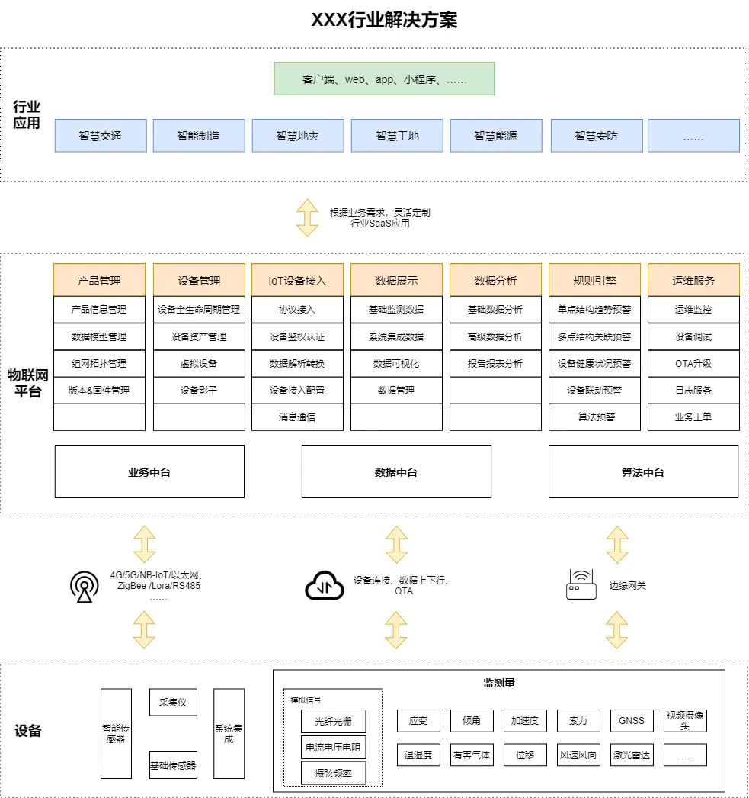
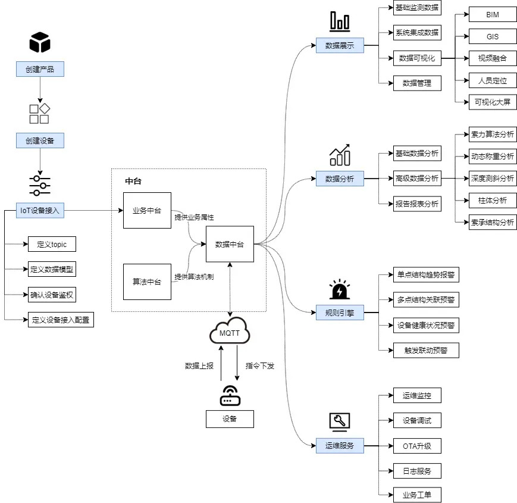

# 第七章 物联网
- ## 04-1.1 物联网平台架构

------
## 目录
- [第一章 - JAVA架构师](JAVA架构师.md)
- [第二章 - python全栈](python全栈.md)
- [第三章 – GO编程](GO编程.md)
- [第四章 – 大数据](大数据.md)
- [第五章 – AI智能](AI智能.md)
- [第六章 – 云原生](云原生.md)
- [第七章 – 物联网](物联网.md)
- [第八章 - 云计算](云计算.md)
- [第九章 - 区块链](区块链.md)
- [第十章 - 运维工程师](运维工程师.md)
- [第十一章 - 元宇宙](元宇宙.md)
- [第十二章 - WEB3.0](WEB3.0.md)
------

从PC互联网到移动互联网都是人与人的连接，而物联网则是将身边的所有东西和事件都连接在了互联网上。本篇文章中，作者从感知层、网络层、平台层、行业应用层这四个层面，为我们分析了物联网平台应该如何进行产品架构

# 1.1.1 物联网介绍
物联网（ IoT ，Internet of things ）即“万物相连的互联网”，是互联网基础上的延伸和扩展的网络，将各种信息传感设备与互联网结合起来而形成的一个巨大网络，实现在任何时间、任何地点，人、机、物的互联互通。

在传感技术、微机电系统、通讯技术、云计算等技术产业的支持下，物联网技术的发展非常迅速，并且作为近年来受国家政策大力扶持的国家战略，开始备受瞩目，逐渐迎来各种商机，市场也在逐渐扩展。

在未来十年，随着物联网与互联网、人工智能、5G、大数据等技术的发展，即将迎来引领社会发展的智能化时代。对于物联网技术的应用，可划分为四层，分别感知层、网络层、平台层、应用层：

- 感知层：即通过传感技术，感知并采集物理世界的数据，建立人与物之间的沟通桥梁；
- 网络层：网络层作为数据传输的管道，把物与互联网进行连通，实现人、机、物之间互通；
- 平台层：数据接入到系统平台后，平台可对数据进行解析、分析、处理后，提供丰富的服务与功能；
- 应用层：物联网的最终将会应用于各类行业，如智能家居、智能汽车、智慧城市、智慧交通、智慧医疗等等，推动智能化发展。

# 1.1.2 产品架构
物联网平台，提供海量设备的接入与管理能力，可以将您的IoT设备连接到云平台，支撑设备数据采集上云和云端下发命令给设备进行远程控制，根据不同的应用场景，帮助您快速构建物联网安全监测解决方案。

构建一个完整的建物联网安全监测解决方案，主要分为设备、物联网平台、行业应用3个部分：

1）设备

即物联网技术中的感知层和网络层。

对于各类传感设备，可以通过zigbee/Lora/RS485等通讯方式接入传感网，或通过4G/5G/NB-IoT/以太网等多种网络接入物联网平台，并使用MQTT协议将业务数据上报到平台，平台也可以将控制命令下发给设备。

2）物联网平台

即物联网技术中的平台层。

物联网平台作为承接设备与行业应用的中间服务，它承载了抽象化的业务逻辑及标准化的核心数据模型，实现设备的快速接入，同时提供强大的模块化能力，支撑行业应用场景下的各类需求。

3）行业应用

即物联网技术中的应用层，通过调用物联网平台提供的API接口，快速构建满足行业需求的功能模块。

本文举例的物联网平台产品架构，是建立在安全监测为应用领域来设计的，不同企业的产品架构多少会与上图会有出入，但是整体框架应该是类似的，将着重介绍我对物联网平台的理解。

# 感知层
感知层，实现对物理世界的识别感知、信息采集，是物理世界和信息世界的重要桥梁。感知层包括RFID、传感器等设备。

1）RFID（射频识别技术）

通过一个小小的标签，便拥有信息存储、信息收发的能力，使得每个物体都被赋予了一个ID，为物体识别带来极大的便利。

2）传感器

对于传统的定义为：能感受到被测量并按照一定的规则转换成可用输出信号的器件或装置。对于广义上的传感器，在此基础上还会加入微处理器、模数转换、通信模组、电路设计、嵌入式程序等能力，极大程度地提升传感器的智能化。

# 1.1.4 网络层
网络层，实现数据传输，把数据从感知层传输至平台层。网络层又分为物接入互联网、互联网传输两部分。

1. 物接入互联网部分
   分为三类通讯方式：有线通讯、无线短距局域网通讯、无线长距广域网通讯。

1）有线通讯

以太网/光纤；
串口通讯：按位（bit）发送和接收字节，如USB/RS485/RS232等。
2）无线短距局域网通讯

ZigBee（紫蜂）：一种低速短距的无线通信技术，工作频段在4GHz，通讯距离在百米范围，功耗低。通过节点+网关的方式，可以搭建万级节点拓扑的私有网络；
Wifi：一种高速短距的无线通信技术，工作频段在2.4GHz和5GHz，通讯距离在百米范围，功耗很大，一般只用于有源设备；
Bluetooth（蓝牙）：一种中速短距的无线通信技术，工作频段在4GHz，通讯距离在十米范围，连接设备的数量不多。
3）无线长距广域网通讯

Lora（Long Range Radio）：一种低速远距调制技术，采用线性调制扩频方式，增强通讯距离，可达2~15km的范围，在中国使用的是470-510MHz免授权频段。与ZigBee类似也是需要通过节点+网关的方式搭建网络，功耗较低；
NB-IoT（Narrow Band Internet of Things，窄带物联网）：一种新兴的低功耗远距通信技术，属于授权频段，只需要180kHz的带宽便可部署至运营商网络上。通讯距离也在10km级别。其低功耗休眠机制，会导致无法实时通信；
4G：第四代移动通信技术，高速远距通信，在中国使用的工作频段为824~960 MHz，1710~2690 MHz。传输数据量大，功耗也大。

2. 互联网传输部分
   目前有两种主流的通讯协议：MQTT和CoAP

MQTT（Message Queuing Telemetry Transport，消息队列遥测传输）：是一个基于客户端-服务器的消息发布/订阅传输协议，可保持长连接，实现多对多异步通信；
CoAP（The Constrained Application Protocol，受限应用协议）：是一种客户端-服务器单对单的协议，具备轻量低功耗的特点。

# 1.1.5 平台层

上图为设备上平台的数据信息流。对于平台层的各种能力，下面将会展开说明。

1. 产品管理
   产品是设备的集合，通常是一组具有相同功能定义的设备集合。该模块以一种硬件产品为粒度，创建产品及配置产品相关信息。

产品信息管理：硬件产品的功能描述、性能参数、发布状态等信息管理；
组网拓扑管理：对于传感器、采集仪、网关，由于通讯方式不同，产品的组网拓扑便不同。此处描述各类产品入网的拓扑关系；
版本&固件管理：对产品的版本信息及固件进行管理；
物模型管理：物模型，即一类物理世界的实物（如传感器）在平台的数字化模型。物模型对该产品的上行数据、下行指令，上下行动作进行描述。简单来说，物模型就是该实体能对外提供什么信息以及能对它做什么，因此物模型是设备与平台之间的关键枢纽。
2. 设备管理
   设备是硬件产品的最小单位，每个设备都对应一个唯一编码，从设备入库开始便记录相关信息，并且可以对设备进行资产分配、安全认证、配置操作等行为，最后对设备从入库到报废的全生命周期管理。

设备全生命周期管理：对设备的物理状态、健康状态、资产归属、调试日志进行记录，记录设备从入库到报废的全生命周期，便于问题追溯分析。
设备资产管理：对设备资产进行划分，便于控制用户设备权限。
虚拟设备：根据物模型构建虚拟设备，用于用户体验、真实设备受限时的模拟调试验证、批量压测验证平台性能等场景。
设备影子：每个设备有且只有一个设备影子，设备可以通过MQTT获取和设置设备影子来同步状态，用于存储设备上报状态、应用程序期望下发的配置，解耦应用于终端设备。一般用于网络不稳定、设备无法实时通信、一个设备在同一时间被反复请求等场景。
3. IoT设备接入
   物联网平台支持海量多元异构数据的设备接入，通过简易的配置，便可建立设备与云平台之间的联系，实现稳定可靠的双向通信。

协议接入：使用MQTT协议接入数据，并根据场景定义不同topic进行消息发布订阅。
设备鉴权认证：以网关为单位，对接入数据topic做发布订阅鉴权认证，实现topic级别的权限隔离，提高接入安全性。
数据转换解析：对接入的异构数据进行格式统一，根据物模型对接入数据进行解析。
设备接入配置：此处的目的是把接入到平台的数据与具体的实体对象进行握手，以便于在应用中能够区分不同实体对象的数据。此处依赖于产品物模型与产品组网拓扑。需要注意的是，在应用层中，根据不同业务属性，可能会把实体对象做某些关系映射。
消息通信：当完成设备接入配置后，用户便能实现对设备的交互，包括数据上报、命令下发等。
4. 数据展示
   该模块对物联网收集的数据，运用相应的可视化图表进行展示，以便于物联网监测数据能直观展示。此处功能与企业业务方向会紧密相关。

基础监测数据：对结构化数据进行基础图形表格数据展示。
系统集成数据：对视频监控、车流量等系统集成类进行数据展示。
数据可视化：安全监测领域主流的可视化系统，如BIM、GIS、视频融合、人员定位、可视化大屏等。
数据管理：对原始数据的数据维护、数据下载、文档管理等服务。
5. 数据分析
   该模块对展示的数据加以分析，把物联网海量数据变成有价值的数据。此处功能与企业业务方向会紧密相关。

基础数据分析：包括同步分析、关联分析、同步分析、频谱分析、风玫瑰图分析；
高级数据分析：针对特定传感器的高级算法分析，包括索力算法分析、动态称重分析、深度测斜分析、柱体分析、索承结构分析；
报告报表分析：专业结构人员使用的分析工具，制作专业分析报告。
6. 规则引擎
   规则引擎是指用户可以在物联网平台上可以配置某些规则，在判断条件满足规则后，平台会执行相应的动作来满足用户需求，灵活构建场景联动、报警等定制化业务场景。规则引擎所需要的元素如下：

1）触发条件

触发对象：可以是某个设备，某个测点，也可以是某个时刻，或某个事件；
触发条件：可以是简单的上下限判断，也可以是一个复杂的函数/算法判断；
触发时间：即时效性，可以是一直有效，或者规定时间内有效；
沉淀机制：避免设备上传相同数据导致重复触发规则。
2）执行动作

指令下发：即对制定设备发送指令；
发送通知：如短信、邮件、小程序、APP推送等；
产生报警：在运维报警监控界面产生一条报警记录；
执行时间：立即、或延时；
执行规则：执行某条规则；
规则状态开关：开启或关闭某条规则。
3）日志

每条状态为开启的规则，每次执行都要留有日志，存储触发时间、判断依据、执行动作记录等。

7. 运维服务
   此模块为专业运维团队提供运维服务，是业务正常运作的关键。

运维监控：对项目运维情况进行监控，包括设备拓扑网络、运维报警监控、无效数据、设备报表分析；
设备调试：对设备进行远程在线调试；
OTA升级：上传新的升级包，并将OTA升级消息推送给设备，设备即可在线升级；
日志服务：包括设备全生命周期日志、用户操作日志等；
业务工单：支持业务运作的跨部门协作工单，此工单内容根据企业业务不同会有较大差异，此处不做具体展开说明。
五、行业应用层
物联网的应用领域涉及非常广，比如跟生活相关的家居、饮食、医疗、教育、旅游等，也有跟行业相关的交通、物流、工业、安防、能源等。以下简单列举几个应用场景。

1. 智能家居
   智能家居是以住宅为单位，通过物联网技术把家中的各类设备（如家电设备、照明、安防、摄像头、电源、影音等）连接到一起，实现家电控制、防盗报警等设备智能化场景联动。

通过AI语音、触屏、生物识别等交互方式实现人与物的智能化互动，极大地提升便利性、安全性、舒适性的居家体验。

2. 智慧交通
   随着社会经济和科技的快速发展，城市化水平越来越高，机动车的数量也迅速增加。

随着物联网、大数据、云计算等技术的发展和应用，需要一种面向人、车、基础设施的智慧交通管理方案，以便于为城市的交通领域提供更高效、绿色、安全的出行方式。其中有多类主流的应用场景：

交通实时监控：实时监控交通事故、交通拥堵、交通违章等问题；
基础设施结构安全监测：对于桥梁、路面等结构安全做监测，实时监测结构损坏情况并及时维护，预测寿命，保证交通安全；
车辆智能管理：利用先进的传感技术、定位技术，实时监控车辆的运行状态及轨迹，实现智能充电、智能停车、ETC等场景；
公共设施智能调度：如红绿灯、路灯、摄像头监控、公交车等，根据实际交通情况及算法，实现智能调度。
3. 智能制造
   工业互联网是实现智能制造的关键。其本质是通过开放的、全球化的工业级网络平台把设备、生产线、工厂、供应商、产品和客户紧密地连接和融合起来，高效共享工业经济中的各种要素资源，从而通过自动化、智能化的生产方式降低成本、增加效率，帮助制造业延长产业链，推动制造业转型发展。

4. 智慧能源
   对能源行业实现自动化、智能化。对于当前主要能源电力，覆盖了发电、输电、变电、配电、用电等环节，实现电力智能监测、保护与管控。

5. 智慧医疗
   通过物联网、大数据、人工智能等技术，实现患者、医护人员、医疗机构、医疗设备之间的信息互动，完善医疗管理系统，提高医疗效率与服务质量。

六、总结
如今的物联网技术的应用，存在许多机遇，这一片蓝海市场等着我们一起开拓。不可否认的是，物联网给我们带来更加便利的生活，给社会经济带来更快速发展。

然而，也面临着许多挑战，如平台的易用性、海量数据的接入稳定性、海量数据的意义挖掘、跨企业跨平台的技术通用性、数据安全性等。即将进入智能化时代的我们，一起来积极拥抱这些新兴技术吧。

---
- 作者：face
- Github地址：https://github.com/facehai/thinking-framework-master
- 版权声明：著作权归作者所有，商业转载请联系作者获得授权，非商业转载请注明出处。
