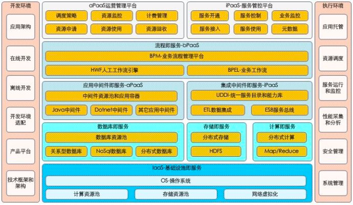
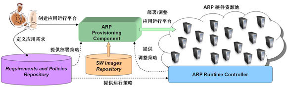

# 第八章 云计算

------
## 目录
- [第一章 - JAVA架构师](JAVA架构师.md)
- [第二章 - python全栈](python全栈.md)
- [第三章 – GO编程](GO编程.md)
- [第四章 – 大数据](大数据.md)
- [第五章 – AI智能](AI智能.md)
- [第六章 – 云原生](云原生.md)
- [第七章 – 物联网](物联网.md)
- [第八章 - 云计算](云计算.md)
- [第九章 - 区块链](区块链.md)
- [第十章 - 运维工程师](运维工程师.md)
- [第十一章 - 元宇宙](8.1云计算-PAAS.md)
- [第十二章 - WEB3.0](WEB3.0.md)
------

对于私有云PaaS实际上涉及到的内容相当多，根据gartner参考架构，我原来也总结过包括了一个标准的paas架构应该包括的内容。平台即服务核心即平台能力超云端的迁移和运化。具体内容包括了数据库资源池，中间件资源池，应用托管和动态调度，技术平台，开发框架和环境，运行环境，管理平台，云存储，分布式计算，私有云PaaS下的服务总线和集成平台，流程平台等多个内容。

还有PaaS仅仅是技术架构和技术平台，而在私有云PaaS实施过程中更加重要的是企业架构，SOA组件化架构思想的引入，只有这样才能真正打破传统应用建设边界，实现业务驱动IT，业务组件化和组件能力化。

## 1.1 概述
### PAAS平台概述
> 平台即服务（Platform-As-A-Service，PaaS）已经成为业界探讨云计算的热点之一，采用 PaaS 模式构建应用运行平台是实现平台服务的重要实践。

> 云计算（Cloud Computing）是当前 IT 领域的热点，它的目标之一是通过互联网，使用户更加方便、快捷、灵活地使用各种有质量保障的 IT 资源，这些资源以服务形式提供，终极的云计算环境将使得消费这些服务就像今天使用水、电和煤气等公共基础设施一样便捷。

> 通常，云计算包括三个主要的层次：基础设施服务（Infrastructure Services），平台服务（Platform Services）和应用服务（Application Services）。

其中，平台服务已经成为实践云计算的重点之一，它将应用运行所需的 IT 资源和基础设施以服务的方式提供给用户，包括了中间件服务，信息服务，连通性服务，整合服务和消息服务等多种服务形式。为实现平台服务，业界提出了 “平台即服务（Platform as a Services，以下简称 PaaS）”的交付模式。PaaS 模式，基于互联网提供对应用完整生命周期（包括设计、开发、测试和部署等阶段）的支持，减少了用户在购置和管理应用生命周期内所必须的软硬件以及部署应用 和 IT 基础设施的成本，同时简化了以上工作的复杂度。为了确保高效地交付具备较强灵活性的平台服务，在 PaaS 模式中，平台服务通常基于自动化的技术通过虚拟化的形式交付，在运行时，自动化，自优化等技术也将被广泛应用，以确保实时动态地满足应用生命周期内的各种 功能和非功能需求。

具体来说，搭建传统 IT 基础平台是一个漫长的过程，通常由申请，审计，硬件购买与运输，硬件安装与配置，软件安装与配置等步骤组成。在这个过程中繁复的手工配置工作费时费力，而 且容易产成人为配置错误。同时，平台环境的升级维护也面临人为配置错误频繁产生问题，造成不必要的影响和损失。由于这些原因，搭建完成的应用运行平台，即 使在一定时期内不再需要，也不会被及时释放回收，以供新项目使用。这是造成空闲硬件资源的原因之一。此外，传统基础平台提供的应用运行能力是静态的。然而 在不同时间，应用负载往往是不一样的。为了确保高负载时应用的正常运行，应用运行平台必须能够提供最高运行能力，这就造成了非高峰时的众多空闲硬件资源。

云计算的产生，尤其是平台服务的理念，从产生空闲硬件资源的根本原因入手。建立了快速搭建部署应用运行环境和动态调整应用运行时环境资源这 两个目标。依据虚拟化与自动化技术实现应用运行环境的即时部署以及快速回收，降低了环境搭建时间，避免了手工配置错误，快速重复搭建环境，及时回收资源， 减少了低利用率硬件资源的空置。另一方面，根据应用运行时的需求对应用环境进行动态调整，实现了应用平台的弹性扩展和自优化，减少了非高峰时硬件资源的空 置。

在实际应用中，PaaS 模式的重要应用场景之一是向用户交付一个支撑应用运行的应用运行平台（Applications Running Platform，以下简称 ARP）。基于 PaaS 模式构建应用运行平台，需要满足以下典型需求：

- 提供定义应用需求的接口：用户可以方便地定义满足应用功能需求所需的组件，同时可以定义应用的非功能性需求，例如可用性，服务水平等；
- 提供基于应用需求快速构建应用运行环境的能力：能将应用需求映射为物理的 IT 资源和基础设施的具体配置和拓扑结构，并进行快速部署；
- 提供运行时实时动态满足应用需求的能力：将应用需求映射为运行策略，在运行时，根据系统运行的实际状况，例如负载状况，动态地对物理的 IT 资源和基础设施进行调整，例如调整负载分配或增减计算资源，使 ARP 具备足够的弹性和灵活性，以实时动态地满足应用需求。

针对上述需求，基于 PaaS 模式构建 ARP 的解决方案至少需要包括如下组件：

- 需求与运行策略库： 向用户提供定义应用需求的界面，保存应用需求，并将应用需求转化为部署及运行策略，提供给平台交付组件和运行时控制组件；
- 软件映像库： 提供应用运行平台所需的基础软件；
- ARP硬件资源池：基于 Hypervisor，以虚拟化的方式，提供应用运行平台所需的硬件资源；
- 平台交付组件：根据部署或调整策略及 APR 硬件资源池来创建或调整应用运行平台；
- 运行时控制组件： 根据运行策略和实际运行状况动态调整 ARP 资源池，提供资源动态调度能力

## 1.2 PAAS平台说明
平台即服务，则核心就在于平台层能力由终端向云端的集中化迁移，平台涉及到业务平台和技术平台，因此涉及到两级平台的云化。技术平台涉及到底层数据库，中间件，也涉及到在这个上面进行的二次封装，这些都是需要考虑云化的内容。由于在没有谈PAAS平台前，我们已经在考虑技术平台和产品平台的建设，因此这些平台建设经验在构建PAAS基础平台的时候同样适用，平台即服务，即平台层的能力转化为一种服务。

在标准的产品开发思路上，我们一般考虑分为产品，平台和技术三个层面的内容。也可以将最下层是技术平台，一个技术平台可以衍生多个产品平台，一个产品平台又可以衍生多种型号规格的产品。建设平台的核心思路是已有业务系统中通用的非业务相关内容的下沉，通过下沉后进行集中化构建，最大化复用。在业务系统的构建中真正实现业务和技术，业务和平台的解耦，开发人员只需要关注业务，而不用关注太多技术和底层平台细节。

在传统平台建设过程中，我们根据强调开发平台，即是基于一种开发技术架构进行二次封装，提供一整套的开发框架和模式，供各个业务系统使用，业务系统遵循同样的开发思路和流程。这个在平台建设早期是有益的。后续我们可能可能不简单的停留在全空的框架上面。因为各个应用系统在开发中都涉及到组织，权限，工作流引擎，安全，异常，日志等的开发，而这些内容由于和业务无关具有很大的共性，因此在第二个阶段平台会进一步演进，即不是提供空框架，而是提供没有任何业务功能的空应用系统。各个业务系统完全在这个空应用基础上架构业务组件和模块。这个空应用系统即进一步朝产品平台的层面过渡。

而到了第三个阶段，虽然有空应用系统，但是组织权限，流程规则等仍然是在各个业务系统里面，各个业务系统都需要对这部分内容进行管理和维护。因此平台会进一步考虑通用型的能力如组织引擎，权限引擎，工作流引擎等真正从业务系统中剥离出来，进行统一和集中，由终端迁移到云端形成各个业务系统都共用的内容。这种集中化即是企业内平台朝PAAS平台走的一个演进思路。

再回来看Google的GAE和微软的Azure对PAAS平台即服务的思路，它们的核心逻辑是只要你遵循我提供的标准开发框架和开放式能力接口，那你开发的应用就可以托管到我的云环境。而这个云环境可以满足你对分布式计算，分布式存储，分布式资源调度的所有需求。因此中间件，数据库，已经基于两者构建的基础平台完全云化在云端，实现集中化的管理和动态调度。

平台层提供能力，能力即服务，服务需要进行集成，这是我们常说的SOA和云计算的关联点。在我们整个平台云化后，业务系统和平台之间还需要集成，以实现能力的接入和使用，而这是需要通过ESB总线机制来实现。在这个思路上我们再来分析PAAS平台和各其它关键要素的关系。

## 1.3 PAAS平台和IAAS层的关系
首先企业内的PAAS平台是一个各个业务系统公用的平台，因此PAAS平台本身需要支持多组织和多租户。其次PAAS平台和SAAS没有必然的关系，根据业务需求定。基于PAAS平台开发的应用在公用云环境可能偏SAAS应用，而在私有云环境则不一定是SAAS应用。没有PAAS也可以实现SAAS层和IAAS层的直接集成。

## 1.4 PAAS平台和SOA集成平台
在这里只将企业内容，很多时候我们将SOA集成平台本身就作为企业内PAAS平台的一部分。SOA集成平台提供了能力和服务的集成，BPEL流程编排，BPM和规则引擎等基本功能。SOA集成平台不在业务系统内部，而是集中化的只有一套，这套ESB能力供各个业务系统使用并实现集中化管理。

在通过SOA解决基础的问题后，过渡到PAAS平台一定要考虑PAAS平台本身可以通过组合和编排来产生新的服务和能力，这个能力可以在PAAS平台里面产生并集中化管理，而不是传统的在业务系统产生SOA只管集成。

## 1.5 PAAS平台和基础能力
对于PAAS层平台需要提供基础层得平台能力，这些能力是原有的各个业务系统中能力的下沉。即我们常说的统一的组织权限引擎，主数据，统一的流程建模，执行和监控平台全部划入到SOA集成平台。通过提供这些基础能力实现真正意义的业务系统完全只剩余业务模块和业务组件。朝业务组件化和组件能力化的构想更进一步。

## 1.6 PAAS平台和开发模式
推行PAAS平台一定要考虑到PAAS平台的建设本身就是开发框架和模式的大变革。只有基于标准开发框架和模式才能够自动部署和应用托管。这里的开发模式我们更加强调的是SOA的内化，为了考虑后续NoSQL数据库的使用，我们会弱化关系型数据库的思维，进一步加强领域建模的思路。组件化架构+领域建模我认为是PAAS平台下的核心开发思维模式。

---
- 作者：face
- Github地址：https://github.com/facehai/thinking-framework-master
- 版权声明：著作权归作者所有，商业转载请联系作者获得授权，非商业转载请注明出处。
