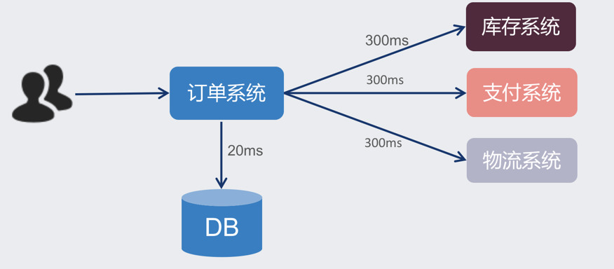
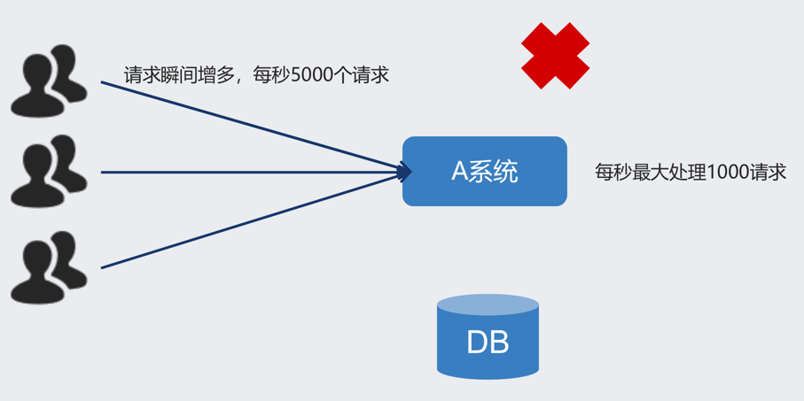
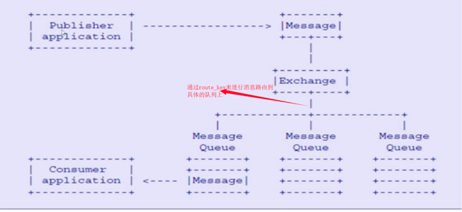

# 第一章 JAVA架构师

---
## 目录
- [第一章 - JAVA架构师](JAVA架构师.md)
- [第二章 - python全栈](python全栈.md)
- [第三章 – GO编程](GO编程.md)
- [第四章 – 数据挖掘](数据挖掘.md)
- [第五章 – AI智能](AI智能.md)
- [第六章 – 云原生](云原生.md)
- [第七章 – 物联网](物联网.md)
- [第八章 - 云计算](云计算.md)
- [第九章 - 区块链](区块链.md)
- [第十章 - 运维工程师](运维工程师.md)
- [第十一章 - 元宇宙](元宇宙.md)
- [第十二章 - WEB3.0](WEB3.0.md)

---
## 1.1 MQ基本概念
### 1.1.0 MQ概述
> MQ全称 Message Queue（消息队列），是在消息的传输过程中保存消息的容器。多用于分布式系统之间进行通信。
> 

### 1.1.1 MQ优势
- 应用解耦：提高系统容错性和可维护性
- 异步提速：提升用户体验和系统吞吐量
- 削峰填谷：提高系统稳定性

>- **应用解耦:**  
> 系统的耦合性越高，容错性就越低，可维护性就越低。 
> 使用 MQ 使得应用间解耦，提升容错性和可维护性。
> 
>- **异步提速：**  
> 
> 
> 一个下单操作耗时：20 + 300 + 300 + 300 = 920ms，用户点击完下单按钮后，需要等待920ms才能得到下单响应 
> 用户点击完下单按钮后，只需等待25ms就能得到下单响应 (20 + 5 = 25ms)。提升用户体验和系统吞吐量（单位时间内处理请求的数目）。
> 
>- **削峰填谷**
> 
> 
> 
> 使用了 MQ 之后，限制消费消息的速度为1000，这样一来，高峰期产生的数据势必会被积压在 MQ 中，高峰就被“削”掉了，但是因为消息积压，在高峰期过后的一段时间内，消费消息的速度还是会维持在1000，直到消费完积压的消息，这就叫做“填谷”。 使用MQ后，可以提高系统稳定性。

### 1.1.2 常见MQ产品

### 1.1.3 RabbitMQ简介
> **AMQP**，即 Advanced Message Queuing Protocol（高级消息队列协议），是一个网络协议，是应用层协议的一个开放标准，为面向消息的中间件设计。基于此协议的客户端与消息中间件可传递消息，并不受客户端/中间件不同产品，不同的开发语言等条件的限制。2006年，AMQP 规范发布。类比HTTP。

> 2007年，Rabbit 技术公司基于 AMQP 标准开发的 RabbitMQ 1.0 发布。RabbitMQ 采用 Erlang 语言开发。Erlang 语言由 Ericson 设计，专门为开发高并发和分布式系统的一种语言，在电信领域使用广泛。 
> **RabbitMQ 基础架构如下图：**

#1.1 初识RabbitMq
> rabbitmq是一个开源的消息代理和队列服务器，通过普通的协议(Amqp协议)来完成不同应用之间的数 据共享; 
> rabbitmq是通过elang语言来开发的基于amqp协议

#1.2 为什么选择Rabbitmq
- 1)比如滴滴，美团，携程，去哪儿等为什么选择
- 2)开源，性能好，稳定性保证,
- 3)提供了消息的可靠性投递（confirm），返回模式 
- 4)与sping amqp 整合和完美，提供丰富的api 
- 5)集群模式十分丰富(HA模式 镜像队列模型) 
- 6)保证数据不丢失的情况下，保证很好的性能

#1.3 Rabbitmq高性能是如何做到的
>- 使用的语言是elang语言(通常使用到交互机上)，elang的语言的性能能与原生socket的延迟效果.  
>- 消息入队的延时已经消息的消费的响应很快

#1.4 什么是AMQP协议?
>- 是一个二进制协议,AMQP协议(Advanced message queue protocol) 高级消息队列协议 
>- amqp 是一个应用层协议的规范（定义了很多规范）,可以有很多不同的消息中间件产品（需要 遵循该规范）server：是消息队列节点 virtual host:虚拟注解 exchange 交换机(消息投递到交换机上) message queue（被消费者监听消费） 交互机和队列是有一个绑定的关系

# 1.5 AMQP的核心概念
> 1:server :又称为broker，接受客户端连接，实现amqp实体服务  
> 2:Connection: 连接,应用程序与brokder建立网络连接 
> 3：channel：网络通道，几乎所有的操作都是在channel中进行的，是进行消息对象的通道，客户端可以建立 多个通道，每一个channel表示一个会话任务 
> 4:Message: 服务器和应用程序之间传递数据的载体，有properties（消息属性,用来修饰消息,比如消息的优 先级,延时投递）和Body（消息体） 
> 5:virtual host(虚拟主机): 是一个逻辑概念,最上层的消息路由，一个虚拟主机中可以包含多个exhange 和 queue 但是一个虚拟主机中不能有名称相同的exchange 和queue 
> 6:exchange 交换机: 消息直接投递到交换机上，然后交换机根据消息的路由key 来路由到对应绑定的队列上 
> 7:baingding: 绑定 exchange 与queue的虚拟连接,bingding中可以包含route_key 
> 8：route_key 路由key ，他的作用是在交换机上通过route_key来把消息路由到哪个队列上 
> 9:queue：队列，用于来保存消息的载体，有消费者监听，然后消费消息 

#1.6 Rabbitmq的整体架构模型

#1.7 rabbitmq的消息是如何流转的

---
- 作者：face
- Github地址：https://github.com/facehai/thinking-framework-master
- 版权声明：著作权归作者所有，商业转载请联系作者获得授权，非商业转载请注明出处。
