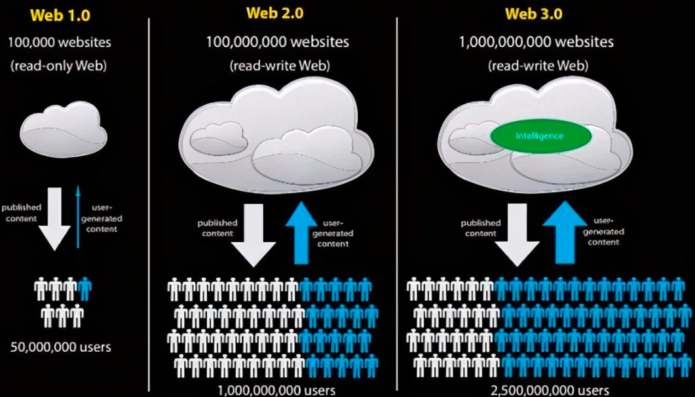
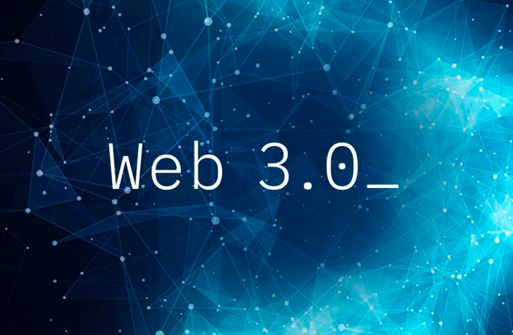

# 第一章 JAVA架构师

------
## 目录
- [第一章 - JAVA架构师](JAVA架构师.md)
- [第二章 - python全栈](python全栈.md)
- [第三章 – GO编程](GO编程.md)
- [第四章 – 数据挖掘](数据挖掘.md)
- [第五章 – AI智能](AI智能.md)
- [第六章 – 云原生](云原生.md)
- [第七章 – 物联网](物联网.md)
- [第八章 - 云计算](云计算.md)
- [第九章 - 区块链](区块链.md)
- [第十章 - 运维工程师](运维工程师.md)
- [第十一章 - 元宇宙](元宇宙.md)
- [第十二章 - WEB3.0](WEB3.0.md)
------

## 1.1 概述
### 1.1.0 Web3.0下去中心化的内容创作
>最近随着元宇宙的火热，Web3.0的概念再次被提及，但是更多的是谈去中心化的区块链和代币等内容。今天我想谈下对Web3.0下去中心化内容创作的一点思考。

## 1.2 从Web1.0到Web2.0
可以看到Web2.0本身就是互联网发展中的一个关键突破。类似当时主流的博客，微博，SNS等都是Web2.0时代的重要产物。

Web2.0带来的一个重要变化就是更加强调了全民创作，强调了人和人之间的连接。而在Web1.0时代各个网站往往都只能是自己雇佣员工创作内容。在Web2.0时代人人都是创作者。

同时随着短视频的兴起和火热，本身又加速了Web2.0下自媒体时代的到来。

人人都是创作者，同时内容创作者还可以挣钱。

特别是类似头条发起的各种对创作者的创造激励活动，你只要能够创造优质的内容，有人阅读和有流量，就能够有收益。内容本身还是免费，但是类似头条等平台将创造者的内容，用户，头条广告运营等各种内容有机地融合在一起。

这个不是简单的Web2.0时代的内容创作和协同。

更加重要的是基于创造者和内容，基于平台能力来构建了一个经济系统。这个经济系统能够正常运行，商品就是各个创造者创造的内容。

## 1.3 当前内容创作的问题？
首先谈下当前内容创作的问题。

我个人在去年6月份开始在头条号进行日更，同时部分文章同步到个人的微信号。在整个内容创作过程中谈下常见的一些问题。

第一就是当前内容创作仍然是中心化的，而且是多中心化。比如头条号，平台就是这个中心，对于具体创作内容的单价，收益的核算等都是平台订规则，创作者更多的是遵守平台的规则。

同时当前的创作本身还是多中心化的，如果你同时在做知乎，微信公众号，百家号等，你会发现你创造的内容需要你自己手工在多个平台去发布。而每个平台对于内容创作的激励规则本身又不同，你都需要去遵守。

第二就是内容抄袭的问题。我发布在头条的内容，经常都出现在未经过授权的情况下被人发布到其它平台，好点的还会保留原出处和标明转载，而更多的是完全去掉原作者变成自己的原创内容，或者就是对内容进行修改和洗稿等。

如果我的内容被别人发布或转载了，那么就变成了他人获取了内容收益，获取了流量。而对于原创作者来说无法获得任何有效的版本保护。

比如我在头条发布的内容，如果晚两天再发布到我个人的微信公众号，往往就发布不成功。原因就是已经别其它公众号非法转载并发布了。

第三就是刚才谈到的同一个内容重复发布的问题。本来一个内容，由于存在多个平台，你需要多处去发布，这个本身也是不合理的地方，导致了各种重复工作量。

如果这种中心化的平台越多，你会发现这种无意义的重复发布的工作量越大。这都是多中心化带来的极差的一种创作体验。

## 1.4 Web3.0下的去中心化内容创作

也正是这个原因，个人展望下Web3.0下去中心化的内容创作新模式。

即在去中心化的内容创作下，不再需要一个中心化的平台去管理你的内容，并对你的内容进行收益核算。整个内容创作和分享，收益核算本身是一种完全去中心化的架构模式。当前最终也会形成一个完全独立的去中心化的经济系统，区块链技术或代币仅仅是该经济系统正常运行的货币系统。

在Web3.0下个人创作内容后会快速分发。

创作的内容由于没有中心化的平台，你也不需要在多个平台重复去发布相关内容。

同时发布出去的内容本身存在进一步的转发，转载等操作。但是所有的转发，转载等最终都可以核算到原始创作者应该有的收益。

内容创作者创造的内容本身防止篡改，也无法简单的洗稿，所有的内容通过去中心化的运作系统自动的得到版权保护。

原有的类似头条号，百家号等创造平台不再具备中心化的内容管理，收益核算发布能力。而全部统一为底层的一个技术平台，仅仅提供创造内容的上传，发布，分布式存储等基础技术能力即可。

在Web3.0下的内容创作，最终收益会以类似代币等方式进行自动化结算。

同时，内容创作再次进入一种完全的开放生态体系。

互联网本身强调的是开放生态，但是当前各大内容创作平台各自为战，本身各大平台的内容往往处于一种完全封闭的体系中。内容无法在整个互联网完全共享。

创作者创造的内容本身应该开放，版权就属于创造者，而不是属于任何平台。内容的定价也不是由中心化的平台去判断，而是应该有一个内容自适应规则去计算，这个过程都应该是去平台和去中心化的。

在Web3.0下的内容创作应该是一种自组织模式的，有一套自我调整的内在规则在运作。同时Web3.0下应该是一次创作，全网共享，并永久版权，永久获取流量收益。这才是一种应该有的去中心化的开放生态。

---
- 作者：face
- Github地址：https://github.com/facehai/thinking-framework-master
- 版权声明：著作权归作者所有，商业转载请联系作者获得授权，非商业转载请注明出处。
